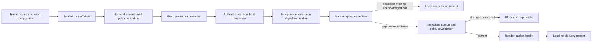

# Local Codex Handoff Boundary

## Status

This document defines the Sprint 24 local-only handoff contract. AgentMage can construct, review,
and render a bounded Markdown packet for manual handling. It cannot invoke Codex, activate or
populate another interface, write the clipboard, launch a URI, contact a runtime, make a network
call, submit content, or claim external delivery.

## Flow

The production host currently has no trusted session composer that installs the handoff draft, so
the native command fails closed as unavailable. Tests install an exact fixture through the explicit
trusted boundary; ambient prompts and untrusted host requests cannot install or alter a draft.

## Disclosure Contract

The draft and rendered packet bind the objective, acceptance criteria, constraints, source
excerpts, citations, evidence hashes, inferences, exclusions, unresolved questions, sensitivity,
redactions, destination class, and packet size. Every entry is content-addressed and belongs to one
closed disposition. Hidden, unrelated, prohibited, secret-bearing, or incorrectly redacted entries
are rejected.

Source excerpts are rendered as inert indented code. Prompt text asking AgentMage to conceal a
source or bypass disclosure remains visible content and cannot alter validation. Permitted
user-provided or non-public content requires an explicit acknowledgement on the exact review.

## Exact Review and Rendering

The kernel hashes the draft, ordered entry identities, exact packet bytes, manifest, and review.
The authenticated host retains a pending review for a bounded lifetime. Final rendering consumes
that review once and revalidates the current draft, workspace identity, source hashes, citations,
policy digest, and redaction digest. Any change requires regeneration.

The extension independently recomputes all packet, manifest, review, and receipt hashes. It compares
the reviewed and rendered packet bytes and manifest identity exactly. A changed, extra, missing,
oversized, expired, malformed, or delivery-claiming response is never displayed as a handoff.

## Effect Boundary

The handoff interface exposes only preview, local render, local cancellation, and local denial
receipts. Each prohibited action has a closed identifier and produces a receipt whose
`external_delivery_attempted` field is false. There is no handoff API for clipboard access, tab or
Chat control, URI opening, process invocation, runtime delivery, networking, or submission.

The mandatory notice is part of the hashed review:

> This packet remains local. AgentMage has not contacted Codex or any external service. External
> handling begins only if you manually transfer selected content.

## Evidence Limit

Pure Rust and TypeScript tests establish the deterministic local contract, authenticated transport,
independent digest checks, and absence of a declared transfer surface. They do not establish an
installed native workflow, canonical production session composition, live zero-egress observation,
platform accessibility, or independent review. Sprint 24 remains blocked until those artifacts are
retained.
