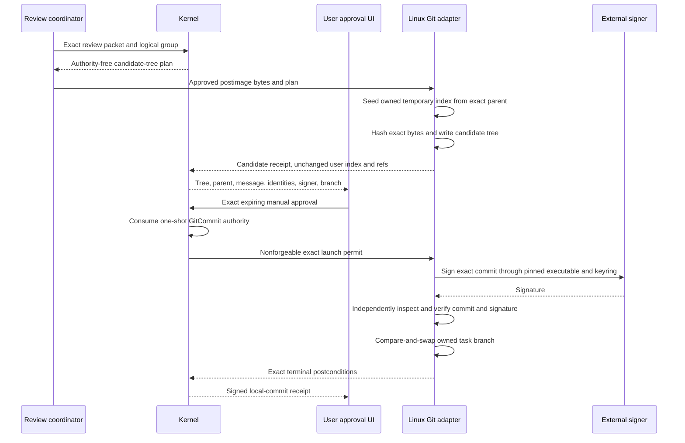

# Local Review and Signed Commit Boundary

## Status

Sprint 47 implements authority-free review packets, deterministic logical commit
plans, candidate-tree and local-commit contracts, exact manual approval receipts,
and a Linux source candidate for temporary-index tree construction and externally
pinned OpenPGP commits. Native fixture tests create and verify a signed commit in
a disposable repository and keyring.

No local commit path is registered in a product profile. A production-approved
hardware-backed or OpenPGP identity, protected approval channel, complete process-
tree interruption campaign, Ubuntu and Windows acceptance, trusted installed-
parent execution, independent review, and deferred manual fuzzing remain absent.
The implemented source and fixture evidence therefore does not establish a
supported product workflow or release gate.

## Boundary Sequence

Candidate-tree construction precedes commit approval because the user approves
the actual Git tree object, not a prediction of it. Candidate construction may
add exact blob and tree objects, but it cannot update any ref. Commit creation is
separate from validation and from every publication operation.

## Review Packet

[`review_packet.rs`](../../kernel/engine/src/review_packet.rs) seals one complete
packet containing:

- Objective, behavior delta, exact repository and base identities, changed files,
  complete diffs, rollback, screenshots or outputs, and content-minimized evidence.
- Verified Sprint 46 validation receipts and every requested check not run.
- Correctness, simplicity, maintainability, security, data-integrity,
  accessibility, performance, tests, and documentation review modes.
- Visible findings plus preserved duplicate and low-confidence evidence.
- Deterministic behavior, formatting, tests, documentation, migration, and
  generated-output commit groups, with unrelated user work excluded.

Normalization is reconstructed during verification. A caller cannot retain a
weaker duplicate, invent a suppression target, change a group, or rehash a forged
packet into validity. Review packets and logical plans carry no write, commit,
push, merge, or release authority.

## Candidate Tree

[`local_commit.rs`](../../kernel/engine/src/local_commit.rs) binds candidate
construction to the exact review packet, change set, logical group, parent,
temporary-index identity, user-index identity, preservation manifest, path,
postimage digest, and regular-file mode. Symlink and submodule modes are not
admitted by this first boundary.

The Linux adapter:

1. Recollects the exact preservation manifest and rejects stale state.
2. Creates an index only under the verified AgentMage-owned management root.
3. Seeds it with `read-tree` from the approved parent.
4. Hashes approved bytes without filters and stages only the approved blob,
   mode, and path tuples.
5. Writes the tree, removes the temporary index, and recollects repository state.
6. Returns success only when the user index and every ref remain unchanged and
   the object database is the sole repository delta.

Hooks, content filters, external diff, text conversion, pagers, editors,
credential helpers, maintenance, recursive submodules, Large File Storage
processing, and every network protocol are disabled or rejected. Benign Git
repository metadata is necessarily read; evidence asserts specifically that
repository configuration selected no executable program.

## Signer Inspection

The signer report admits only `hardware_backed` or `open_pgp` identities from a
platform broker or external keyring. It records only the signer artifact and path
digests, public fingerprint, public-key digest, inspection-evidence digest, and
closed source classification. It contains no private key or secret keyring path.

The Linux OpenPGP adapter requires a root-owned, non-writable signer executable
and a current-user-owned private keyring outside the checkout, Git directory, and
AgentMage management root. It lists the exact secret-key fingerprint and exports
only public verification material. Repository-selected signing programs and
unsigned fallback are structurally denied.

## Manual Approval and Authority

The manual approval receipt binds the exact plan, tree, parent, message,
author/committer identities, signer, task branch, preservation manifest, trusted
approval-channel identity, approval time, and expiry. The receipt:

- Requires explicit human confirmation.
- Rejects model confirmation.
- Expires in at most ten minutes.
- Carries no execution authority.
- Is serialized with the plan into the exact `GitCommit` authority request.

Only the kernel's ordinary single-use authority transaction can create a launch
permit. A valid plan, signer report, candidate receipt, or manual approval cannot
launch Git independently.

## Commit Reconciliation

The adapter creates a new signed commit with exact author, committer, timestamp,
timezone, message, tree, parent, and pinned signer. Before any ref update it reads
the raw commit, checks all exact fields, requires a signature header, and runs an
independent signature verification through the pinned signer boundary.

The final effect is one compare-and-swap update from the approved parent to the
verified commit on `refs/heads/agentmage/tasks/*`. Kernel reconciliation permits
only the object database and AgentMage task-ref identities to change. The user
index, current branch, unrelated refs, remotes, configuration, hooks, filters,
notes, stashes, tags, and user files must remain unchanged.

Automatic commit, amend, history rewrite, reset, discard, force, push, merge,
release, and network authority are all false in the exact plan. Push and every
hosted mutation remain separate future operations with separate approval.

## Runtime Records

Closed JSON Schemas and valid fixtures are published under
[`schemas/runtime/`](../../schemas/runtime/) for:

- `local-review-packet` and `logical-commit-plan`
- `pinned-commit-signer`
- `candidate-tree-plan` and `candidate-tree-receipt`
- `local-commit-plan`
- `manual-commit-approval-receipt`
- `local-commit-receipt`

Semantic validators enforce ordering, exact grouping, bounded approval lifetime,
message identity, signer/source compatibility, authority absence, signature
success, unchanged index/remotes, and no network effect.

## Remaining Evidence

The local fixture proves one Fedora-host candidate tree and disposable OpenPGP
signed commit. It does not substitute for:

- A user-approved production signer or hardware-backed signer campaign.
- Process-group and descendant cleanup under cancellation, timeout, crash, and
  signer-agent failure.
- Installed-package, clean Fedora, clean Ubuntu, and Windows native acceptance.
- Malicious repository configuration, attribute, filter, hook, signer, race, and
  interruption campaigns through a product-registered coordinator.
- Independent security review and the separately deferred manual fuzz campaign.

Those gaps must remain visible blockers until their owning evidence exists.
