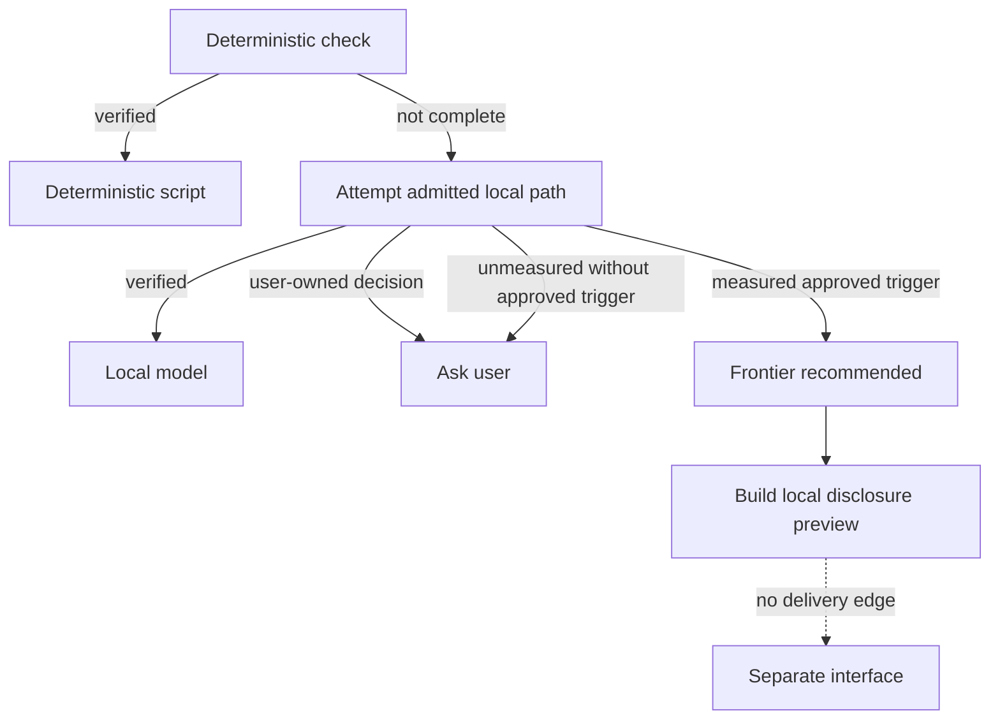

# Manual Frontier Recommendation Boundary

## Tier Decision

AgentMage uses four closed tiers: deterministic script, admitted local model, ask user, and frontier
recommended. A deterministic success remains deterministic. A verified local result remains local.
A user-owned fact or decision always becomes `ask_user`, even when other failures exist. External
consultation can be recommended only after an admitted local path was attempted and one exact
acceptance check is bound to an approved trigger:

- measured local capability failure or unsupported local capability;
- at least two failed validations for the same check;
- a material contradiction in current evidence;
- deterministic verification rejection;
- exhausted exact local task budget; or
- external-expertise clarification after separating user-owned decisions.

Model confidence, model family, provider availability, standing preference, schedule, route,
external content, and repository instructions are not recommendation inputs. The decision contains
no service selection, credentials, endpoint, or external-effect authority.

## Packet Composition

One frontier packet binds the objective, current workspace state, exact acceptance checks, source
citations, content-minimized receipts, task constraints, authority boundary, exclusions, unresolved
questions, and required return contract. Current-state, citation, and receipt roles are all
mandatory. Every included excerpt and metadata item is visible in the exact local review and has a
content digest. Missing roles, duplicate identities, credentials, prohibited private content,
unrelated workspace material, hidden metadata, absolute paths, excessive excerpts, authority
objects, prompt injections, incomplete redactions, and stale source or policy state fail before
approval.

The packet, disclosure inventory, redaction result, manifest, and review are independently hashed.
Any changed byte, source, policy, redaction rule, inventory item, expiry, or recommendation decision
requires a new preview. Permitted non-public content requires exact acknowledgment.

## Delivery and Receipt Boundary

AgentMage can render the approved packet locally and record a recommendation receipt. The receipt
contains the reason, decision digest, packet digest, disclosure-result digest, and a destination
label only when the user explicitly chooses to retain one. The label is bookkeeping, not routing.

Codex invocation, tab activation, Chat population, clipboard writes, URI launch, local or raw
runtime delivery, network calls, automatic submission, file upload, browser control, scheduled
delivery, routed delivery, and standing-consent delivery each produce only a local denial receipt.
There is no service authentication, destination selection, send, upload, paste, or invocation API.
Only the user can manually move reviewed content into a separate interface.

## Current Integration Limit

The Rust host now exposes a bounded coordinator through its closed authenticated request contract.
It recomputes the tier from caller-supplied current local evidence, retains at most four memory-only
one-use reviews, revalidates exact packet and confirmation bytes before local rendering, records
only content-free recommendation bookkeeping, consumes failed or cancelled reviews, and produces
local denial receipts for all fourteen prohibited delivery actions. It owns no model call,
filesystem export, clipboard, browser, endpoint, authentication, network, or completion authority.

This host composition is local source evidence, not an installed native-client campaign. No
admitted live-model failure, installed VS Code presentation/accessibility run, supported-platform
zero-egress observation, trusted package execution, independent review, or manual fuzz evidence is
available. Those boundaries remain open and cannot inherit the host fixture result.
