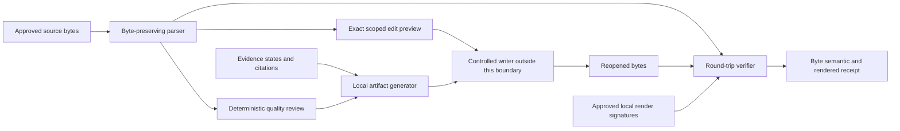

# Markdown Artifacts and Round Trip

## Scope

The Sprint 57 boundary parses and previews exact user-owned Markdown, performs deterministic local
quality review, generates seven evidence-aware artifact classes, and verifies reopened bytes,
supported semantic structure, and caller-supplied local render signatures. It has no ambient file,
network, renderer, shell, delivery, approval, or execution authority.

The registered host coordinator admits all seven hash-bound artifact skills and binds source
quality review, citation-aware generation, an optional exact edit preview, reopened bytes, and
caller-supplied local render signatures. Sticky cancellation and missing dependencies fail before
content evaluation. The controlled writer and local renderer remain dependencies, not powers held
by the coordinator. Generation returns bytes as a proposal. Display links are non-authoritative
references built from validated workspace identities and relative components.

## Supported Structure

The parser records headings, paragraphs, ordered and unordered lists, task items, tables, fenced
code and fence content, inline links, wiki links, text blocks, frontmatter, LF or CRLF line endings,
and exact source ranges. Unsupported syntax is retained byte-for-byte with a visible fidelity
warning. Exact edits bind the original digest, target element, source range, replacement bytes,
line-ending policy, and sealed preview digest.

Code-fence content and raw-note regions are protected. Unrelated blocks are not normalized.
Comments, whitespace, frontmatter order, and unsupported source remain untouched unless the user
reviews an exact scoped replacement.

## Quality and Adversarial Content

Quality review is deterministic and configured by an exact profile. It reports CommonMark heading
spacing, local links missing from an approved inventory, duplicate headings, malformed tables,
unsupported structure, long sentences or paragraphs, and uppercase acronyms absent from the exact
approved acronym inventory. Unknown acronyms are never expanded by inference.

HTML, scripts, event handlers, dangerous URI schemes, remote image targets, hidden text, comments,
secret canaries, and instruction-like text are source data. They are never fetched or executed.
Dangerous URI, executable HTML, and canary findings block generated disclosure until reviewed.

## Evidence and Completion

Every confirmed, inferred, historical, or disputed generated statement resolves to one or more
exact citation identities. An unknown statement may remain explicitly uncited. Each citation binds
a validated workspace path, one-based inclusive line range, and source digest.

Local round-trip completion requires all three independent checks:

1. Exact source bytes are identical after reopen.
2. Supported semantic element signatures are identical.
3. Approved local rendered-block signatures are identical.

Any failed dimension produces a stable limitation and prevents local completion. These checks do
not prove installed product integration, visual accessibility, cross-platform behavior, trusted
package execution, independent review, or the deferred manual fuzz campaign.
