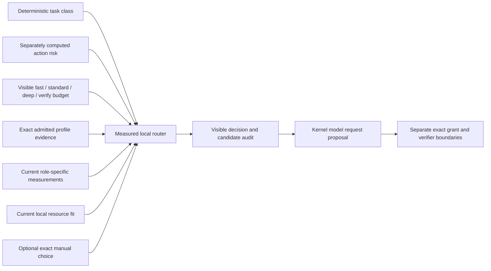

# Measured Local Model Routing

## Status

The measured router is composed behind a kernel-owned authenticated product
service and native content-minimized audit projection. It is not registered in
an integrated workflow or installed interface. AgentMage has zero enabled
product models, automatic routing is disabled, and no current exact profile has
the evidence required by this boundary.

The router does not approve a model. It consumes already admitted, exact,
current profile and role evidence. A failed identity, provenance, origin,
license, artifact, tokenizer, template, codec, runtime, context, decoding,
resource, role, policy, benchmark-generation, or platform boundary cannot be
waived by a routing score.

## Deterministic Inputs

The request has no model-confidence, model-preference, provider-marketplace,
remote-provider, or authority-bearing classifier field. Task class and action
risk are separate typed facts. A learned classifier can narrow or block before
the router, but cannot select a profile, widen a role, transfer authority, or
override a deterministic denial.

## Exact Profile Boundary

A routable profile binds:

- exact profile, first-party publisher, lineage, reviewed license, and origin;
- exact model artifact, tokenizer, template, family codec, and local runtime;
- exact context, decoding, resource, platform, policy, and benchmark generation;
- approved lifecycle state for automatic measured routing;
- current platform and resource fit; and
- independent measured evidence for the requested role.

Every identity-bearing artifact uses an exact digest. Family names and mutable
registry tags are insufficient. Chinese, Chinese-derived, unresolved,
unapproved, degraded, quarantined, rejected, retired, remote-only, fallback-enabled,
platform-unmeasured, hardware-unfit, and stale profiles are ineligible.

The [historical later-candidate record](../../model-profiles/routing/historical-later-candidates.json)
preserves Gemma 4 26B and Devstral Small 2 without claiming either is an exact
admitted profile. Neither is selectable or eligible for routing.

## Role Evidence

Dialogue, tool selection, summarization, repository-map interpretation,
embedding, reranking, patch generation, citation verification, planning,
coding, retrieval, and document work are measured independently. Evidence for
one role cannot be borrowed by another.

The [role benchmark corpus](../../model-profiles/routing/role-benchmark-corpus-v1.json)
requires at least 30 repeated trials over one exact comparable tuple, the best
published manual-selection baseline, quality, grounding, reliability, failure,
latency, memory, and optional explicitly absent energy results. Primary routing
requires at least 250 basis points of declared, statistically supported benefit.
A second verifier requires at least 150 basis points of separately measured
verification benefit.

Raw model results and exact benchmark tuples must be retained by the owning
evaluation campaign. The corpus file defines suites and thresholds; it is not a
benchmark result and cannot enable a profile.

## Visible Budgets

| Budget | Context ceiling | Tool-proposal ceiling | Review boundary |
|---|---:|---:|---|
| `fast` | 8,192 | 2 | Standard |
| `standard` | 16,384 | 4 | Standard |
| `deep` | 32,768 | 8 | Enhanced |
| `verify` | 32,768 | 8 | Independent |

All four budgets are local only. A budget changes declared inference resources
and review; it does not grant tools, select a remote service, create an effect,
or relax the exact profile boundary.

## Decision Procedure

1. Validate the request, policy, benchmark generation, budget, platform, and
   current resource observation.
2. Sort exact profiles by stable profile identity and reject duplicate identity.
3. Audit every profile against exact admission, role, platform, resource,
   context, tool, policy, and evidence requirements.
4. Preserve an exact eligible manual selection. If it is ineligible, block
   without choosing another profile.
5. Without manual selection, choose the eligible profile with the largest
   supported improvement over the manual baseline.
6. Break an equal score by stable profile identity and retain every equal-score
   disagreement visibly.
7. For `verify` work at high or critical risk only, select a distinct eligible
   verifier only when its measured verification benefit passes the threshold.
8. Emit one content-minimized receipt containing every candidate disposition,
   exact selected identities, disagreements, policy and benchmark-generation
   identities, fixed budget boundary, and receipt digest.

The complete [decision table](../../model-profiles/routing/measured-routing-decision-table-v1.json)
is machine checked. Missing, stale, unmeasured, degraded beyond its evidence,
blocked-hardware, policy-drifted, classifier-unavailable, and no-profile states
fail closed. A profile or runtime failure after selection blocks or becomes
uncertain; it never triggers an invisible switch.

## Authority And Audit

The receipt is descriptive and content minimized. It records:

- deterministic task class and separately computed risk;
- exact budget and review boundary;
- selected primary and optional verifier identities;
- every considered profile's eligibility, ordered rationale, and role-evidence
  digest;
- every equal-score disagreement;
- current policy and benchmark-generation digests; and
- explicit `false` values for frontier transfer and model-confidence use.

The receipt grants no model, tool, filesystem, connector, network, or effect
authority. Runtime execution and any proposed action still cross their existing
kernel policy, grant, worker, receipt, and deterministic-verifier boundaries.

`MeasuredRoutingService` owns the immutable exact profile-catalog generation;
a caller cannot supply a replacement candidate list per request. It accepts one
actor/session/assertion envelope only after `RoutingAuthenticationVerifier`
validates the protected assertion digest. Failed authentication emits no route
and no audit entry.

Each authenticated decision appends a `NativeRoutingAuditView` with the fixed
deterministic method, exact task, result code, complete candidate rationales,
ties, policy, benchmark generation, catalog generation, and receipt digest.
When a profile is eligible, the view independently projects exact artifact,
tokenizer, template, codec, runtime, context, decoding, resource, and platform
evidence identities. The protected authentication digest, credentials, prompts,
outputs, and model-visible content never enter the view. An empty product
catalog produces a visible `no-eligible-profile` decision and enables nothing.

The host `drive_interactive_cli_routing` adapter forwards this authenticated
envelope unchanged and presents only the already appended native audit view.
It cannot provide a candidate list, select or retry a model, change the view,
or gain model/runtime authority. Source tests prove invalid authentication
produces no presentation and the current empty catalog produces the same
visible no-profile result through the host path. This is source composition,
not trusted installed-package execution or platform acceptance.

## Disabled Paths

Invisible fallback, automatic model installation, broad provider marketplaces,
frontier routing, unmeasured ensembles, family-wide evidence borrowing, model
self-selection, and confidence-based authority are absent. The API has no
variant capable of expressing those paths.

## Remaining Product Evidence

Current source tests use synthetic exact profiles. No real later profile has a
complete manifest, current role benchmark, supported-platform result, or
product activation. Role-specific live quality, grounding, reliability,
latency, memory, energy where measured, and failure campaigns remain required.
Trusted installed-package execution, supported-platform package tests,
independent human review, and the deferred manual fuzz campaign remain open.
These blockers prevent Sprint 49 and every routing release claim from passing.
