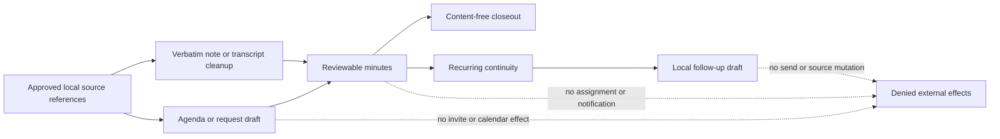
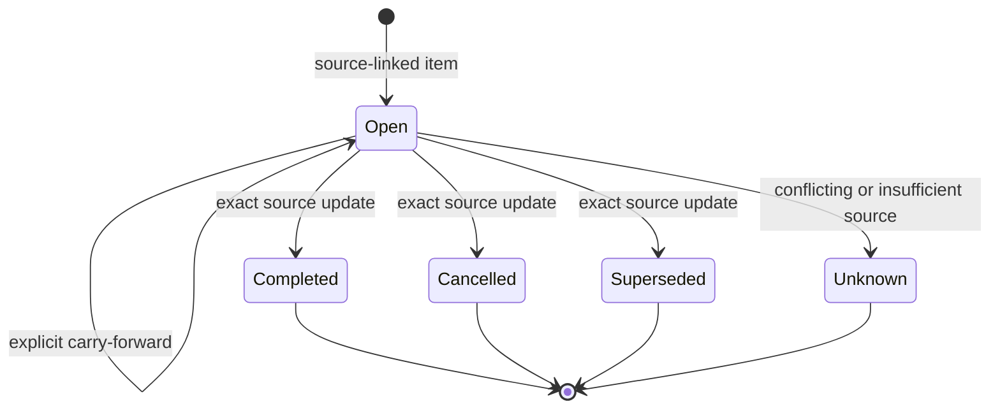

# Meeting Records and Continuity

## Scope

Sprint 55 defines source-preserving local records for meeting preparation, attendee states, note
and transcript cleanup, minutes, closeout, recurring continuity, and follow-up drafts. The source
candidate does not connect to an inbox, invite participants, assign work, send a follow-up, change a
calendar, or mutate a canonical note.

The implementation consumes only exact local source references admitted by an existing knowledge
adapter. Every source carries a stable source and object identity, optional fragment and revision,
content digest, and local storage grammar. Meeting outputs therefore do not create new read scope.

## Contract Family

| Record | Bound behavior | Permanent effect boundary |
|---|---|---|
| `MeetingPlanDraft` | Purpose, participants, topics, decision needs, preparation, and expected outputs | Proposal only; no invitation or calendar effect |
| `MeetingAttendee` | Independent invitation-response and attendance states with exact evidence state | Neither state is inferred from silence or the other state |
| `MeetingTranscriptCleanup` | Verbatim text, cleanup proposal, timestamps, attribution confidence, and byte-exact unclear markers | Verbatim source retained; no source mutation |
| `MeetingMinutes` | Confirmed/proposed decisions, actions, questions, risks, next meeting, owners, dates, and sources | No assignment, commitment, communication, or calendar effect |
| `MeetingContinuityRecord` | Immutable carry-forward history, source-backed state updates, and local follow-up draft | No communication or source mutation |
| `MeetingCloseout` | Content-free counts over exact sealed minutes and continuity | No external effect |

All sealed records bind their canonical serialized representation to SHA-256. Verification clears
the digest field, recomputes the digest, and rejects stale records. Identifiers, lists, timestamps,
dates, source references, and text are bounded before a digest is accepted.

The registered host coordinator presents an explicit projection precondition before invoking this
pure source layer. Sticky cancellation rejects the projection before dependency evaluation;
otherwise every declared local dependency must be ready. It admits all six hash-bound meeting
skills, verifies the plan, cleanup, and minutes, requires one meeting identity, source set, and
participant ledger, and then derives continuity and closeout. Neither rejection creates a partial
output or an external effect.

Native Chat, interactive CLI, JSON, SDK, and ACP surfaces use the same closed meeting command and
host coordinator. The client command contains only the meeting identity, sealed-record digests,
continuity-record identity, and a domain-separated digest over every host-owned coordinator input.
Plans, cleanup text, minutes, prior continuity, updates, and follow-up draft content never cross the
thin-client command boundary. The host rejects stale requests, workspace substitution, record
substitution, or aggregate-input mismatch before composition, and successful routing still grants
no invitation, assignment, notification, send, scheduling, calendar, or source-mutation effect.

## Truth Rules

Invitation response and attendance are separate closed states. An observed invitation or
attendance value requires confirmed evidence; `not_observed` and `unknown` remain unknown. An
accepted invitation never implies attendance, and attendance never implies acceptance.

Cleanup retains the exact verbatim string beside the proposed cleaned string. Every unclear marker
uses UTF-8 byte offsets whose source slice must equal the retained fragment. Missing timestamps
remain absent rather than synthesized. A missing speaker has unknown attribution and zero stated
confidence.

A confirmed decision requires confirmed evidence. A proposed decision cannot carry confirmed
evidence. Owner and date values are independent fields with `confirmed`, `proposed`, or `unknown`
state. An absent value must be unknown, and an unknown value must remain absent.

## Continuity

Open actions, questions, and risks become source-linked continuity items. A later minutes item can
carry an item forward by naming an exact historical item. A source-backed update can mark an item
completed, cancelled, superseded, or unknown; absence from later minutes never implies completion.
Every revision retains sorted historical minutes-item identities and source identities.

## Security Mapping

- `SR-DAT-001` through `SR-DAT-003`: exact local source identities, digests, bounded text, privacy
  class on minutes, immutable history, and no source mutation.
- `SR-AI-003`, `SR-AI-007`, and `SR-AI-010`: explicit evidence states, verbatim retention,
  attribution confidence, unclear markers, and refusal to guess owners, dates, acceptance,
  attendance, or decisions.
- `SR-CIV-003` through `SR-CIV-009`: proposal-only outputs and constant-false invitation,
  assignment, communication, calendar, and source-mutation effects.

This source layer does not prove native accessibility, installed-platform behavior, trusted package
execution, durable reminders, independent records review, or manual fuzzing. Native routing is
locally integrated, but those remaining claims stay blocked until their exact evidence exists.
