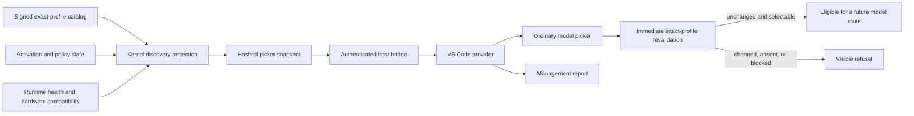

# Native Chat Model Discovery

## Status

This document defines the Sprint 23 local contract for model discovery in the native Visual Studio
Code Chat model picker. It does not claim that a production model runtime or an installed native
Chat workflow is available.

## Boundary

AgentMage registers one language-model provider through the pinned stable Visual Studio Code API.
The provider contains no compiled model family, mutable model tag, default model, or automatic
fallback. It asks the authenticated local host for a current picker snapshot and exposes only the
entries that the kernel projected as selectable.

The current production host bootstrap does not yet install a verified catalog snapshot or connect
an admitted profile to an inference adapter. Consequently, the production provider truthfully
discovers zero profiles until that later integration exists.

## Exact Entry Identity

Each picker entry binds all of the following into `entry_sha256`:

- profile, display, family, manifest, artifact, codec, tokenizer, and template identity;
- runtime adapter, implementation kind, contract version, build identity, build digest, platform,
  and architecture;
- declared modalities and role-specific capability outcomes;
- visible context, input, message, and output limits;
- digests of the complete context-accounting, decoding, hardware-envelope, and policy tuples;
- lifecycle, runtime health, activation, compatibility, support, limitations, picker disposition,
  and explicit-decision requirement.

The snapshot binds the signed-catalog digest, signature-verification fact, observation time, ordered
entries, and each entry digest. The TypeScript bridge independently recomputes the entry and
snapshot digests before displaying any profile.

## Selection Rules

An entry is ordinarily selectable only when all of these current facts hold:

1. The catalog signature has already been verified by the trusted caller.
2. The exact profile is enabled and its lifecycle is `approved` or `degraded`.
3. Activation is `activated`, compatibility is `compatible`, and policy evidence is current.
4. Support is `supported` or `limited`, runtime health is `ready`, and at least one role passed.
5. A new explicit user decision is required.

All other valid entries are management-only. Candidate, evaluating, quarantined, rejected,
retired, incompatible, stale, blocked, failed, inactive, and unsupported states cannot enter the
ordinary picker.

## Revalidation and No Substitution

Immediately before every provider response, the extension submits the selected profile identity
and previously displayed entry digest to the authenticated host. The host compares them with its
current verified snapshot. Removal, mutation, or a management-only disposition returns a typed
refusal. No other local profile, Docker profile, remote model, or cloud service is selected.

The pure contract tests cover removal and exact-identity mutation without fallback. Preservation of
the full production task, plan, evidence, and checkpoint during runtime crash, quarantine, or
resource exhaustion in every request phase remains unverified.

## Output and Links

The provider emits ordered native `LanguageModelTextPart` values for diagnostics, evidence,
citations, receipts, denials, cancellation, failures, and diagnostic export. File links are emitted
only after the local display-link grammar accepts a bounded ASCII `file:///` URI with valid percent
encoding and no query or fragment.

This is structured final-result streaming, not model-token streaming. Token counting remains a
bounded estimate. Session, permission, tool, offline, and complete workspace indicators are not yet
implemented.

## Evidence Limit

Pure Rust and TypeScript tests do not prove behavior in an installed Visual Studio Code instance.
Native keyboard, focus, live-region, screen-reader, zoom, reflow, cancellation, and picker behavior
must remain not tested until retained platform evidence exists. The current conformance status is
recorded in
[`native-chat-accessibility-conformance-v0.1.md`](../verification/native-chat-accessibility-conformance-v0.1.md).
