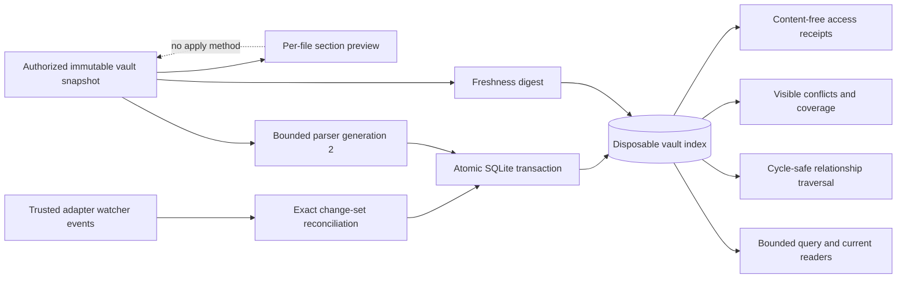

# Obsidian Index Boundary

## Purpose

Sprint 28 derives a disposable, source-traceable vault projection from Sprint 27's authorized
Obsidian snapshots. It adds bounded reads, relationship traversal, stale detection, exact change
previews, and watcher-event reconciliation without giving SQLite, an event, or a preview authority
over a user-owned note.

## Derived Projection

The only constructor opens SQLite in memory. No caller can supply an index path. The schema has
seven product tables: metadata, notes, verified attachments, source-ranged elements, resolved
links, unsupported-syntax coverage, and visible conflicts. The authority marker is always
`derived_only`; no operational session, memory, conversation, temporary-text, grant, receipt
ledger, or hidden agent-record table exists.

Every indexed element binds the canonical workspace path, exact source-content digest, parser
generation, current-or-historical class, optional normalized record type, element class, text, and
one-based UTF-8 byte-column range. Obvious secret candidates remain in the user-owned source but
are marked in parser coverage and omitted from searchable derived text.

## Atomicity and Freshness

A rebuild deletes and inserts derived rows inside one SQLite transaction. The source snapshot and
complete SQL projection each receive independent deterministic digests. The projection digest is
stored in the same transaction and verified before every query, traversal, conflict read, watcher
update, or preview. A transaction abort, digest mismatch, parser-generation mismatch, source
change, source deletion, or source addition cannot publish partial state.

Watcher updates accept only an expected index revision, an exact bounded event set, and a complete
new authorized snapshot. The event set must equal the calculated create, modify, and delete delta;
create and modify digests must match the new snapshot, and deletes must carry no digest. An update
then performs the same complete atomic publication as a rebuild. It mutates no source object.

This is the deterministic watcher processing boundary, not an operating-system filesystem watcher.
A trusted platform adapter must still observe changes through the common protected path boundary.
That platform integration remains open.

## Reads, Conflicts, and Previews

Lexical queries and current-note readers enforce fixed query and result limits. Current versus
historical classification follows explicit status metadata and bounded archive-path conventions.
Relationship traversal is breadth-first, deterministically ordered, cycle-safe, and bounded by
depth and result count. Missing, ambiguous, ASCII-case-colliding, rooted, and traversal-like links
remain visible conflicts; Unicode NFC path enforcement occurs before vault admission.

The parser retains exact source bytes only in the caller-owned snapshot. A section preview requires
a fresh index, one uniquely named heading, an exact source digest, and a bounded replacement. It
replaces only the selected section body, hashes untouched prefix and suffix bytes, and sets
`write_enabled` to false. No apply operation exists.

Rebuilds, watcher updates, queries, current readers, traversals, and previews produce receipts that
contain only sequence, operation class, index revision, snapshot/index digests, and path digests.
Every receipt explicitly records no source mutation, process launch, or network access.

## Adapter Parity and Deferrals

Exact AgentMage canonical records embedded in an Obsidian vault can be projected through
`ObsidianKnowledgeStore`. That view delegates unchanged to `PlainFolderKnowledgeStore`, proving
identical summaries, reads, compare-and-swap values, and write previews without treating ordinary
Obsidian notes as canonical records.

An operating-system watcher, installed host workflow, and every canonical note write remain
deferred. Obsidian is never installed, launched, configured, or automated by this capability.
