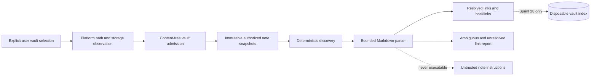

# Obsidian Parser Boundary

## Purpose

Sprint 27 adds deterministic Obsidian note discovery and parsing without opening a host path,
launching Obsidian, mutating a vault, or creating an index. The capability consumes only immutable
snapshots already authorized and held by a trusted platform adapter.

## Admission and Data Flow

The selected root is a canonical `WorkspaceScopePath`, not an absolute path, URL, descriptor, or
ambient filesystem capability. Admission requires a nonzero root-identity digest, a local
filesystem classification, no synchronization marker, and a symlink-free platform observation.
Remote, FUSE, unknown, synchronized, and symlinked roots fail closed.

The capability adds `.obsidian` and `.trash` to the exact ignored-scope set and accepts additional
ignored scopes only when they are strict descendants of the selected vault. A caller cannot ignore
the complete vault or a foreign scope.

## Discovery Contract

Every input carries a canonical workspace path, observed entry kind, hidden and synchronization
classifications, held bytes, and a SHA-256 digest. Discovery sorts paths before parsing and rejects
foreign or out-of-scope paths, per-entry synchronization, symbolic links, special entries,
oversized notes, duplicate paths, and content drift. Symbolic links are rejected even when they
appear below an ignored scope. Hidden entries, directories, ignored scopes, and non-Markdown files
are excluded without being parsed.

`WorkspacePath` supplies the same component, traversal, separator, root, control-character,
platform ambiguity, and Unicode NFC protections used by other file-tool contracts. Spaces and
canonical Unicode names remain valid and sort deterministically.

## Parser Contract

The parser accepts UTF-8 with optional BOM and LF or CRLF line endings. Frontmatter, when present,
must use an initial and closing `---` delimiter and a bounded flat grammar of unique normalized
keys, scalar values, inline sequences, or indented scalar sequences. Nested mappings, tabs,
duplicate keys, unmatched quotes or brackets, empty pending values, unsupported controls, and
resource overages fail closed.

Outside fenced code blocks, the parser records ATX headings, Markdown checkbox tasks, wiki links,
aliases, recognized frontmatter timestamps, and one-based source lines. Code-fence content remains
ordinary inert text. Link resolution uses exact vault-relative paths first, then exact basenames
and aliases. Heading and block fragments do not change note identity. Traversal-like or rooted
targets never become path authority. The graph reports every zero-candidate target as unresolved
and every multi-candidate target as ambiguous; it never guesses.

## Authority and Deferrals

Parsed note text, frontmatter, and instruction-like prose are untrusted data. This capability has
no filesystem, platform, operational-store, grant, shell, model-runtime, process-launch, or network
dependency. It exposes no apply, write, move, delete, watcher, or Obsidian automation method.

Vault indexing, index transactions, stale-index detection, watchers, access receipts, bounded
queries, special current-note readers, and raw-section-preserving change previews begin in Sprint
28. Canonical writes remain unavailable until the later grant-mediated write milestone.
