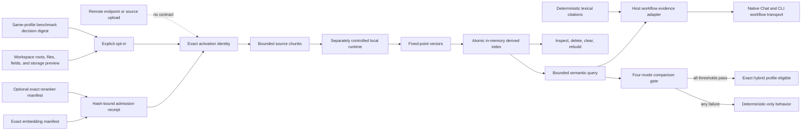

# Optional Local Semantic Retrieval

## Purpose

Sprint 30 defines the enforcement, lifecycle, and comparison boundary for optional local embedding
and reranking. Deterministic structural and lexical retrieval remains complete and available. No
semantic profile can activate from a mutable model name, an unreviewed artifact, a remote service,
an implicit workspace scan, or a benchmark assertion without exact evidence.

## Admission and Opt-In

The embedding profile and optional reranker each declare a stable profile ID, closed role,
publisher, lineage, license, artifact digest, tokenizer identity/digest, closed local runtime,
fixed dimensions, resident-memory ceiling, lifecycle state, and origin/license policy outcomes.
Activation requires an approval receipt bound to the exact serialized manifest and approval
evidence digest. Candidate, evaluating, quarantined, rejected, changed, wrong-role, unlicensed, or
origin-policy-failing profiles cannot activate.

The per-workspace opt-in lists exact approved roots and every included canonical file, source hash,
byte count, and closed field set. It binds policy and accepted benchmark-decision digests, source
and record ceilings, one explicit storage-protection choice, and disclosures for inspection,
retention, deletion, and rebuild. All approval and local-only fields must be true. Duplicate files,
outside-root paths, empty field sets, changed hashes, undisclosed fields, and excess budgets fail
before indexing.

No real embedding or reranking manifest is approved by this Sprint 30 implementation. Test
manifests are explicitly synthetic fixtures and establish contract behavior only.

## Derived Index Lifecycle

Each record key contains canonical path, source hash and exact range, branch, embedding and optional
reranker manifest digests, tokenizer identity/digest, chunker identity/digest, index schema,
policy digest, and complete opt-in digest. Vectors are signed fixed-point values with one exact
dimension, excluding NaN and platform-dependent float ordering. The capability receives vectors
from a separately controlled local runtime; it cannot launch a model process or access a network.

A rebuild validates the complete chunk/vector set into a temporary ordered projection before
publication. Missing, duplicate, mismatched, secret-bearing, oversized, out-of-scope, or invalid
vectors publish nothing. Changed source hashes are omitted and counted stale. Configuration
compatibility compares model, reranker, opt-in, tokenizer/chunker, schema, and policy identity.
Branch and source changes create different record keys.

Inspection returns only revision, counts, configuration digests, index digest, and a fixed false
remote marker. Query uses a deterministic fixed-point dot product and canonical key tie-breaking.
Delete-by-path, clear, and complete rebuild update only the derived projection and emit content-free
receipts stating that no network or source mutation occurred. Deleted excerpts and vectors are no
longer queryable. Lexical fallback is always reported available.

Remote embedding, reranking, indexing, and source-upload requests enter a closed rejection
function carrying only an operation class and proposed-destination digest. Its content-free receipt
always records rejection, no network use, and no source upload. No endpoint text or client handle
is accepted.

The trusted host application adapter accepts only an already admitted `LocalSemanticIndex`, a
bounded fixed-point query vector produced by the separately controlled local runtime, and exact
lexical citation/result digests. It queries the index, retains the lexical citations as the
complete fallback, adds only source-content identities from returned local hits, and binds the
index revision, configuration, result identities, and scores into the workflow retrieval digest.
Empty indexes, empty hits, malformed lexical evidence, dimension mismatch, or a remote-enabled
summary fail before the existing Native Chat and CLI-compatible workflow transport is created.
This proves application composition, not a real model, model quality, or release eligibility.

## Comparative Gate

One versioned comparison accepts labeled code-symbol and concept/prose cases containing structural,
lexical, semantic, and hybrid results gathered under one result limit and hardware digest. It
computes integer micro-precision, recall, top-one accuracy, exact citation-set correctness, maximum
latency, maximum memory, and uncertainty failures for every mode. The report names concept recall
gain, overall precision and citation deltas, code-symbol non-regression, and every blocker.

Hybrid eligibility requires the declared concept/prose gain, citation threshold, no precision or
citation regression, no code-symbol recall regression, resource compliance, and no excess
uncertainty. Any failure selects `DeterministicOnly`. Eligibility applies only to the exact model,
corpus, hardware evidence, scope, and policy identities; it is not automatic runtime activation.

## Open Boundary

The policy/lifecycle, application-composition, gate-owned review, and synthetic comparison
contracts are locally executable. Real approved embedding and reranking artifacts,
runtime-generated vectors from those artifacts, a representative production corpus,
real-hardware measurements, and upstream Sprint 29 closure remain absent. Semantic retrieval
therefore remains disabled for release.
