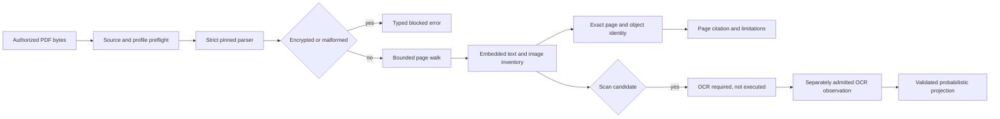

# PDF Extraction and Exact-Page Citations

## Scope

Sprint 60 introduces a bounded in-memory PDF read boundary. It accepts bytes and a canonical
workspace path from an already authorized caller, parses under explicit source, object, page,
stream, image, and text ceilings, and returns deterministic page records. It does not discover or
open files, request passwords, launch OCR, render pages, mutate a PDF, or persist a result.

The original artifact remains authoritative. Extracted text is evidence for search and citation,
not a fidelity-preserving replacement for the PDF.

## Parser Boundary

`lopdf 0.44.0` is pinned by exact Cargo version and registry checksum with default features
disabled. The complete transitive graph, licenses, checksums, and dependency edges remain in the
repository software bill of materials. The loader uses strict parsing and a per-stream decompressed
byte ceiling. Document-level ceilings apply before or immediately after parsing.

The admitted parser supplies extraction, basic metadata access, and page-object identities. It is
not a renderer, PDF generator, redaction verifier, or OCR engine. Those capability classes remain
unadmitted and cannot be inferred from the parser dependency.

## Page Identity

Each page identity binds:

- the exact source SHA-256;
- the one-based logical page number;
- the indirect-object number and generation; and
- a deterministic digest over those fields.

An embedded-text citation repeats the page identity, exact text digest, extraction method, and
confidence. It resolves to an exact page but not a bounding region. The reason code
`pdf.citation.region-unavailable` preserves that limitation without blocking page-level citation.
Region-aware provenance belongs to a later admitted extractor and cannot be guessed.

## Failure States

Encrypted documents reject even when the parser could authenticate an empty user password.
AgentMage does not accept, retain, or attempt a PDF password in this boundary. Malformed and
truncated documents return a content-free typed error. Stream or text overflows never return partial
best-effort text as verified evidence.

An image-only page with insufficient embedded text becomes `scanned_candidate`; a page without
text or observed images becomes `empty`; parser, decoding, or resource failures become
`extraction_limited`. Every blocking condition remains visible in the result and prevents an
`extraction_complete` claim.

## OCR Admission

OCR is a separate effectful operation. The Sprint 60 validator accepts only a caller-supplied
observation bound to an exact source and scan-candidate page plus a trusted-caller-verified package
admission containing exact package and model digests, version, license, and receipt digest. The
projection preserves confidence in basis points and labels the text `pdf.ocr.probabilistic`.

No OCR package or model is currently admitted. The validation contract therefore demonstrates the
authority and provenance boundary without claiming native OCR execution, cancellation, platform
support, or product integration.

## Platform Truth

Focused parser tests currently execute on Fedora x86-64. Fedora evidence does not establish Ubuntu,
Windows 11, or retained Apple Silicon macOS acceptance. No native PDF renderer, OCR package,
installed-product accessibility review, or independent native-boundary review is present. Sprint
60 remains blocked despite the locally passing extraction subset.
