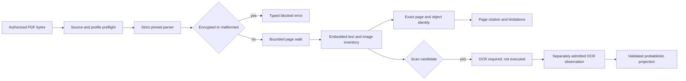

# PDF Extraction and Exact-Page Citations

## Shared source-artifact adapter

`PdfStructuredSourceExtractor` adapts already captured PDF bytes to the common
`StructuredSourceExtractor` boundary. It verifies the declared media type and complete source
digest, applies the caller's section and output ceilings, and emits one document root followed by
ordered page and line-like span sections. Every page section retains the exact PDF object/generation
identity and one-based logical page; child spans retain exact UTF-8 byte ranges and text digests.
The page record reports visible-character density over decoded content bytes and labels span order
only as unverified parser-emission order. It never promotes that observation to visual or semantic
reading-order certainty. Parser limitations become visible source warnings; an image-only page
remains incomplete and requires a separately admitted OCR observation.

The adapter acquires no path, network, process, decryption, or write authority. Cancellation before
or after parsing publishes no extraction. The existing inert artifact inspector gates publication:
JavaScript, launch, submission, remote-document or external-URI actions, embedded files, encryption,
and incomplete inspection quarantine the source without following or executing content. This source
milestone does not claim region geometry, reading-order certainty, table or column semantics, OCR
execution, runtime lifecycle integration, or installed-client support.

Internal destinations, form identities, and page-image objects remain inert structured sections
with exact source-object provenance. Forms retain no values, images retain no payload in the shared
projection, and actions retain no executable authority. Table/column interpretation and ligature
mapping are labeled unverified; damaged or unsupported structures quarantine instead of being
silently flattened into invented fidelity.

## Scope

Sprint 60 introduces a bounded in-memory PDF read boundary. It accepts bytes and a canonical
workspace path from an already authorized caller, parses under explicit source, object, page,
stream, image, and text ceilings, and returns deterministic page records. It does not discover or
open files, request passwords, launch OCR, render pages, mutate a PDF, or persist a result.

The original artifact remains authoritative. Extracted text is evidence for search and citation,
not a fidelity-preserving replacement for the PDF.

## Parser Boundary

`lopdf 0.44.0` is pinned by exact Cargo version and registry checksum with default features
disabled. The complete transitive graph, licenses, checksums, and dependency edges remain in the
repository software bill of materials. The loader uses strict parsing and a per-stream decompressed
byte ceiling. Document-level ceilings apply before or immediately after parsing.

The admitted parser supplies extraction, basic metadata access, and page-object identities. It is
not a renderer, PDF generator, redaction verifier, or OCR engine. Those capability classes remain
unadmitted and cannot be inferred from the parser dependency.

## Page Identity

Each page identity binds:

- the exact source SHA-256;
- the one-based logical page number;
- the indirect-object number and generation; and
- a deterministic digest over those fields.

An embedded-text citation repeats the page identity, exact text digest, extraction method, and
confidence. It resolves to an exact page but not a bounding region. The reason code
`pdf.citation.region-unavailable` preserves that limitation without blocking page-level citation.
Region-aware provenance belongs to a later admitted extractor and cannot be guessed.

Each non-empty parser-emitted line becomes a source-bound span with one-based emission ordinal,
inclusive/exclusive UTF-8 offsets into the exact page text, and its own digest. The separate
`pdf.page.reading-order-unverified` limitation makes clear that these spans are not evidence of
layout, columns, tables, ligatures, or semantic reading order.

## Failure States

Encrypted documents reject even when the parser could authenticate an empty user password.
AgentMage does not accept, retain, or attempt a PDF password in this boundary. Malformed and
truncated documents return a content-free typed error. Stream or text overflows never return partial
best-effort text as verified evidence.

An image-only page with insufficient embedded text becomes `scanned_candidate`; a page without
text or observed images becomes `empty`; parser, decoding, or resource failures become
`extraction_limited`. Every blocking condition remains visible in the result and prevents an
`extraction_complete` claim.

## OCR Admission

OCR is a separate effectful operation. The Sprint 60 validator accepts only a caller-supplied
observation bound to an exact source and scan-candidate page plus a trusted-caller-verified package
admission containing exact package and model digests, version, license, and receipt digest. The
projection preserves confidence in basis points and labels the text `pdf.ocr.probabilistic`.

`PdfOcrEngine` is an implementation-free optional boundary: this crate cannot launch a process.
Per-page eligibility admits only an image-bearing scan candidate without embedded text. Any future
observation must bind the preprocessing profile, admitted language, contiguous UTF-8 ranges, exact
page-image rectangles, and aggregate and per-region confidence thresholds before it can become a
proposal. Region provenance remains separate from parser-emitted text spans.

No OCR package or model is currently admitted. The validation contract therefore demonstrates the
authority and provenance boundary without claiming native OCR execution, cancellation, platform
support, or product integration.

## Platform Truth

Focused parser tests currently execute on Fedora x86-64. Fedora evidence does not establish Ubuntu,
Windows 11, or retained Apple Silicon macOS acceptance. No native PDF renderer, OCR package,
installed-product accessibility review, or independent native-boundary review is present. Sprint
60 remains blocked despite the locally passing extraction subset.
