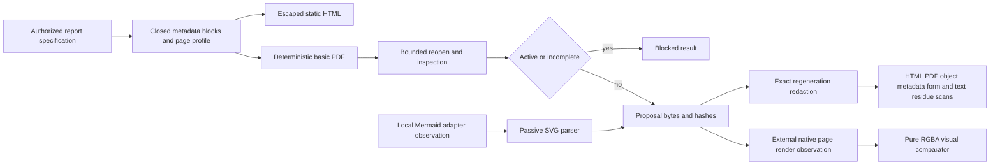

# PDF Generation, Redaction, and Visual Evidence

## Scope

Sprint 61 adds a closed, local proposal path for deterministic basic reports. It inspects metadata,
links, forms, images, encryption, and active structures; emits escaped static HTML and a basic PDF;
reopens generated bytes; supports full-regeneration redaction for its own exact report
specifications; validates offline Mermaid SVG observations; and compares caller-supplied rendered
pages. It does not discover files, overwrite an artifact, follow a link, execute document content,
launch a renderer, or claim arbitrary-PDF redaction.

## Inspection Boundary

The pinned `lopdf 0.44.0` parser inventories standard metadata, custom metadata key names, links,
actions, forms, image objects, and encryption state under the Sprint 60 extraction profile. Link
targets remain inert. JavaScript, launch, remote-document, submission, embedded-file, automatic,
or structurally limited content prevents safe reuse. Form values are not retained in the inspection
record. Encrypted documents receive a blocked inventory without password handling or extraction.

## Generation Boundary

The generator accepts only headings, paragraphs, list items, table rows, internal page links,
single-line text form fields, and spacing. It uses fixed page geometry, fixed caller metadata, a
base-14 Helvetica profile, and no current clock. The ASCII-only font limit and required native
visual review are explicit. Static HTML escapes all caller content and declares a deny-by-default
content security policy with no remote fonts, styles, scripts, or assets. Generated PDF bytes must
reopen as complete, unencrypted, and safe before they are returned.

The Markdown adapter consumes the already parsed Markdown structure. Raw HTML and unsupported
constructs remain escaped inert text with visible fidelity limits. It does not reinterpret source
instructions or fetch linked content.

## Redaction Boundary

Secure redaction is limited to a report that can be reproduced byte-for-byte from the exact
AgentMage report specification. The redactor changes the specification and regenerates the entire
PDF; it never paints over content or appends an incremental update. It then scans:

- escaped HTML bytes;
- serialized PDF bytes;
- parsed names, strings, dictionaries, arrays, and decoded streams;
- reopened metadata and form inventory;
- reopened extracted text; and
- cross-reference and end-of-file markers.

The receipt retains target digests rather than raw target text. Any residue fails closed. Native
visual review remains required because byte and object absence alone cannot establish visual
quality. Arbitrary input PDFs, partial overlays, and unsupported identity redaction are rejected.

## Rendering and Accessibility Boundary

The core comparator receives decoded RGBA pages and observations from a separately authorized
renderer adapter. Renderer executable, version, font manifest, platform, package, profile, and page
pixels are hash-bound. It computes exact pixel deltas and combines them with pagination, clipping,
overlap, font, table, image, redaction, reading-order, alternative-text, and form-accessibility
observations. Synthetic fixtures test comparator semantics only and always require human review.

No native PDF rasterizer is admitted yet, so Fedora, Ubuntu, Windows 11, and retained Apple Silicon
macOS rendering evidence remains absent.

## Offline Mermaid Boundary

The repository's pinned Mermaid CLI remains a development-only documentation dependency. The Rust
validator accepts a caller-supplied observation only when package, version, MIT license, executable,
lockfile, source, SVG, zero exit status, network denial, and remote-asset absence are exact. A
structured XML walk rejects document types, scripts, active foreign content, event handlers, and
remote or executable references. This is not yet a product renderer adapter and does not close the
offline Mermaid task by itself.

## Platform Truth

The deterministic core and synthetic comparison fixtures currently execute on Fedora x86-64.
There is no admitted native renderer, installed-product accessibility result, independent native
review, merge/split workflow, approved OCR execution, or manual fuzz result. Sprint 61 therefore
remains blocked even when its local contracts pass.
