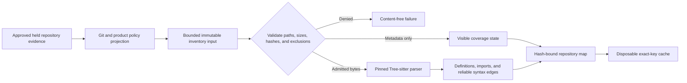

# Pinned Repository Map

| Field | Value |
|---|---|
| Status | Platform-neutral map, coverage, resolution, and renderer core implemented; production host and persistence integration remain open |
| Requirement | `AM-REP-001` |
| Acceptance | `AT-REP-001` |
| Task gate | Sprint 18 |

## Boundary

The repository-map capability is a pure, bounded consumer of immutable evidence. It has no filesystem, Git-process, credential, persistence-path, or network authority. An approved host must discover the repository, apply Git and product policy, hold each admitted file object, and supply exact metadata and optional authorized bytes. The capability validates that projection, parses supported content, and returns a hash-bound derivative map.

Excluded, generated, vendored, and Git-ignored paths must arrive without content. A supported path whose bytes were not authorized is `content_not_read`; it is never mislabeled as an unsupported language. Regular files, symbolic links, and Gitlinks have distinct closed object kinds. Symbolic links and Gitlinks remain visible `Unknown/Blocked` inventory facts, but are never followed, entered, parsed, or lexically searched. Unsupported, binary, oversized, failed, syntax-error, and truncated states remain visible rather than disappearing from coverage.

## Pinned Grammar Set

The v0.1 set is deliberately closed:

| Language or dialect | Grammar crate | Exact version |
|---|---|---|
| Rust | `tree-sitter-rust` | `0.24.2` |
| Python | `tree-sitter-python` | `0.25.0` |
| TypeScript | `tree-sitter-typescript` | `0.23.2` |
| TSX | `tree-sitter-typescript` | `0.23.2` |
| JavaScript | `tree-sitter-javascript` | `0.25.0` |
| Swift | `tree-sitter-swift` | `0.7.3` |

All use the exact `tree-sitter` `0.26.12` runtime locked by Cargo. Each runtime descriptor binds language, crate, version, upstream repository, parser version, observed grammar ABI, packaged `node-types.json` digest, and complete descriptor digest. The complete ordered set has its own digest. A mutable family name cannot select or substitute a parser.

## Structural Facts

The parser accepts UTF-8 sources up to 4 MiB and retains at most 10,000 stable items. It records modules, functions, classes, structs, enums, interfaces or protocols, traits, type aliases, constants, and exact import declarations with byte and line ranges plus syntax-node hashes.

The only v0.1 relationship is `declares_import`: an exact parsed module contains an exact import declaration. It is emitted only when the corresponding import item exists with the same range and hash. The map does not guess that an import resolves to another file, package, symbol, or runtime dependency.

## Coverage Ledger

Every map carries counts for discovered, read, parsed, searched, skipped, excluded, unsupported, failed, truncated, and uncertain files plus discovered bytes and all fixed file, byte, parse, and structural-item budgets. A file is parsed when a pinned parser returns a tree; syntax-error and truncated trees remain parsed but separately uncertain. A parser failure means that no tree returned. Exclusions are visible but do not count as uncertainty because their omission is a deterministic policy outcome.

Base-map search count is zero. A renderer separately reports files searched, exact lexical matches, files rendered, budget omissions, requested context units, and consumed upper-bound units. These ledgers may overlap by design: for example, a truncated file is both parsed and uncertain.

## Source Resolution

Every structural item resolves to:

- canonical workspace-relative path and complete content hash;
- exact byte, line, and column range plus syntax-node hash;
- closed structural kind and bounded control-safe name;
- exact grammar descriptor hash and parser runtime version; and
- repository, worktree, branch or detached state, and commit identity.

The complete resolution is hash-bound. Verification searches the exact current map for the corresponding file and parser item and rejects any path, content, range, syntax, parser, repository, worktree, branch, or commit drift.

## Context Rendering

The deterministic renderer prioritizes exact named paths or parser-backed symbols, conventional entry points, direct named-path neighborhoods, tests, configuration, and then remaining visible inventory. Ties are canonical-path ordered. It accepts 512 through 262,144 conservative context units. Each canonical entry payload UTF-8 byte consumes one unit, providing a tokenizer-independent upper bound rather than a model-specific estimate.

Unsupported, syntax-error, truncated, or parser-failed files can receive exact authorized fallback bytes only when the bytes match the current mapped path, size, content hash, and Git identity. The renderer performs an exact non-executing lexical search with at most 32 occurrences per file. It retains only the escaped matched bytes, exact range, query hash, source hash, Git identity, and `untrusted: true`; surrounding instructions are not imported. Unsupported or incomplete structure always retains an `unknown_blocked` limitation. Binary, unread, and over-limit sources remain inventory-only and are not silently searched.

A retained context verifies only by deterministic re-render from the exact current map, request, and fallback source set. This prevents a caller from forging unresolved targets, search counts, budget omissions, priority, lexical matches, or truncation and merely recomputing an outer digest.

## Cache And Invalidation

The implemented cache is an in-memory SQLite derivative keyed by workspace-relative path, content hash, Git identity, grammar identity, parser version, and policy revision. Repository, worktree, branch, commit, and policy identities are retained by each file record so insertion recomputes and enforces the only exact key. Reads require an exact complete key and recompute nested record integrity. `invalidate_except` atomically removes records absent from the current complete key set before later retrieval or citation. Multi-entry tests change each validity dimension independently and prove that the changed record is removed while an unrelated record remains byte-identical and retrievable.

This cache is intentionally disposable. It is not canonical operational state and has no path-opening authority. Integration with the encrypted operational store, persistent migrations, host freshness orchestration, and citation invalidation remains open and blocks Sprint 18 completion.

## Verification Truth

Local tests prove deterministic ordering, exact grammar identity, parser extraction across all six language or dialect entries, reliable import relationships, exclusion without content, non-following symlink and Gitlink visibility, complete coverage outcomes, unsupported and unread visibility, malformed and hostile encoding behavior, size and item ceilings, duplicate-path and duplicate-symbol handling, source-injection isolation, foreign-workspace rejection, exact source resolution, fixed priority tiers, conservative context truncation, golden map and context identities, forged-hash rejection, exact cache-key misses, selective invalidation, corruption rejection, and transactional capacity rollback.

A test-only disposable Git repository verifies one real ignore rule and recursive-link exclusion, then snapshots every path, byte, mode, symlink target, Git index, ref, and object before and after two complete maps. The snapshots and maps are identical. The fixture's setup effects live only in the terminal Rust test module and are absent from product-effect surfaces.

Production activation remains blocked on the packaged repository worker and Git-aware projection, real `.gitignore` and policy collection through held objects, encrypted persistent cache integration, full host cancellation and dependency-failure cases, native platform evidence, the deferred manual parser fuzz campaign, and independent review. Passing pure-core tests cannot substitute for those controls.
