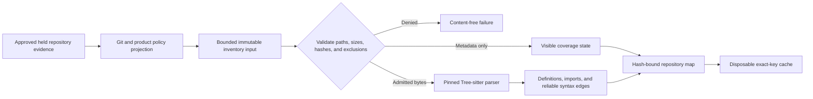

# Pinned Repository Map

| Field | Value |
|---|---|
| Status | Platform-neutral repository-map core implemented; production host and persistence integration remain open |
| Requirement | `AM-REP-001` |
| Acceptance | `AT-REP-001` |
| Task gate | Sprint 18 |

## Boundary

The repository-map capability is a pure, bounded consumer of immutable evidence. It has no filesystem, Git-process, credential, persistence-path, or network authority. An approved host must discover the repository, apply Git and product policy, hold each admitted file object, and supply exact metadata and optional authorized bytes. The capability validates that projection, parses supported content, and returns a hash-bound derivative map.

Excluded, generated, vendored, and Git-ignored paths must arrive without content. A supported path whose bytes were not authorized is `content_not_read`; it is never mislabeled as an unsupported language. Unsupported, binary, oversized, failed, syntax-error, and truncated states remain visible rather than disappearing from coverage.

## Pinned Grammar Set

The v0.1 set is deliberately closed:

| Language or dialect | Grammar crate | Exact version |
|---|---|---|
| Rust | `tree-sitter-rust` | `0.24.2` |
| Python | `tree-sitter-python` | `0.25.0` |
| TypeScript | `tree-sitter-typescript` | `0.23.2` |
| TSX | `tree-sitter-typescript` | `0.23.2` |
| JavaScript | `tree-sitter-javascript` | `0.25.0` |
| Swift | `tree-sitter-swift` | `0.7.3` |

All use the exact `tree-sitter` `0.26.12` runtime locked by Cargo. Each runtime descriptor binds language, crate, version, upstream repository, parser version, observed grammar ABI, packaged `node-types.json` digest, and complete descriptor digest. The complete ordered set has its own digest. A mutable family name cannot select or substitute a parser.

## Structural Facts

The parser accepts UTF-8 sources up to 4 MiB and retains at most 10,000 stable items. It records modules, functions, classes, structs, enums, interfaces or protocols, traits, type aliases, constants, and exact import declarations with byte and line ranges plus syntax-node hashes.

The only v0.1 relationship is `declares_import`: an exact parsed module contains an exact import declaration. It is emitted only when the corresponding import item exists with the same range and hash. The map does not guess that an import resolves to another file, package, symbol, or runtime dependency. Source resolution and broader coverage accounting belong to Sprint 19.

## Cache And Invalidation

The implemented cache is an in-memory SQLite derivative keyed by workspace-relative path, content hash, Git identity, grammar identity, parser version, and policy revision. Reads require an exact complete key and recompute nested record integrity. `invalidate_except` atomically removes records absent from the current complete key set before later retrieval or citation.

This cache is intentionally disposable. It is not canonical operational state and has no path-opening authority. Integration with the encrypted operational store, persistent migrations, host freshness orchestration, and citation invalidation remains open and blocks Sprint 18 completion.

## Verification Truth

Local tests prove deterministic ordering, exact grammar identity, parser extraction across all six language or dialect entries, reliable import relationships, exclusion without content, unsupported and unread visibility, malformed source behavior, size ceilings, duplicate-path rejection, forged-hash rejection, exact cache-key misses, invalidation, corruption rejection, and transactional capacity rollback.

Production activation remains blocked on the packaged repository worker and Git-aware projection, real `.gitignore` and policy collection through held objects, encrypted persistent cache integration, full host cancellation and dependency-failure cases, native platform evidence, the deferred manual parser fuzz campaign, and independent review. Passing pure-core tests cannot substitute for those controls.
