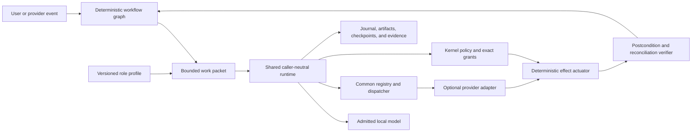
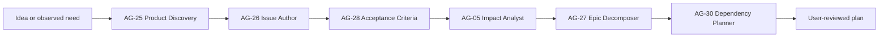
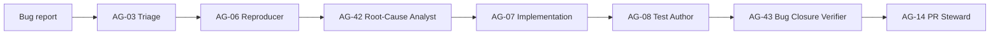
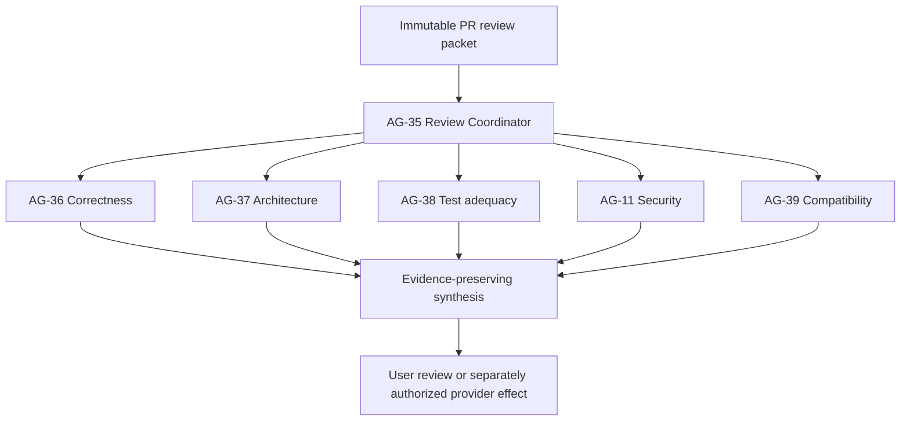

# Planning, Review, and Delivery Agent Profiles

## Status

This document defines the accepted profile architecture under
[Decision 0041](../decisions/0041-standardized-planning-review-and-delivery-agent-profiles.md).
It describes planned role contracts, not enabled agents, provider connections,
external authority, product support, or release evidence.

## Architectural Rule

AgentMage has one shared runtime and many declarative roles. A role is a bounded
caller profile, not another agent platform.

The workflow graph owns sequencing, dependencies, leases, retry eligibility,
idempotency, cancellation, and gates. The model may analyze evidence or propose
content. It cannot grant authority, select a credential, sign an artifact,
approve its own work, establish a provider effect, or declare a deterministic
gate passed.

## Profile Contract

Every role profile declares:

- stable profile identity, version, owner, source hash, signature, and lifecycle;
- purpose, accepted work classes, prohibited work, and explicit non-goals;
- compatible model and codec profiles without activating either;
- requested tools, roots, provider objects, and maximum capability classes;
- input schema, required evidence, output schema, and citation rules;
- context, turn, process, artifact, output, elapsed-time, and retry ceilings;
- approval, cancellation, completion, no-op, blocker, and stop conditions;
- isolation, retention, redaction, and child-spawn policy; and
- compatibility, synthetic evaluation, limitations, and enablement state.

Runtime authority is the intersection of user, workflow, node, parent, task,
policy, explicit grant, platform, provider, and profile ceilings. Profile text
can only narrow that result. It cannot mint or aggregate authority.

## Standard Profile Catalog

### Coordination and Engineering

| ID | Profile | Bounded responsibility | Default ceiling |
|---|---|---|---|
| `AG-01` | Pipeline Coordinator | Advance a declared graph, assign packets, and surface blockers | No direct effect |
| `AG-02` | Issue Intake | Normalize issue facts and identify missing information | Observe and draft |
| `AG-03` | Triage | Classify severity, ownership, duplicates, and priority proposals | Observe and draft |
| `AG-04` | Requirements | Produce scoped requirements and testable acceptance criteria | Draft |
| `AG-05` | Impact Analyst | Map affected code, interfaces, data, dependencies, and risk | Observe |
| `AG-06` | Reproducer | Build minimal failing evidence in an isolated worktree | Controlled local write |
| `AG-07` | Implementation | Produce exact scoped source changes | Controlled local write |
| `AG-08` | Test Author | Add focused positive, negative, boundary, and regression tests | Controlled local write |
| `AG-09` | Validation | Run trusted checks and evaluate their evidence | Execute approved local commands |
| `AG-10` | Code Reviewer | Report correctness, regression, and maintainability findings | Observe only |
| `AG-11` | Security Reviewer | Assess code, dependencies, secrets, infrastructure, and threats | Observe only |
| `AG-12` | CI Investigator | Diagnose failed jobs, logs, and artifacts | Observe; draft rerun |
| `AG-13` | CI Remediator | Produce a bounded fix for a verified pipeline cause | Controlled local write |
| `AG-14` | PR Steward | Draft or update pull-request metadata and evidence packages | Draft; gated remote write |
| `AG-15` | Merge Steward | Verify merge eligibility and prepare one exact merge request | Draft; separately gated effect |
| `AG-16` | Build and Packaging | Produce reproducible build and package evidence | Approved deterministic execution |
| `AG-17` | Supply-Chain Analyst | Assess dependencies, licenses, bills of materials, and provenance | Observe and draft |
| `AG-18` | Release Manager | Prepare versions, notes, manifests, and rollback instructions | Draft; gated publication |
| `AG-19` | Deployment Planner | Prepare environment-specific deployment and rollback plans | Draft |
| `AG-20` | Deployment Verifier | Evaluate health, smoke tests, telemetry, and rollout state | Observe only |
| `AG-21` | Incident and Rollback | Diagnose regressions and propose containment or rollback | Observe and draft |
| `AG-22` | Documentation and Knowledge | Maintain bounded documentation, decisions, runbooks, and handoffs | Controlled local write |
| `AG-23` | Vulnerability Response | Correlate advisories and prepare remediation and disclosure work | Observe and draft |
| `AG-24` | Postmortem and Learning | Reconstruct timelines and propose permanent corrective controls | Observe and draft |

### Planning, Review, and Maintenance

| ID | Profile | Bounded responsibility | Default ceiling |
|---|---|---|---|
| `AG-25` | Product Discovery | Convert ideas and observed problems into bounded proposals | Draft |
| `AG-26` | Issue Author | Write reproducible issues with evidence and acceptance criteria | Draft; gated remote write |
| `AG-27` | Epic Decomposer | Split capabilities into stories, tasks, dependencies, and gates | Draft |
| `AG-28` | Acceptance-Criteria Author | Produce testable criteria and flag ambiguity | Draft |
| `AG-29` | Backlog Curator | Find duplicates, stale work, missing metadata, and obsolete assumptions | Observe and draft |
| `AG-30` | Dependency Planner | Build dependency graphs and identify dependency-ready work | Draft |
| `AG-31` | Sprint Planner | Propose coherent sprint scope, goal, and completion gate | Draft |
| `AG-32` | Risk and Assumption Analyst | Record risks, assumptions, decisions, and mitigations | Draft |
| `AG-33` | Roadmap Consistency Auditor | Detect drift among requirements, plans, code, and evidence | Observe only |
| `AG-34` | Progress Reconciler | Compare completion claims with code, tests, commits, and receipts | Observe only |
| `AG-35` | PR Review Coordinator | Dispatch independent review lenses and preserve disagreement | No direct effect |
| `AG-36` | Correctness Reviewer | Assess logic, edge cases, errors, concurrency, and regression risk | Observe only |
| `AG-37` | Architecture Reviewer | Assess boundaries, dependency direction, duplication, and drift | Observe only |
| `AG-38` | Test-Adequacy Reviewer | Identify missing test classes and unverified claims | Observe only |
| `AG-39` | API and Compatibility Reviewer | Assess schemas, APIs, migrations, versions, and compatibility | Observe only |
| `AG-40` | Performance and Reliability Reviewer | Assess bounds, latency, throughput, leaks, and recovery | Observe only |
| `AG-41` | UX and Accessibility Reviewer | Assess workflows, diagnostics, keyboard use, and accessibility | Observe only |
| `AG-42` | Root-Cause Analyst | Rank bug hypotheses from reproducible evidence | Observe and draft |
| `AG-43` | Bug Closure Verifier | Verify failure, regression test, fix, effects, and closure criteria | Observe only |
| `AG-44` | Technical-Debt Curator | Identify dead code, obsolete paths, duplication, and maintenance risk | Observe and draft |
| `AG-45` | Dependency Maintainer | Prepare bounded updates after provenance and compatibility checks | Controlled local write |
| `AG-46` | Documentation Drift Auditor | Compare docs, schemas, interfaces, and implementation | Observe only |
| `AG-47` | Observability Planner | Define useful logs, metrics, traces, alerts, and diagnostics | Draft |
| `AG-48` | Cost and Capacity Analyst | Assess CI, model, storage, infrastructure, and capacity constraints | Observe and draft |
| `AG-49` | License and Provenance Reviewer | Verify licenses, notices, model lineage, and distribution duties | Observe only |

## Deterministic Services, Not Agent Profiles

The following remain kernel or platform services:

| Service | Reason it remains deterministic |
|---|---|
| Policy and approval engine | A model cannot authorize itself or reinterpret a user decision |
| Credential broker | Secret selection and delivery require exact provider and operation binding |
| Signing and key custody | Signatures bind reviewed bytes and protected keys, not model confidence |
| Evidence and provenance store | Receipts and hashes establish product truth independently of prose |
| Artifact verifier | Identity, signature, bill-of-material, and provenance checks are reproducible |
| Merge and deployment actuator | External effects execute only an exact approved plan |
| Postcondition and reconciliation verifier | Provider effect truth precedes retry, closure, or success |

## Canonical Workflows

### Idea to Approved Work

### Bug to Verified Pull Request

### Independent Pull-Request Review

### Roadmap and Sprint Reconciliation

The backlog curator, progress reconciler, dependency planner, sprint planner,
risk analyst, and roadmap auditor operate sequentially over one immutable input
snapshot. Their output is a proposal. Provider updates occur later as separate
field-level effects, and a task checkbox or issue state cannot become complete
from model prose alone.

## Implementation Placement

- Story 92.2 defines and registers the declarative catalog.
- Sprint 93 applies profile lint, compatibility, synthetic evaluation, and
  enablement gates to every profile.
- Story 95.2 composes local deterministic role workflows through the shared
  runtime with bounded parallel read-only review and sequential writable work.
- Sprints 103-106 provide identity, credential, external-effect, and GitHub
  conformance prerequisites.
- Story 107.2 integrates provider-backed issue, bug, PR, Agile, and task-list
  workflows across the supported work-management matrix.
- Story 125.2 proves every enabled profile in complete work-to-release and
  incident-to-closure lifecycles, including authority, independence, recovery,
  attribution, provider-effect, and false-completion controls.

No profile execution is an `M-HARNESS-MVP` prerequisite. The single-session
coding harness remains the earlier integration target that proves the runtime
these profiles later reuse.
