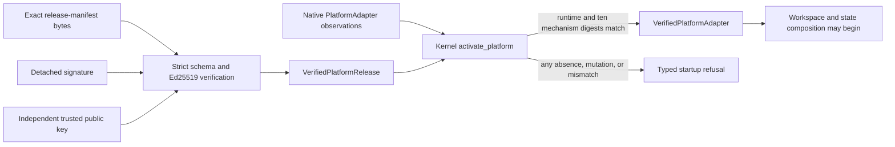
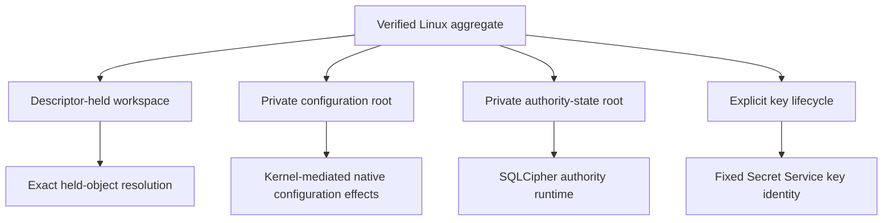

# Platform Adapter Contract

## Status and Scope

This document describes platform-adapter API version 1 and the Phase 8 Linux
candidate governed by accepted Decision 0017. Shared release verification and
the Fedora/Ubuntu aggregate adapter are implemented. The repository does not
contain a production signing key, signed release manifest, supported package,
or integrated product workflow. Synthetic manifests used by tests make no
release or platform-support claim.

macOS field requirements remain frozen but unimplemented. Windows remains a
later independent platform increment. Evidence from one platform cannot satisfy
another platform's gate.

## Independent Trust Boundary

The expected release identity and native observations enter from different
boundaries. A native adapter cannot select or echo its own expected manifest.

`verify_platform_release` accepts only bounded schema-version-2 JSON with the
exact `platform-release-manifest` record type, `signed-release` status, current
adapter API, supported Linux family and architecture, complete runtime identity,
and one ordered nonzero mechanism digest for every required capability. The
detached Ed25519 signature covers a versioned domain separator plus the exact
manifest bytes.

`PlatformAdapter` reports only observed runtime and capability evidence.
`activate_platform` compares those observations with `VerifiedPlatformRelease`.
There is no weaker activation form, omitted capability, unsigned fallback, or
adapter-supplied expected identity.

## Capability Closure

| Capability | Required pre-workspace result |
| --- | --- |
| Workspace authorization | Exact aggregate and descriptor-safe mechanism verified |
| Secure path resolution | Descriptor-relative confinement identity verified |
| Tool confinement | Fresh worker-isolation identity verified |
| Secret storage | Fixed native Secret Service mechanism verified |
| Process limits | Enforced native resource-control identity verified |
| Local inference | Approved local runtime identity verified |
| Model installation | Separate verified installer identity verified |
| Packaging | Exact installed package identity verified |
| Updates | Signed update and rollback mechanism identity verified |
| Network isolation | Offline enforcement mechanism identity verified |

An observation is bound to one capability and platform family and contains one
mechanism digest. `Unavailable` and `Invalid` are distinct typed failures;
neither reduces the capability set. The expected mechanism digest comes only
from the independently verified release.

## Linux Aggregate

`LinuxPlatformAdapter::discover` observes Fedora or Ubuntu, x86-64 or AArch64,
the operating-system build, fixed toolchain identity, Visual Studio Code build,
current AgentMage executable, and fixed native mechanisms. Missing mechanisms
are `Unavailable`; present but unsafe or changed mechanisms are `Invalid`.

Construction conveys no workspace or state authority. Production workspace
selection, path resolution, configuration opening, authority-state opening, and
initial key provisioning require a `VerifiedPlatformAdapter<LinuxPlatformAdapter>`.
Workspace selection is the only production constructor for a Linux authorized
workspace and opens the selected root without following symbolic links.

The current development executable and absent package-time helper paths do not
constitute a signed production installation. Production discovery therefore
fails closed at activation unless an independently signed manifest exactly
matches the installed runtime and all ten mechanisms.

## Runtime Matching

Startup compares fields in fixed order before workspace access:

1. Adapter API, platform family, and processor architecture.
2. Operating-system build, toolchain, Visual Studio Code, and package digests.
3. Every required capability in the closed API order.
4. Capability family, status, and independently expected mechanism digest.

Wrong capability order, foreign platform evidence, zero mechanisms, changed
runtime fields, a substituted signer or signature, and an adapter that reports
arbitrary `Verified` evidence all fail closed with content-free errors.

## Dependency and Evidence Limits

Maintainer signing dependencies, end-user runtime dependencies, and excluded
build-time dependencies remain disjoint. Signing secrets, tokens, certificates,
passphrases, private paths, command output, environment values, and credentials
never enter manifests or observations.

Current tests prove strict signed-manifest parsing, signature and signer
mutation, runtime and mechanism comparison, complete capability closure,
Fedora/Ubuntu non-portability, and aggregate constructor gating. They do not
prove a supported package, Ubuntu-native execution, model runtime, updater,
installer, Visual Studio Code workflow, macOS, or Windows.
