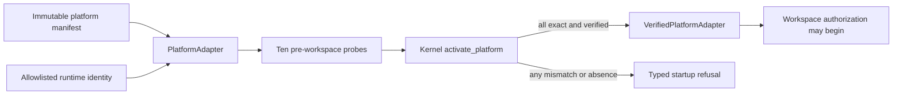

# Platform Adapter Contract

## Status and Scope

This document freezes platform-adapter API version 1 and the pre-release
manifest fields required before product logic may depend on a platform. The
shared Rust contract and fail-closed kernel selector are implemented. Fedora and
Ubuntu manifest fixtures are deterministic public examples. They are not signed
packages, do not establish platform support, and make no release claim.

macOS field requirements are frozen here for compatibility, but macOS adapter,
package, signing, entitlement, and execution evidence remain blocked. Linux
results cannot satisfy those gates.

## Adapter Boundary

Operating-system decisions belong behind `PlatformAdapter`. Product code passes
one adapter to `activate_platform` and receives a `VerifiedPlatformAdapter` only
after exact runtime identity and every required capability pass. There is no
weaker adapter, capability omission, or automatic fallback.

The shared API owns these exact domains:

| Capability | Required pre-workspace result |
| --- | --- |
| Workspace authorization | User-mediated mechanism identity verified |
| Secure path resolution | Descriptor-relative confinement identity verified |
| Tool confinement | Fresh worker isolation identity verified |
| Secret storage | Operating-system secret store identity verified |
| Process limits | Enforced resource-control identity verified |
| Local inference | Approved local runtime identity verified |
| Model installation | Separate verified installer identity verified |
| Packaging | Exact installed package digest verified |
| Updates | Signed update and rollback mechanism identity verified |
| Network isolation | Offline enforcement mechanism identity verified |

Each observation is bound to one capability, platform family, immutable manifest
digest, and mechanism digest. It contains no path, command output, hostname,
username, environment value, credential, or native error text.

## Runtime Matching

Startup compares fields in a fixed order and stops before capability probes when
any field differs:

1. Adapter API version.
2. Platform family.
3. Processor architecture.
4. Normalized operating-system build digest.
5. Product toolchain digest.
6. Supported Visual Studio Code build digest.
7. Installed AgentMage package digest.

Capability probes then run in the closed API order. A probe for the wrong
capability, platform, or manifest is foreign evidence and cannot activate the
adapter. `Unavailable` and `Invalid` are distinct typed failures; neither causes
fallback.

## Manifest Field Contract

Every platform release manifest contains:

- Schema, record, manifest, status, and adapter API identity.
- Exact platform family, architecture, supported distribution/build set, and
  normalized operating-system build digest.
- Exact build toolchain, supported Visual Studio Code build, package format, and
  package digest.
- One mechanism identity and digest for every required platform capability.
- Disjoint maintainer-release, end-user-runtime, and excluded-end-user
  dependency classes.
- Explicit assertions that credentials, private environment values, and
  substituted macOS evidence are absent.
- An explicit release-claim state.

The macOS variant additionally requires minimum and tested macOS builds, Apple
SDK and Swift versions, Team ID, host/bridge/helper/inference bundle IDs, App
Group ID, designated requirements, complete entitlement sets, every helper
digest, arm64 package digest, and supported Visual Studio Code build. Those
fields must contain release-derived values; placeholders cannot pass a release
gate.

The Fedora and Ubuntu variants additionally require the supported distribution
versions plus identities for Bubblewrap/seccomp, Secret Service, cgroup limits,
descriptor-safe paths, native inference, package verification, update/rollback,
and network isolation. Docker Model Runner remains a separate compatibility
adapter and cannot replace the native Linux reference identity.

## Dependency Separation

| Class | May be present in release environment | May be required from end user | May enter package or diagnostics |
| --- | --- | --- | --- |
| Maintainer build and signing tools | Yes | No | Identity only, never credentials |
| End-user runtime dependencies | Yes | Yes, when documented | Name/version/digest only |
| Compilers and package build tools | Yes | No | No executable dependency |
| Signing/notarization credentials | Isolated release environment only | No | Never |

The fixture manifests list these classes independently and require them to be
disjoint where their meaning conflicts. A signing identity name may be recorded
for a fixture; signing keys, tokens, certificates, passphrases, environment
values, and private paths may never be recorded.

## Evidence Limits

Current unit tests prove shared identity comparison, complete capability closure,
wrong-capability and foreign-evidence rejection, and refusal for every absent or
invalid capability. Fedora and Ubuntu native mechanism execution, packaging, and
clean-environment proof belong to later Linux topology and release work. macOS
implementation and execution remain blocked.
