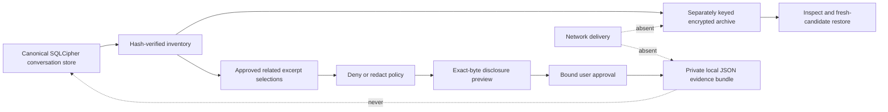
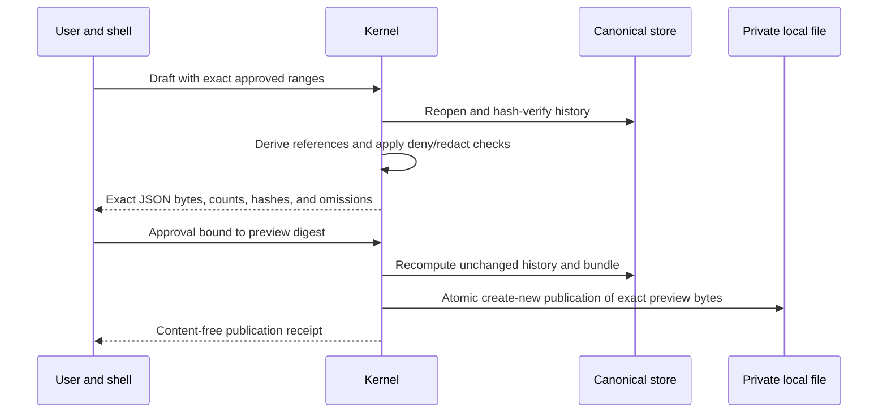

# Private Archives and Evidence Bundles

## Purpose

Sprint 33 separates two different portability needs. A private archive is a complete SQLCipher
snapshot intended for later local inspection or fresh-candidate recovery. An evidence bundle is a
small, non-executable JSON derivative containing only explicitly reviewed claims, methods,
constraints, references, and source excerpts. Neither artifact becomes operational authority.

## Encrypted Private Archives

`ConversationArchiveRequest` names the exact sorted conversation identities reviewed for the
snapshot. Creation recomputes every canonical conversation, turn, and compaction through the
hash-verifying conversation API before calling the existing SQLCipher online-backup boundary. A
stale identity list fails before a destination is created.

The content-free manifest binds the archive identity and revision to:

- the exact included conversation identities and counts;
- immutable turn and compaction counts;
- a digest of the complete verified source inventory;
- SQLCipher schema and canonical generation;
- encrypted file digest and byte count; and
- a visible retention policy and manifest digest.

Archive inspection first requires strict-local storage, a private regular file, unchanged bytes,
and the separately scoped key. It then reopens SQLCipher and recomputes the complete conversation
inventory. Restore always writes to a new separately keyed candidate and verifies the restored
inventory; it never replaces the live store.

Retention changes are compare-and-swap manifest revisions. A user hold or future deletion time
blocks deletion. Deletion requires an unchanged file and manifest, an exact preview, and explicit
approval bound to that preview. The receipt claims file absence and key-independent ciphertext
removal only; it does not claim physical media overwrite.

## Portable Evidence Bundles

An evidence-bundle draft binds one exact conversation history, disclosure policy, redaction
policy, model manifest, claims and closed evidence states, methods, constraints, exclusions, and
ordered source-range selections. Citation, receipt, and source-hash sets are derived from selected
canonical turns rather than accepted from model output.

Every source range carries explicit `user_approved` and `related` decisions. Included ranges must
be valid UTF-8 boundaries, within fixed byte limits, non-restricted, non-system content, and clear
of the shared deterministic secret scanner. Redacted ranges emit only `[REDACTED]`, a source-text
digest, byte range, role, sensitivity, and stable redaction codes. System turns are never selectable,
including as redacted metadata, so hidden prompt identities and hashes cannot enter the bundle.

Publication requires strict-local storage, an unexpired unchanged preview, explicit confirmation,
and an unoccupied destination. The file is mode `0600` and published with create-new semantics.
The bundle declares `executable`, `startup_authority`, and `external_delivery_attempted` as false.
There is no bundle-import path and no network worker.

## Current Recovery Boundary

The local implementation verifies SQLCipher archive corruption, wrong keys, stale inventories,
fresh restore, retention holds, approval-bound deletion, occupied destinations, stale source
history, and exact evidence publication. `S-027-RT01` runs each archive, branch, export, deletion,
and restore operation in a subprocess stopped immediately before or after the effect boundary.
The parent then reopens encrypted canonical state and accepts only the complete old or complete new
state. The same matrix refuses a simultaneous writer while the recovered store is held. This is
local source-level evidence; installed shell integration and independent review remain separate
Sprint 33 blockers.

Conversation search also exposes closed evidence-reference filters for unreferenced, cited,
receipted, checkpointed, and compacted turns. An exact ancestor filter walks only verified parent
identities with cycle and traversal bounds. Search hits return stable matching turn identities so a
caller can reopen the canonical messages instead of treating snippets as authority.
