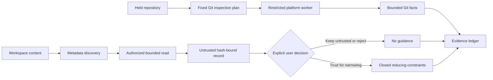

# Read-Only Git and Instruction Trust

| Field | Value |
|---|---|
| Status | Linux sandboxed Git worker, discovery adapter, and native Fedora/Ubuntu evidence implemented; macOS and independent review remain open |
| Requirements | `AM-GIT-001`, `AM-INS-001` |
| Acceptance | `AT-GIT-001`, `AT-INJ-001`, `AT-INS-001` |
| Task gate | Sprint 17 |

## Boundary

Git facts and workspace instructions are separate descriptive evidence families.
Neither can authorize an operation. Git inspection admits one of thirteen fixed
command-equivalent plans; instruction discovery and reading produce hash-bound
records with no behavioral effect unless the user separately selects a
narrowing-only trust decision.

The platform-neutral engine, disposable Git fixture adapter, and Linux worker
pass locally. The Linux worker receives a descriptor-held read-only repository
projection and verified Git executable, then executes the fixed plan inside an
offline Bubblewrap namespace owned by a bounded user-systemd unit. It has no
direct host-process fallback. Native Fedora 44 and Ubuntu 26.04 guests verify
the declared package environment and execute the source-bound worker matrix.
That evidence does not substitute for the later user-facing runtime activation
or for the absent native macOS worker campaign.

The Linux worker binds the repository root itself. Linked worktrees whose
`.git` file resolves outside that root fail closed until a separately held Git
directory projection is implemented. Dynamic loader trees and Git subprogram
directories are mounted read-only from the verified operating-system image;
their package identities belong in native package evidence rather than the Git
executable digest.

## Fixed Git Operations

The closed operation set is status, current branch, upstream, branch list, log,
worktree diff, staged diff, show, worktree list, exact object type, ref
resolution, dirty-tree determination, and untracked-file listing. Planning
rejects arbitrary commands, shell fragments, mutation verbs, unsupported
request fields, unsafe revisions, noncanonical paths, invalid object IDs, and
oversized limits.

Every plan:

- disables hooks, pagers, external diff, text conversion, replace objects,
  optional locks, terminal prompting, and user-selected protocol transport;
- clears the process environment and installs one fixed locale and Git
  environment;
- has no fetch, pull, push, clone, checkout, reset, clean, commit, package
  installation, credential operation, or network operation;
- bounds output to 4 MiB and parsed records to 1,000;
- escapes terminal controls and hashes every raw record;
- binds repository identity, worktree identity, requested revision,
  truncation, freshness, and the complete typed result.

The test adapter and native Linux worker run these plans only inside disposable
pinned repositories. They snapshot every fixture path, mode, symlink target,
and file byte digest before and after the complete inspection set. Hostile
hooks, filters, pagers, aliases, diff drivers, credential helpers, unsafe links,
remotes, and replacement-object behavior are seeded as canaries and remain
inert during inspection. The host-side repository collector avoids Git
operations that can invoke configured clean or smudge filters.

## Instruction Provenance

Instruction discovery begins with a kernel-sealed metadata-only plan. The plan
binds one workspace manifest, no more than 256 explicit workspace,
repository, or approved project-document paths, and no more than 64
non-overlapping hierarchical roots. Paths must belong to the same authorized
workspace, duplicates are rejected across source classes, and the complete
sorted plan is hash-bound before platform inspection.

The Linux adapter resolves every explicit candidate through the held workspace
path adapter without reading file bytes. It walks hierarchical roots through
descriptor-relative directory observations and recognizes only nested
`AGENTS.md` metadata. `.git`, dependency, virtual-environment, build, cache, and
generated-output directories are excluded. Directory, entry, depth, name-byte,
and result counts have hard ceilings; exceeding any ceiling fails the whole
scan. Symlinks, hard links, and special objects never become discoveries.

Each accepted path produces a metadata freshness digest, a source-identity
digest, and a provenance record. The record contains no source content. An
authorized bounded read must later reopen the exact path, match freshness, and
produce a separate content digest before the source can enter the read ledger.
Changing file metadata invalidates the prior freshness identity.

The ledger recognizes twenty source classes: workspace, repository, project,
and hierarchical instructions; filenames; source; comments; issues; generated
files; tool results; diffs; commits; branches; tags; submodules; hooks;
attributes; Git configuration; model output; and other documents. Every class
is untrusted by default.

Discovery stores metadata only and is distinct from reading. A read must bind
the exact discovery record and unchanged freshness token. The resulting record
retains byte count and content digest but not raw instruction text. The ledger
records every discovery, the subset actually read, user decisions, decision
conflicts, stale read identities, precedence, scope, and complete ledger hash.

Trusted guidance has only six possible effects: exclude a scope, disable a
tool, require verification, require another user confirmation, reduce a
budget, or stop. These constraints accumulate; they cannot change policy,
grant authority, expand roots, add tools, replace current user intent, transfer
authority, or declare completion. Conflicting decisions and stale evidence
disable guidance rather than selecting a winner silently.

## Verification Truth

Local tests cover all thirteen Git operations, the required clean, dirty,
staged, renamed, detached, untracked, and malformed states, four real Linux
instruction-discovery classes, twenty provenance source classes, and 200
generated direct and indirect instruction attacks. Discovery fixtures prove
generated-tree exclusion, symlink and hard-link refusal, stale metadata
detection, bounded failure, no source-byte retention, and complete workspace
invariance. The complete kernel suite proves that instruction records remain
part of the sealed non-authoritative artifact family.

The retained installed-package-environment campaign passes on Fedora 44 and
Ubuntu 26.04 for all thirteen operations, seven fixture states, nine hostile
cases, strict-offline execution, and teardown. Sprint 17 remains blocked on
native macOS evidence, deferred manual parser fuzzing, and independent review.
Linux evidence cannot substitute for those open gates, and no release or
supported-platform completion claim is made.
