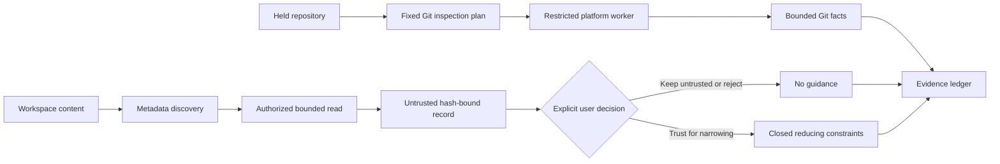

# Read-Only Git and Instruction Trust

| Field | Value |
|---|---|
| Status | Platform-neutral Git and instruction contracts implemented; packaged platform execution remains open |
| Requirements | `AM-GIT-001`, `AM-INS-001` |
| Acceptance | `AT-GIT-001`, `AT-INJ-001`, `AT-INS-001` |
| Task gate | Sprint 17 |

## Boundary

Git facts and workspace instructions are separate descriptive evidence families.
Neither can authorize an operation. Git inspection admits one of thirteen fixed
command-equivalent plans; instruction discovery and reading produce hash-bound
records with no behavioral effect unless the user separately selects a
narrowing-only trust decision.

The current platform-neutral engine and disposable Git fixture adapter pass
locally. Production activation is still denied because the packaged Linux
worker does not yet receive a sealed read-only repository projection and a
separately verified Git executable/runtime. Native macOS worker evidence is
also absent. No direct host-process Git execution is promoted as production
behavior.

## Fixed Git Operations

The closed operation set is status, current branch, upstream, branch list, log,
worktree diff, staged diff, show, worktree list, object type and size, ref
resolution, dirty-tree determination, and untracked-file listing. Planning
rejects arbitrary commands, shell fragments, mutation verbs, unsupported
request fields, unsafe revisions, noncanonical paths, invalid object IDs, and
oversized limits.

Every plan:

- disables hooks, pagers, external diff, text conversion, replace objects,
  optional locks, terminal prompting, and user-selected protocol transport;
- clears the process environment and installs one fixed locale and Git
  environment;
- has no fetch, pull, push, clone, checkout, reset, clean, commit, package
  installation, credential operation, or network operation;
- bounds output to 4 MiB and parsed records to 1,000;
- escapes terminal controls and hashes every raw record;
- binds repository identity, worktree identity, requested revision,
  truncation, freshness, and the complete typed result.

The test adapter runs these plans only inside disposable pinned repositories.
It snapshots every fixture path, mode, symlink target, and file byte digest
before and after the complete inspection set. Hostile hooks, pagers, aliases,
diff drivers, credential helpers, remotes, and replacement-object behavior are
seeded as canaries and remain inert during inspection.

## Instruction Provenance

The ledger recognizes twenty source classes: workspace, repository, project,
and hierarchical instructions; filenames; source; comments; issues; generated
files; tool results; diffs; commits; branches; tags; submodules; hooks;
attributes; Git configuration; model output; and other documents. Every class
is untrusted by default.

Discovery stores metadata only and is distinct from reading. A read must bind
the exact discovery record and unchanged freshness token. The resulting record
retains byte count and content digest but not raw instruction text. The ledger
records every discovery, the subset actually read, user decisions, decision
conflicts, stale read identities, precedence, scope, and complete ledger hash.

Trusted guidance has only six possible effects: exclude a scope, disable a
tool, require verification, require another user confirmation, reduce a
budget, or stop. These constraints accumulate; they cannot change policy,
grant authority, expand roots, add tools, replace current user intent, transfer
authority, or declare completion. Conflicting decisions and stale evidence
disable guidance rather than selecting a winner silently.

## Verification Truth

Local tests cover all thirteen Git operations, the required clean, dirty,
staged, renamed, detached, untracked, and malformed states, twenty instruction
source classes, and 200 generated direct and indirect instruction attacks. The
complete kernel suite proves that instruction records remain part of the sealed
non-authoritative artifact family.

Sprint 17 remains blocked on production platform Git projection and execution,
the full live network observation interval, native macOS evidence, deferred
manual parser fuzzing, and independent review. Those open items cannot be
replaced by the passing local contract tests.
