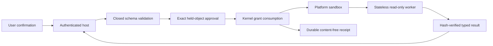

# Read-Only Tool Protocol

| Field | Value |
|---|---|
| Status | Implemented platform-neutral contracts; Linux packaged live execution and macOS XPC evidence remain open |
| Requirement | `AM-TOL-001` |
| Acceptance | `AT-TOOL-001` |
| Task gate | Sprint 16 |
| Catalog version | `1.0.0` |

## Authority Boundary

The read-only capability package is deterministic and has no filesystem,
network, process, credential, or persistence adapter. It receives only a
closed request and an immutable `WorkspaceSnapshot`. The host resolves and
continuously holds each exact workspace object, renders the complete target set
for approval, derives one one-use `WorkspaceRead` grant, and invokes a fresh
platform worker only through the kernel authority transaction.

The generic host request carries a complete exact projection manifest. Every
projected path must equal or descend from a request root, every request root
must itself be projected, duplicate paths fail closed, and the expected file or
directory kind is verified during descriptor-relative resolution. The model,
repository content, filenames, and tool output cannot create or widen this
manifest.

## Closed Catalog

| Tool ID | Operation | Exact target shape |
|---|---|---|
| `agentmage.workspace.list-directory` | Direct child listing | One directory plus explicitly projected direct children |
| `agentmage.workspace.directory-tree` | Recursive bounded tree | One directory plus explicitly projected descendants |
| `agentmage.workspace.read-file` | UTF-8 byte-range read | One regular file |
| `agentmage.workspace.read-multiple` | Multiple UTF-8 byte-range reads | Exact regular files |
| `agentmage.workspace.search-filenames` | Case-sensitive filename search | Exact root objects and projected descendants |
| `agentmage.workspace.search-text` | Case-sensitive UTF-8 text search | Exact root objects and projected descendants |
| `agentmage.workspace.metadata` | Content-free object metadata | Exact files or directories |
| `agentmage.workspace.hash-file` | SHA-256 of one file | One regular file |
| `agentmage.workspace.hash-tree` | Canonical bounded tree SHA-256 | One directory plus explicitly projected descendants |
| `agentmage.workspace.binary-metadata` | Size, SHA-256, and fixed magic hint | One regular file |

Every definition is low risk, declares exactly one `WorkspaceRead` effect,
requires a one-use grant, and binds the same hash-pinned closed input and output
schemas. No write, Git mutation, command, network, credential, installation, or
arbitrary parser operation is registered.

## Hard Limits

| Limit | Hard ceiling | Default request |
|---|---:|---:|
| Exact projected objects | 256 | 128 |
| Regular-file input bytes | 16 MiB | 4 MiB |
| Descendant depth | 32 | 16 |
| Search matches | 1,000 | 256 |
| Serialized result items | 2 MiB | 1 MiB |
| Nested call depth | 8 | 0 |
| Request wire bytes | 64 KiB | Not applicable |
| Snapshot wire bytes | 128 MiB | Not applicable |
| Worker result wire bytes | 4 MiB | Not applicable |
| Worker timeout | 15 seconds | 15 seconds |

The request validator rejects zero, oversized, malformed, duplicate-keyed,
unknown-field, unsupported-version, noncanonical-path, wrong-encoding,
wrong-query, and operation-incompatible values before execution. The worker
also applies the declared per-call limits to the immutable projection.

## Result Contract

Every worker response is one closed `ReadOnlyResult` with one of these terminal
states: `succeeded`, `no_result`, `denied`, `partial`, `truncated`, `malformed`,
`cancelled`, or `failed`. The result records observed object and byte counts,
truncation, exact evidence ranges where applicable, and a SHA-256 over every
preceding result field. The host verifies the schema, tool identity, invariants,
bounds, and digest before returning a typed response. Worker diagnostics are
never returned as content; receipts retain only stable identities, outcomes,
sequences, and digests.

Every launched read-only attempt crosses the kernel authority transaction and
retains its resulting durable receipt, including worker failure, absent or
malformed output, sensitive-output refusal, and output-limit failure. Preview
rejection and cancellation before launch correctly produce no operation
receipt because no effect attempt occurred.

Before a verified result can become model-visible runtime output, the host
checks text and match payloads for credential fields, private keys, bearer
credentials, provider tokens, cloud access keys, and credentials embedded in
URIs. A match fails closed as `runtime.tool.output-sensitive`: the model,
runtime event stream, artifact candidate, and error surface receive no result
content. This is withholding at the model-context boundary, not an assertion
that an approved human-facing read response has been rewritten in place.

## Platform Truth

Linux uses two sealed memfd projections mounted at fixed paths
`/input/request` and `/input/snapshot`. The worker receives no ambient workspace
path. Bubblewrap creates fresh namespaces, denies network syscalls, and runs
under a bounded user cgroup. Launch artifacts must be root-owned, non-writable,
hash-verified regular files. This deliberately prevents a user-owned development
binary from being treated as a packaged production worker.

The platform-neutral tool engine, Linux mediation contract, host approval flow,
golden results, malformed-input matrix, and non-live sandbox attacks are locally
verified. Sprint 16 remains blocked until a packaged root-owned worker is tested
live, cancellation/timeout/kill/crash cleanup evidence is retained, the complete
attack matrix passes, an independent worker review is retained, and the required
macOS XPC evidence is produced on eligible hardware.
