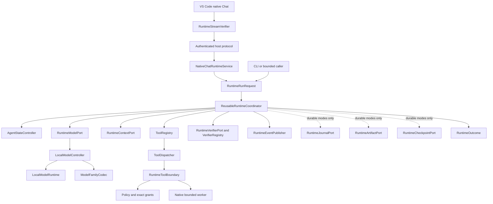
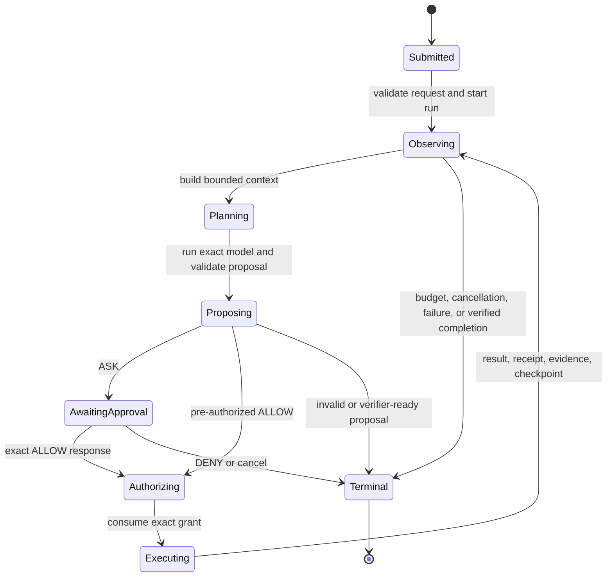
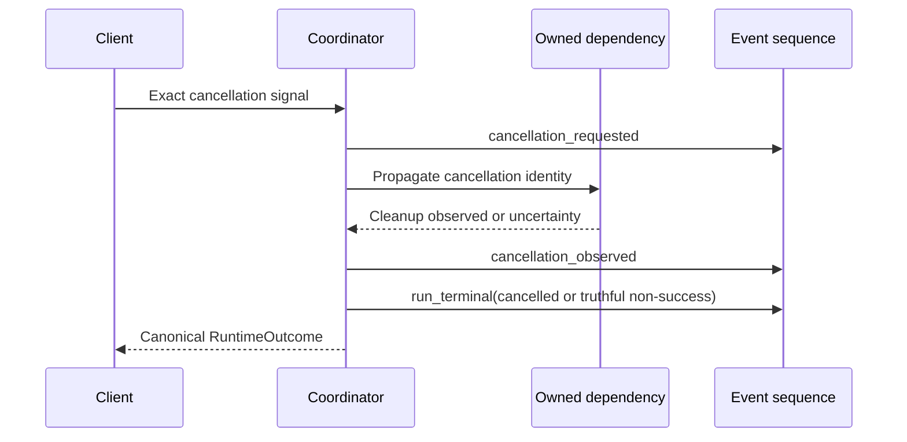

# Reusable Runtime Coordinator

## Status

This document records the implemented source-level Story 23.4 coordinator and
its remaining integration boundary. The interface-independent request, outcome,
event, state, context, model, tool, policy, approval, cancellation, verifier,
journal, artifact, and checkpoint composition exists. A deterministic fake
model completes a native read-only tool call through that composition.

The source-level Visual Studio Code provider now submits this request through a
closed authenticated host protocol, verifies and renders its canonical event
stream, relays one protected approval response, cancels through a hash-bound
cursor, and displays the canonical outcome. The installed host still does not
compose a production runtime factory or admitted model. This document therefore
makes no installed-product, enabled-model, supported-platform, or release claim.

## Component Ownership

The coordinator owns sequencing, not any effect implementation. Each port is
narrow and injected. The model returns only an inert typed proposal. The tool
boundary evaluates policy, resolves a protected user response, consumes exact
authority, and launches a worker. Only the verifier can admit success.

## Dependency Direction

| Layer | May depend on | Must not depend on |
|---|---|---|
| Contracts | Closed identities and data contracts | Platform, process, UI, storage implementation |
| Kernel coordinator | Contracts and kernel services | Visual Studio Code, terminal, JSON transport, MCP transport, native process APIs |
| Host composition | Kernel ports and verified platform adapters | Client rendering or model-authored authority |
| Client | Runtime request/event/approval/outcome port | Tool dispatcher, grants, storage, model adapter, worker APIs |
| Optional MCP adapter | Common tool definition and dispatcher boundary | A second model loop, policy engine, or native-tool prerequisite |

## Run Request and Outcome

`RuntimeRunRequest` binds:

- exact run, session, task, and work-packet identities;
- ephemeral read-only, durable read-only, or controlled-write mode;
- authorized workspace and repository snapshots;
- one exact admitted model profile and context budget;
- one frozen visible tool catalog and ordered tool definitions;
- one exact policy revision;
- turn, model, tool, repetition, depth, no-progress, context, event, elapsed,
  and output ceilings; and
- an optional verified event cursor only for durable resume.

`RuntimeOutcome` binds the request digest, one terminal agent state, resource
counts, prior event, evidence, receipts, unresolved reason codes, bounded inline
or artifact-backed output, and its own canonical digest.

## State and Loop

Each turn performs observe, build context, request model, validate the typed
proposal, evaluate policy, optionally pause, execute at most one admitted call,
observe result and receipt, update evidence, and verify any completion claim.
The loop enforces all request ceilings, repeated-call limits, no-progress
limits, cancellation checks, and output bounds.

## Disposition Mapping

| Evaluation | Runtime behavior | Effect behavior | Terminal implication |
|---|---|---|---|
| `ALLOW` | Emit `permission_decided`, consume exact grant, then emit `tool_started` | One exact worker may start | Success still requires deterministic verification |
| `ASK` | Seal and emit one `RuntimeApprovalChallenge`; return `AwaitingApproval` | No worker starts | Exact allow resumes once; deny closes truthfully |
| `DENY` | Emit a no-effect decision and close the requested call | No worker starts | Declined or other truthful non-success outcome |

An approval response must echo run, approval, challenge digest, disposition,
and the proposed grant identity for `ALLOW`. Expired, stale, mismatched,
replayed, or cancellation-losing responses fail before worker launch.

## Cancellation Path

Cancellation has no execution authority. It wins over a pending approval
response, cannot convert uncertainty to success, and must close owned work
before a cancelled terminal event is legal.

## Ephemeral Native Read Fixture

The Story 23.4 host fixture composes the real shared coordinator with:

1. the checked-in deterministic fake exact model profile;
2. a fake model script that first proposes `read_text` and then proposes a
   completion candidate;
3. the common native read-only registry containing ten read/search/metadata
   tools plus fixed read-only Git inspection;
4. the existing closed read argument validator and snapshot executor;
5. a context port that receives the verified tool result and evidence;
6. an exact receipt and current repository-snapshot citation; and
7. a deterministic verifier that alone admits the success outcome.

The fixture reaches two turns, two model calls, one tool call, one receipt,
grounded evidence, a terminal hash-chained event stream, and a verified success
outcome. It requires no durable journal, artifact store, checkpoint, MCP,
network, write, command, process, or client-specific execution branch.

## Component Parity Matrix

| Responsibility | Existing owner | New Story 23.4 component | Duplicate owner introduced |
|---|---|---|---|
| Agent state | `AgentStateController` | Coordinator sequencing only | No |
| Model lifecycle | `LocalModelController`, runtime and codec traits | `RuntimeModelPort` adapter | No |
| Context | Existing context contracts and host builder | `RuntimeContextPort` | No |
| Tool catalog and validation | `ToolRegistry` | Runtime tool references | No |
| Dispatch and repeat guard | `ToolDispatcher`, `ToolAttemptGuard` | Coordinator invocation | No |
| Policy and grants | Existing policy, grant, and authority transactions | `RuntimeToolBoundary` | No |
| Verification | `VerifierRegistry` and deterministic verifier | `RuntimeVerifierPort` | No |
| Ordered events | Story 21.2 event sequence and publisher | Coordinator emission | No |
| Journal | Story 21.2 durable writer | Optional `RuntimeJournalPort` | No |
| Artifacts | Story 22.2 artifact lifecycle | Optional `RuntimeArtifactPort` | No |
| Resume | Story 22.1 checkpoint and binding | Optional `RuntimeCheckpointPort` | No |
| Client presentation | Native Chat or terminal adapter | `CodingCoordinatorPort` and event sink | No |
| Workflow attachment | Story 50.2 caller-neutral port | Same coordinator | No |

## Interface Boundary

The implemented `CodingCoordinatorPort` exposes only:

- advance to approval or terminal outcome;
- read the canonical event history; and
- read verified artifact references.

`drive_coding_client` independently verifies the event sequence, presents each
new event once, obtains one explicit approval disposition, constructs the exact
response, and returns the canonical outcome and artifact references. It cannot
dispatch tools, mint grants, read artifact bytes, alter policy, select a model,
or claim completion.

The same driver is exercised by current terminal/headless source-level tests.
Native Chat now has a transport-neutral host adapter and a TypeScript thin
client that submit the exact request, stream verified events, relay a protected
response, cancel by exact identity, release completed state, and render the
outcome. The installed host must still compose that adapter with a production
runtime factory and admitted profile; cross-interface parity also remains open.

## Data Flow

| Data | Producer | Consumer | Retention | Prohibited flow |
|---|---|---|---|---|
| Runtime request | Trusted host composition | Coordinator | Run/session policy | Client-authored grants or policy |
| Context packet | Context port | Exact model adapter | Bounded call | Ambient repository or secret access |
| Model result | Exact model adapter | Coordinator parser | Bounded run state | Direct tool or effect dispatch |
| Tool call | Coordinator after parsing | Common registry and boundary | Attempt state | Model-to-worker shortcut |
| Approval challenge | Coordinator | Protected client UI | Pending operation only | Approval inferred from text or workflow output |
| Tool result and receipt | Trusted boundary | Coordinator and verifier | Session/evidence policy | Client-certified result |
| Runtime event | Coordinator | Journal and bounded clients | Event policy | Raw token or giant payload event |
| Outcome | Coordinator and verifier | Bounded clients/callers | Session policy | Presentation-specific success mutation |

## Current Verification and Open Work

Implemented source-level tests cover request and outcome closure, profile and
catalog drift, direct verified completion, read-only mode restrictions,
`ALLOW`/`ASK`/`DENY`, cancellation over approval, expired approval, malformed
model output, false model-certified success, native registry validation,
duplicate registration refusal, and the native fake-read vertical slice.

Still open:

- installed-host runtime-factory and admitted-model composition;
- complete direct-answer, multi-read, search, Git, repeat, no-progress, budget,
  disconnect, and injected-failure fixture matrix;
- native Chat versus CLI parity;
- coordinator and optional-port performance ceilings;
- complete canary and bypass campaign;
- installed platform evidence and independent review; and
- deferred manual fuzzing.
