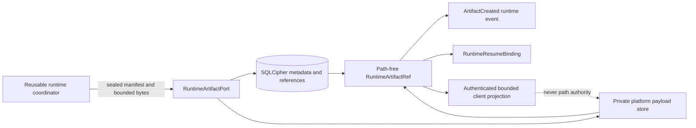
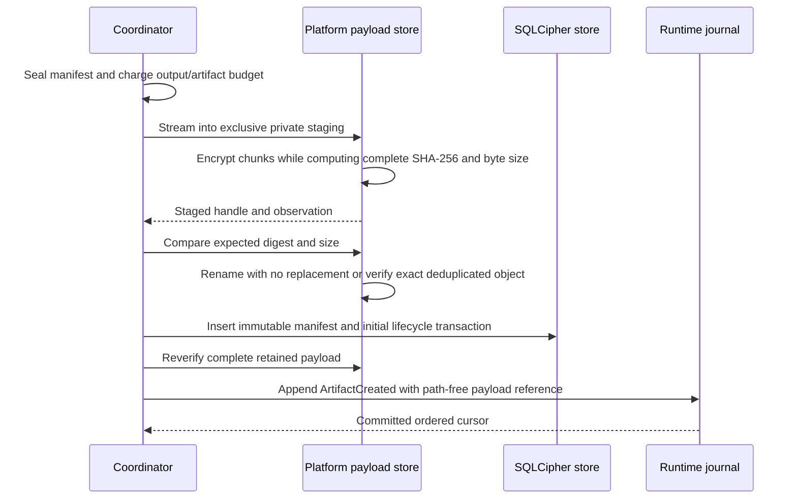
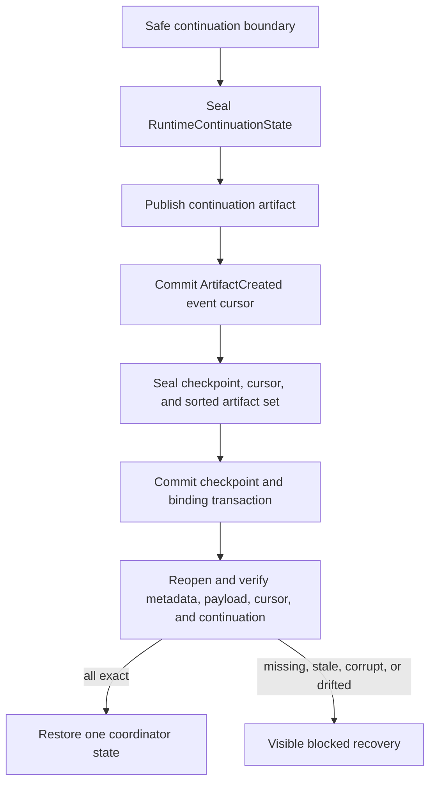
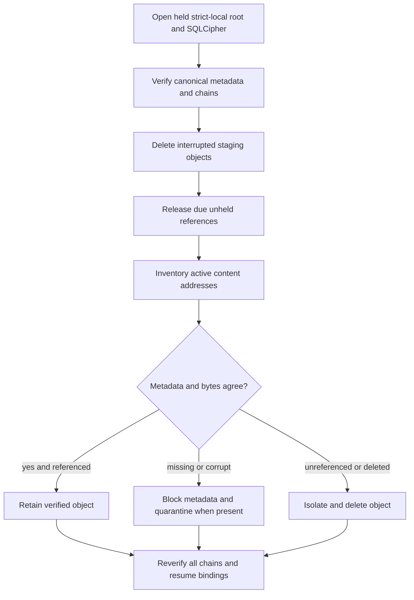

# Content-Addressed Runtime Artifact Lifecycle

**Status:** Implemented platform-neutral contracts and authenticated Linux
lifecycle with explicitly open cross-platform, campaign, and independent-review evidence
**Contract schema:** 2
**Canonical operational-store schema:** 7
**Owning roadmap story:** 22.2

This record defines the runtime artifact boundary used for large model output,
patches, command output, test logs, generated files, and reports. It describes
implemented behavior and named gaps. It is not authority or release approval.
The compiled kernel, platform adapter, and current tests govern when this record
differs from source.

## Scope and Ownership

Runtime artifacts prevent large payloads from becoming event, transcript, or
model-context transport. Four owners remain separate:

| Concern | Sole owner | Authority excluded |
|---|---|---|
| Immutable metadata, logical references, lifecycle, retention, and checkpoint linkage | SQLCipher operational store | Native paths and payload bytes |
| Private payload effects | Verified platform payload adapter | Policy, grants, checkpoint truth, and client access |
| Publication, budgets, and event linkage | Reusable runtime coordinator | Native filesystem access and metadata mutation |
| Display and bounded paging | Authenticated client through host | Path authority, arbitrary artifact lookup, and lifecycle mutation |

## Closed Contracts

| Contract | Required identity | Content rule |
|---|---|---|
| `RuntimeArtifactRef` | Artifact, manifest digest, payload digest, byte size, media type | No path, owner, preview, or authority |
| `RuntimeArtifactManifest` | Reference fields plus kind, sensitivity, retention, producer, policy, creation time, integrity, and manifest digest | Optional UTF-8 preview is at most 4,096 bytes and hash bound |
| `RuntimeArtifactOperatorView` | Reference, producer, lifecycle revision, integrity, retention, reference counts, cleanup state | No preview, native path, payload bytes, secret value, or future-read token |
| `RuntimeResumeBinding` | Checkpoint, session, task, run, last committed event cursor, sorted exact artifact set, binding digest | Carries references only; payload bytes remain outside checkpoint state |

The public schemas and canonical examples are:

- `schemas/runtime/runtime-artifact-reference.schema.json`
- `schemas/runtime/runtime-artifact-manifest.schema.json`
- `schemas/runtime/runtime-artifact-operator-view.schema.json`
- `schemas/runtime/runtime-resume-binding.schema.json`

Unknown fields, missing fields, unsupported schema versions, oversized objects,
invalid media types, unsafe retention, cursor/run drift, duplicate or unordered
artifact identities, lifecycle/integrity disagreement, and path-bearing records
fail validation.

## Storage Layout

The Linux adapter opens the approved strict-local root and retains directory
descriptors for the complete lifecycle. Callers never receive or submit these
native names.

| Namespace | Native Linux name | Mode | Purpose |
|---|---|---|---|
| Private artifact root | `.agentmage-runtime-payloads-v1` | `0700` | Distinguishes private operational payloads from repository evidence |
| Staging | `staging` | `0700` | One-use, no-follow, exclusive publication candidates |
| Active objects | `objects` | `0700` | Immutable files named by lowercase payload SHA-256 |
| Quarantine | `quarantine` | `0700` | Isolated corrupt, uncertain, or delete-transition objects |
| Payload files | Opaque staging name or SHA-256 | `0600` | Authenticated encrypted, owner-only, single-link objects on the held device |

Every directory must remain a same-owner, mode-exact directory on the held
device. Every payload must remain a same-owner regular file with mode `0600`,
one link, a bounded size, and stable device, inode, timestamps, and size across
observation. Symlinks, special files, hard links, cross-device substitution,
mode drift, root replacement, and invalid names fail closed.

Staging and active objects use encrypted file-format version 1. The fixed
48-byte header declares the format and 64 KiB plaintext chunk size and carries
a fresh 256-bit per-file salt. Each data record carries a closed type, monotonic
record index, bounded plaintext length, ciphertext, and 128-bit authentication
tag. A final authenticated record binds the complete plaintext byte size and
SHA-256. The maximum 64 MiB plaintext therefore has a separately bounded
ciphertext size that includes all headers and tags.

The repository `artifacts/` tree contains checked-in verification evidence. It
is never searched, opened, collected, or treated as the private runtime payload
namespace.

## Publication Transaction

The initial profile permits one non-empty payload up to 64 MiB and at most
1,024 artifact references in one checkpoint.

The manifest admits one lowercase syntactically valid media type with exactly
one slash and at most 128 bytes. Semantic kind narrows that set as follows:

| Artifact kind | Admitted media types |
|---|---|
| `patch` | `text/x-diff` or `text/plain` |
| `standard_output`, `standard_error`, `test_log` | `text/plain`, `application/json`, `application/x-ndjson`, or `application/octet-stream` |
| `model_output` | `text/plain`, `application/json`, or `application/x-ndjson` |
| `generated_file`, `report` | Any media type that passes the closed lowercase syntax and length check |

The artifact ceiling is 64 MiB, the encrypted metadata preview is at most
4,096 UTF-8 bytes, one checkpoint binds at most 1,024 references, and one tool
execution supplies at most 64 supplemental artifact candidates. These are
independent ceilings; no valid media declaration expands one of them.

Publication order has these consequences:

1. Invalid, empty, oversized, partial, digest-mismatched, or size-mismatched
   staging never creates canonical metadata.
2. Placement never overwrites an existing object. Equal immutable bytes may be
   deduplicated only after complete verification.
3. A crash after placement and before metadata leaves an unreferenced object;
   startup inventory removes it.
4. A metadata or post-placement verification failure poisons the current
   durable authority when integrity is uncertain; startup reconciliation
   quarantines or blocks the affected reference.
5. An artifact is visible to events, checkpoints, or clients only through its
   exact sealed reference.

## Output Routing and Paging

The coordinator accounts complete payload bytes before selecting a projection.
Output at or below the inline ceiling remains an inline `RuntimeOutput`. Larger
durable output is published as a runtime artifact and returns only its path-free
reference. An unavailable artifact port cannot be silently invented; ephemeral
mode may retain bounded inline output under its separate request ceiling.

The coordinator never infers tool-output meaning from a tool name, grant
operation, media type, or payload text. Each trusted `RuntimeToolExecution`
pairs its optional schema-v2 `ToolResult.output` with one explicit closed
`RuntimeArtifactKind`; a missing kind, a kind without a payload, or a tool claim
of `model_output` fails before terminal-result acceptance or artifact
publication. This runtime-local pairing preserves the frozen schema-v2
`ToolResult` wire contract. The durable artifact manifest retains the declared
semantic kind.

One execution may also carry at most 64 bounded, non-empty
`RuntimeToolArtifactCandidate` values. These candidates have only a closed kind,
validated media type, and trusted retained bytes; they carry no path or
authority. The Linux command boundary emits standard output and standard error
as separate candidates. The validation boundary emits captured validation
streams as `test_log` candidates. Candidates above the 64 KiB inline ceiling
are independently published and receipt-bound; smaller candidates remain
covered by their canonical command or validation receipt and are not separately
persisted. Patch, generated-file, and report producers use the same explicit
primary or candidate path. Large model output remains owned by the separate
model-output route.

Command and validation receipts preserve complete stream SHA-256 values, total
and retained byte counts, and explicit truncation flags. An artifact contains
only the trusted retained bytes. Its receipt therefore distinguishes a complete
stream artifact from a bounded prefix without pretending that truncated bytes
are the complete process stream.

Complete reads require exact session, task, current policy digest, reference,
trusted time, and caller byte ceiling. Preview paging additionally binds an
offset and a maximum page size of 4,096 bytes. The platform verifies the whole
immutable object before returning a page. A hash, artifact identity, or native
path alone grants no read.

## Lifecycle and Retention

| Current state | Trigger | Next state | Payload action | Cleanup projection |
|---|---|---|---|---|
| Absent | Verified publication | `active/verified` | Place or deduplicate immutable object | `retained` |
| `active/verified` | Exact owner release with no current checkpoint reference | `released/verified` | Decrement active logical reference count | `eligible` |
| `active/verified` | Missing payload at startup | `quarantined/missing` | No active object | `blocked` |
| `active/verified` | Corrupt payload at startup | `quarantined/corrupt` | Move object to quarantine | `blocked` |
| `active/verified` | Explicit quarantine | `quarantined/quarantined` | Move object to quarantine | `blocked` |
| `released` or `quarantined` | Reference count reaches zero and collection succeeds | `deleted/deleted` | Isolate, unlink, and synchronize directories | `completed` |

Each lifecycle transition advances a monotonic revision and appends a chained
event binding the prior event digest and complete new state digest. Startup
recomputes every manifest, state, event chain, payload count, resume binding,
and current head before use.

Session and user-hold retention have no expiration timestamp. Expiring
retention requires a timestamp later than creation and releases the logical
reference only when the trusted startup time reaches it. A current resumable
checkpoint is a retention root: release is denied while its exact artifact
reference remains in the canonical current checkpoint.

Physical overwrite is never claimed for SSD or copy-on-write storage.
Reference-aware logical deletion and synchronized unlink are implemented.
Destroying and verifying absence of the shared operational-store key makes both
SQLCipher state and every derived payload key unavailable. Individual
reference collection unlinks verified ciphertext but does not claim independent
per-payload cryptographic erasure because deduplicated payloads share references
and the first format derives file keys from one store-scoped root.

## Checkpoint and Resume

The continuation payload contains only safe-boundary coordinator state. It
binds request, run, session, task, event cursor, agent state and transitions,
resource accounting, repeated-call guards, tool results, evidence, receipt
identities, and prior artifact references. It cannot represent an active
effect, approval wait, terminal success, denial, parser failure, or hidden
retry.

Checkpoint publication verifies every referenced native payload before the
SQLCipher transaction. Resume verifies the checkpoint digest, binding digest,
current event row, manifest/reference equality, active lifecycle, payload
identity, continuation canonical encoding, and current runtime request. It
never replays a completed effect to reconstruct missing bytes.

## Startup Reconciliation

Reconciliation returns only content-free counts for verified payloads,
quarantined payloads, deleted orphans, and cleaned staging objects. A storage,
chain, unsafe-root, durability, conflict, or corruption failure prevents the
same in-process durable authority from continuing.

## Operator Projection

`RuntimeArtifactOperatorView` exposes only:

- Exact path-free reference and semantic kind.
- Sensitivity and retention assignment.
- Session, task, run, optional turn, optional operation, optional receipt, and
  policy identities.
- Creation and update times.
- Current lifecycle, integrity, revision, reason code, current-checkpoint
  reference count, shared active payload-reference count, and cleanup state.

It excludes payload bytes, preview text, native paths, environment values,
credentials, keys, grant material, and future-read authority. The current
Linux host can obtain this projection through the held authority boundary. A
user-facing diagnostics command remains separate integration work.

## Encryption Truth

SQLCipher encrypts all artifact metadata, references, lifecycle events, and
resume bindings with the platform-provided operational-store key. The Linux
adapter retrieves that key once inside the bounded provider callback and uses
HKDF-SHA-256 with fixed versioned domain labels to derive a distinct zeroizing
payload-store key. The SQLCipher key is not retained by the payload adapter.

Every staged file receives a fresh 256-bit salt. A second HKDF-SHA-256
derivation produces its file key, and XChaCha20-Poly1305 authenticates each
64 KiB chunk independently. A fixed 128-bit nonce domain plus monotonic 64-bit
record index is unique under that per-file key. Associated data binds the exact
format header, record type, index, and declared length. The authenticated final
record binds the complete plaintext size and SHA-256, so truncation, append,
reordering, wrong-key access, header changes, ciphertext changes, and tag
changes fail before plaintext is returned.

The PRD target named `Content-addressed encrypted payloads` is implemented for
the Linux adapter. Whole-store key destruction cryptographically erases both
metadata and retained payloads, subject to the existing truthful limitation
that physical ciphertext removal or overwrite is not guaranteed on SSD and
copy-on-write media. The current implementation does not claim independently
keyed per-object deletion, online key rotation, or a released plaintext-format
migration. This pre-release repository has no supported plaintext payload-store
format.

No documentation or test may represent private permissions as encryption.

## Implemented Verification

Current automated coverage includes:

- Manifest, reference, preview, media, size, retention, and digest validation.
- Path-free schema examples and missing, unknown, path-bearing, lifecycle,
  cleanup, cursor, duplicate, and preview mutation tests.
- Bounded streaming staging, no-replace placement, exact deduplication, complete
  reads, bounded pages, inventory, quarantine, deletion, and staging cleanup.
- HKDF domain separation, randomized encrypted staging and objects, complete and
  range decryption, wrong-key refusal, raw-disk plaintext-canary exclusion, and
  authenticated header, payload, tag, truncation, and append failures.
- Symlink, mode, invalid-name, root-drift, payload corruption, owner, policy,
  digest, byte-size, checkpoint, metadata-tamper, and transaction-rollback
  failures.
- Hard-link refusal, encrypted open-handle collection, and corrupt inventory
  quarantine without trusting an unavailable plaintext size.
- Current-checkpoint retention-root enforcement and privacy-safe operator
  projection.
- Durable continuation publication, event ordering, checkpoint binding, reopen,
  and shared Chat/CLI/workflow-caller artifact-reference parity.
- Closed primary tool-output classification for patch, standard output,
  standard error, test-log, generated-file, and report artifacts, with
  fail-closed missing/mismatched/model-output tests.
- Separate bounded Linux command stdout/stderr and validation-log candidates,
  including independent large-stream artifact publication and native producer
  assertions.
- Deterministic native namespace-substitution checks at the private store,
  staging, objects, and quarantine directory names. Each fixed name is reopened
  descriptor-relatively and must still resolve to the held inode before the
  next effect. Executable payload modes, traversal names, symlinks, hard links,
  and a repository `artifacts/` lookalike also fail or remain outside private
  inventory as required.
- Fourteen native Linux subprocess-stop cases spanning before and after
  encrypted staging, atomic placement, SQLCipher metadata commit, durable
  artifact-event commit, checkpoint commit, reference release, and collection.
  Every case reopens and reconciles without a false terminal event, hidden
  orphan, mutable overwrite, duplicate artifact event, or invented checkpoint.
  The hash-bound report and redacted raw trace are retained under
  `artifacts/sprints/sprint-22/story-22.2/`.
- One explicit native ceiling campaign publishes and pages a 64 MiB encrypted
  object, admits exactly 1,024 sorted checkpoint references deduplicated onto
  one immutable object, rejects reference 1,025, blocks checkpoint-rooted
  release, collects after an empty successor checkpoint, and verifies a final
  reopen. Its hash-bound report retains measured elapsed time, resident memory,
  disk bytes, and stated host-local limitations.
- One native durable-resume campaign stops deterministically immediately after
  a committed safe-boundary checkpoint, destroys the coordinator, reopens the
  encrypted Linux authority, and restores the exact event cursor, continuation,
  artifact set, receipt, and terminal no-op outcome without replaying the
  protected Git operation. Repository, policy, and model-runtime drift fail
  closed. Missing and corrupt continuation payloads reconcile to an explicit
  blocked restore with no second execution. The hash-bound report and redacted
  raw trace are retained under `artifacts/sprints/sprint-22/story-22.2/`.
- One combined artifact-integrity campaign source-binds 22 kernel contracts,
  nine native Linux payload-store and adversarial tests, one production
  generated-file publication and checkpoint test, and one public-schema
  mutation test. Its coverage matrix includes digest, size, media, preview,
  retention, identity, reference, ownership, encryption, plaintext exclusion,
  missing/corrupt quarantine, duplicate and colliding publication, partial and
  oversized input, expiration, unknown versions, path/link/namespace attacks,
  public-evidence separation, and path-free operator projection. The hash-bound
  report and redacted raw trace are retained under
  `artifacts/sprints/sprint-22/story-22.2/`.
- One deterministic Story 22.2 evidence index maps every sub-task to its exact
  statement digest, implementation paths, executable test identities, and
  hashed retained files. Its mutation suite rejects omission, reorder, status
  drift, unresolved tests, unsafe paths, changed artifacts, and false
  completion. The index retains complete, partial, and open states and does not
  claim story, sprint, or release completion.
- Fedora journal and artifact pressure measurements retained by Story 50.2.

Still open before Story 22.2 can pass:

- Independent review of the encrypted-file construction and root/file-key
  lifecycle, plus deferred manual fuzzing of its parser and state transitions.
- Stops inside an individual filesystem or SQLite syscall, physical power loss,
  torn-sector/controller failure, and filesystem corruption. The current
  native matrix stops immediately before and after each declared transaction
  edge without unwinding; it does not claim those physical-fault conditions.
- Physical disk-full and device-latency injection, mixed-size unique-object
  pressure, and the complete durable-resume campaign for large command, test,
  and model artifacts, long sessions, concurrent collection, quarantined
  payload operator recovery, installed interfaces, and a real local model. The
  current path-substitution, deduplicated ceiling, and focused fake-model
  resume campaigns do not substitute for those remaining classes.
- Windows native artifact-store implementation and evidence; retained macOS work
  remains outside the current GA dependency lane.
- Remaining installed-interface, long-session, and cross-platform producer
  evidence. Large model output and controlled file creation now route above the
  inline ceiling; the native generated-file producer binds its reference into
  durable resume state.
- Online key rotation and any future released-format migration protocol.
