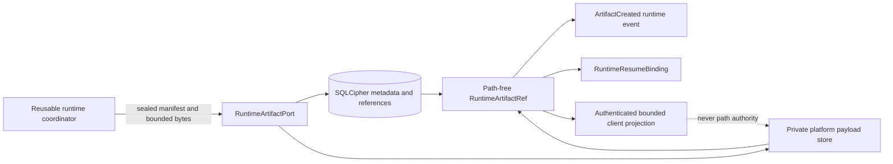
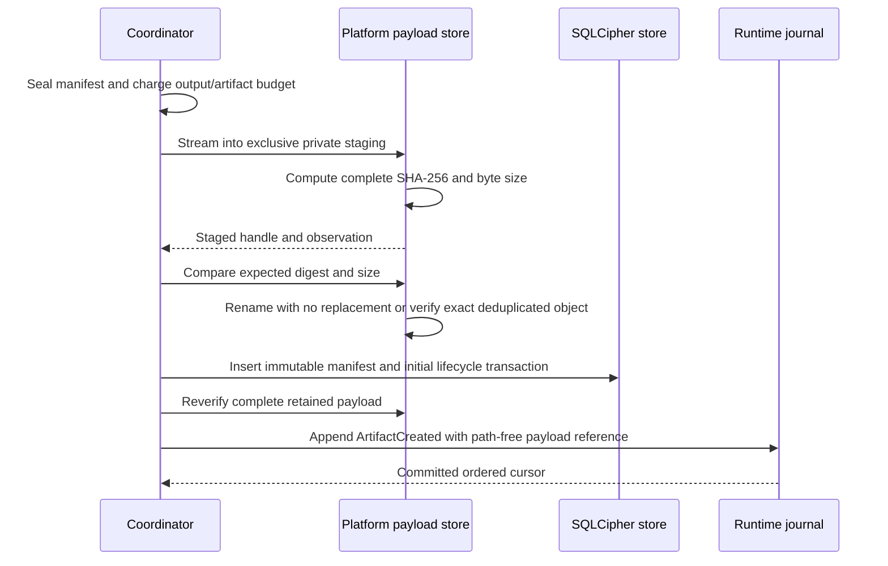
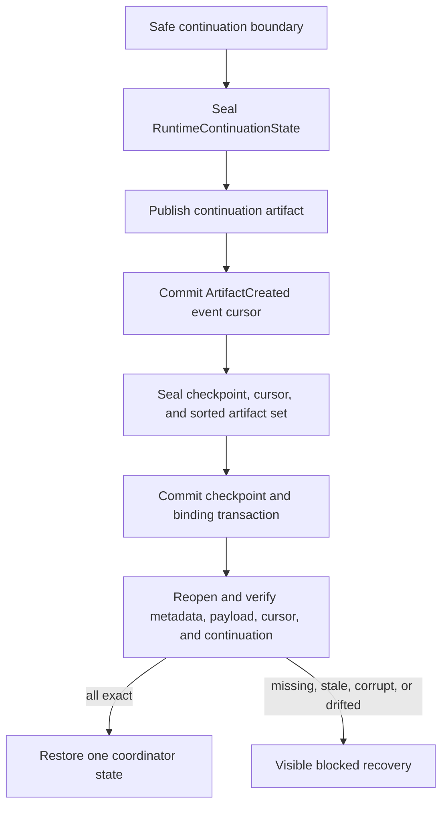
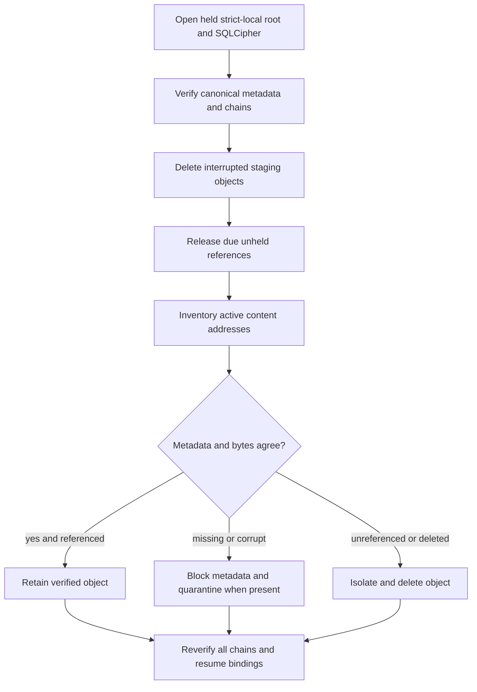

# Content-Addressed Runtime Artifact Lifecycle

**Status:** Implemented platform-neutral contracts and Linux lifecycle with
explicitly open encryption, cross-platform, and campaign evidence
**Contract schema:** 2
**Canonical operational-store schema:** 7
**Owning roadmap story:** 22.2

This record defines the runtime artifact boundary used for large model output,
patches, command output, test logs, generated files, and reports. It describes
implemented behavior and named gaps. It is not authority or release approval.
The compiled kernel, platform adapter, and current tests govern when this record
differs from source.

## Scope and Ownership

Runtime artifacts prevent large payloads from becoming event, transcript, or
model-context transport. Four owners remain separate:

| Concern | Sole owner | Authority excluded |
|---|---|---|
| Immutable metadata, logical references, lifecycle, retention, and checkpoint linkage | SQLCipher operational store | Native paths and payload bytes |
| Private payload effects | Verified platform payload adapter | Policy, grants, checkpoint truth, and client access |
| Publication, budgets, and event linkage | Reusable runtime coordinator | Native filesystem access and metadata mutation |
| Display and bounded paging | Authenticated client through host | Path authority, arbitrary artifact lookup, and lifecycle mutation |

## Closed Contracts

| Contract | Required identity | Content rule |
|---|---|---|
| `RuntimeArtifactRef` | Artifact, manifest digest, payload digest, byte size, media type | No path, owner, preview, or authority |
| `RuntimeArtifactManifest` | Reference fields plus kind, sensitivity, retention, producer, policy, creation time, integrity, and manifest digest | Optional UTF-8 preview is at most 4,096 bytes and hash bound |
| `RuntimeArtifactOperatorView` | Reference, producer, lifecycle revision, integrity, retention, reference counts, cleanup state | No preview, native path, payload bytes, secret value, or future-read token |
| `RuntimeResumeBinding` | Checkpoint, session, task, run, last committed event cursor, sorted exact artifact set, binding digest | Carries references only; payload bytes remain outside checkpoint state |

The public schemas and canonical examples are:

- `schemas/runtime/runtime-artifact-reference.schema.json`
- `schemas/runtime/runtime-artifact-manifest.schema.json`
- `schemas/runtime/runtime-artifact-operator-view.schema.json`
- `schemas/runtime/runtime-resume-binding.schema.json`

Unknown fields, missing fields, unsupported schema versions, oversized objects,
invalid media types, unsafe retention, cursor/run drift, duplicate or unordered
artifact identities, lifecycle/integrity disagreement, and path-bearing records
fail validation.

## Storage Layout

The Linux adapter opens the approved strict-local root and retains directory
descriptors for the complete lifecycle. Callers never receive or submit these
native names.

| Namespace | Native Linux name | Mode | Purpose |
|---|---|---|---|
| Private artifact root | `.agentmage-runtime-payloads-v1` | `0700` | Distinguishes private operational payloads from repository evidence |
| Staging | `staging` | `0700` | One-use, no-follow, exclusive publication candidates |
| Active objects | `objects` | `0700` | Immutable files named by lowercase payload SHA-256 |
| Quarantine | `quarantine` | `0700` | Isolated corrupt, uncertain, or delete-transition objects |
| Payload files | Opaque staging name or SHA-256 | `0600` | Regular, owner-only, single-link objects on the held device |

Every directory must remain a same-owner, mode-exact directory on the held
device. Every payload must remain a same-owner regular file with mode `0600`,
one link, a bounded size, and stable device, inode, timestamps, and size across
observation. Symlinks, special files, hard links, cross-device substitution,
mode drift, root replacement, and invalid names fail closed.

The repository `artifacts/` tree contains checked-in verification evidence. It
is never searched, opened, collected, or treated as the private runtime payload
namespace.

## Publication Transaction

The initial profile permits one non-empty payload up to 64 MiB and at most
1,024 artifact references in one checkpoint.

Publication order has these consequences:

1. Invalid, empty, oversized, partial, digest-mismatched, or size-mismatched
   staging never creates canonical metadata.
2. Placement never overwrites an existing object. Equal immutable bytes may be
   deduplicated only after complete verification.
3. A crash after placement and before metadata leaves an unreferenced object;
   startup inventory removes it.
4. A metadata or post-placement verification failure poisons the current
   durable authority when integrity is uncertain; startup reconciliation
   quarantines or blocks the affected reference.
5. An artifact is visible to events, checkpoints, or clients only through its
   exact sealed reference.

## Output Routing and Paging

The coordinator accounts complete payload bytes before selecting a projection.
Output at or below the inline ceiling remains an inline `RuntimeOutput`. Larger
durable output is published as a runtime artifact and returns only its path-free
reference. An unavailable artifact port cannot be silently invented; ephemeral
mode may retain bounded inline output under its separate request ceiling.

The implemented routing recognizes model output, command standard output,
validation logs, patch payloads, and generic reports. The artifact kind enum
also closes standard error and generated-file identities. Complete production
routing for separately represented standard error and generated-file outputs
remains open because the current `ToolResult` carries one opaque output payload
without a closed output-kind discriminator.

Complete reads require exact session, task, current policy digest, reference,
trusted time, and caller byte ceiling. Preview paging additionally binds an
offset and a maximum page size of 4,096 bytes. The platform verifies the whole
immutable object before returning a page. A hash, artifact identity, or native
path alone grants no read.

## Lifecycle and Retention

| Current state | Trigger | Next state | Payload action | Cleanup projection |
|---|---|---|---|---|
| Absent | Verified publication | `active/verified` | Place or deduplicate immutable object | `retained` |
| `active/verified` | Exact owner release with no current checkpoint reference | `released/verified` | Decrement active logical reference count | `eligible` |
| `active/verified` | Missing payload at startup | `quarantined/missing` | No active object | `blocked` |
| `active/verified` | Corrupt payload at startup | `quarantined/corrupt` | Move object to quarantine | `blocked` |
| `active/verified` | Explicit quarantine | `quarantined/quarantined` | Move object to quarantine | `blocked` |
| `released` or `quarantined` | Reference count reaches zero and collection succeeds | `deleted/deleted` | Isolate, unlink, and synchronize directories | `completed` |

Each lifecycle transition advances a monotonic revision and appends a chained
event binding the prior event digest and complete new state digest. Startup
recomputes every manifest, state, event chain, payload count, resume binding,
and current head before use.

Session and user-hold retention have no expiration timestamp. Expiring
retention requires a timestamp later than creation and releases the logical
reference only when the trusted startup time reaches it. A current resumable
checkpoint is a retention root: release is denied while its exact artifact
reference remains in the canonical current checkpoint.

Physical overwrite is never claimed for SSD or copy-on-write storage.
Reference-aware logical deletion and synchronized unlink are implemented.
Per-payload cryptographic deletion is not yet implemented.

## Checkpoint and Resume

The continuation payload contains only safe-boundary coordinator state. It
binds request, run, session, task, event cursor, agent state and transitions,
resource accounting, repeated-call guards, tool results, evidence, receipt
identities, and prior artifact references. It cannot represent an active
effect, approval wait, terminal success, denial, parser failure, or hidden
retry.

Checkpoint publication verifies every referenced native payload before the
SQLCipher transaction. Resume verifies the checkpoint digest, binding digest,
current event row, manifest/reference equality, active lifecycle, payload
identity, continuation canonical encoding, and current runtime request. It
never replays a completed effect to reconstruct missing bytes.

## Startup Reconciliation

Reconciliation returns only content-free counts for verified payloads,
quarantined payloads, deleted orphans, and cleaned staging objects. A storage,
chain, unsafe-root, durability, conflict, or corruption failure prevents the
same in-process durable authority from continuing.

## Operator Projection

`RuntimeArtifactOperatorView` exposes only:

- Exact path-free reference and semantic kind.
- Sensitivity and retention assignment.
- Session, task, run, optional turn, optional operation, optional receipt, and
  policy identities.
- Creation and update times.
- Current lifecycle, integrity, revision, reason code, current-checkpoint
  reference count, shared active payload-reference count, and cleanup state.

It excludes payload bytes, preview text, native paths, environment values,
credentials, keys, grant material, and future-read authority. The current
Linux host can obtain this projection through the held authority boundary. A
user-facing diagnostics command remains separate integration work.

## Encryption Truth

SQLCipher encrypts all artifact metadata, references, lifecycle events, and
resume bindings with the platform-provided operational-store key. Linux payload
files are currently owner-only, descriptor-relative private files but are not
yet independently encrypted. Therefore:

- The PRD diagram target named `Content-addressed encrypted payloads` is not yet
  satisfied.
- `SR-DAT-004` has not passed for protected artifact-payload persistence.
- Whole-store key destruction cryptographically erases SQLCipher metadata but
  does not establish cryptographic erasure of retained payload files.
- Story 22.2 and any release gate depending on encrypted runtime payloads remain
  blocked until a reviewed platform key and authenticated-encryption design,
  migration, canary scan, failure campaign, and deletion evidence are complete.

No documentation or test may represent private permissions as encryption.

## Implemented Verification

Current automated coverage includes:

- Manifest, reference, preview, media, size, retention, and digest validation.
- Path-free schema examples and missing, unknown, path-bearing, lifecycle,
  cleanup, cursor, duplicate, and preview mutation tests.
- Bounded streaming staging, no-replace placement, exact deduplication, complete
  reads, bounded pages, inventory, quarantine, deletion, and staging cleanup.
- Symlink, mode, invalid-name, root-drift, payload corruption, owner, policy,
  digest, byte-size, checkpoint, metadata-tamper, and transaction-rollback
  failures.
- Current-checkpoint retention-root enforcement and privacy-safe operator
  projection.
- Durable continuation publication, event ordering, checkpoint binding, reopen,
  and shared Chat/CLI/workflow-caller artifact-reference parity.
- Fedora journal and artifact pressure measurements retained by Story 50.2.

Still open before Story 22.2 can pass:

- Authenticated encryption and cryptographic deletion for payload bytes.
- A closed tool-output discriminator for standard error and generated-file
  routing.
- Full crash injection around every placement, metadata, event, checkpoint,
  release, and collection edge using the native Linux store.
- Native path-race, open-handle collection, disk-full, device-latency, high-volume
  retention, and complete durable-resume campaigns.
- Windows native artifact-store implementation and evidence; retained macOS work
  remains outside the current GA dependency lane.
- Independent artifact-boundary review and deferred manual fuzzing.
