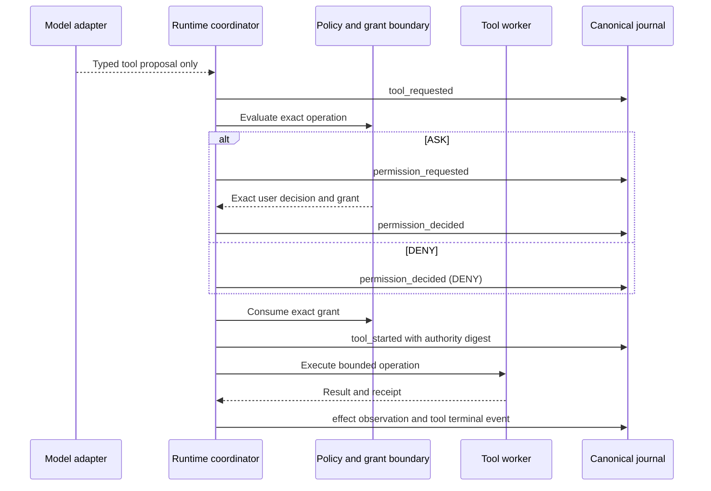
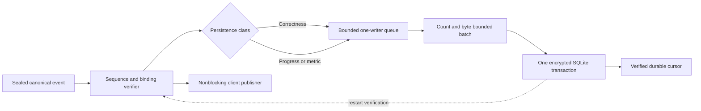

# Runtime Event Journal and Projection Boundaries

## Status

This document is the review artifact for Story 21.2. The closed runtime-event
envelope, hash-chain verifier, legal transition engine, bounded in-process
publisher, durable journal queue, encrypted SQLite projection, terminal flush,
and restart verification exist in source. The complete story remains open for
dedicated writer-thread decoupling, transcript and diagnostics lifecycle
implementation, crash injection at every boundary, reference-hardware pressure
and throughput evidence, installed-client evidence, and independent review.

No statement in this document enables a model, platform, release, transcript,
external telemetry path, or general event bus.

## Invariants

1. The canonical `RuntimeEvent` is content minimized, versioned, immutable,
   hash chained, and bound to one run, session, task, correlation, and policy.
2. Only the runtime coordinator creates canonical events. A model, client,
   tool, transcript renderer, diagnostics sink, or subscriber cannot create
   authority or certify completion through an event.
3. Correctness events are committed before their effect or terminal result is
   represented as durable. Progress and metrics may be delayed only within
   declared count, byte, batch, and age ceilings.
4. Raw prompts, token fragments, secrets, credentials, environment values,
   absolute paths, large output, and transcript prose do not belong in the
   canonical event envelope.
5. Every client independently verifies event shape, digest, binding, ordering,
   causation, transition legality, and terminal closure.
6. A lagging client is detached without blocking the coordinator. Reconnection
   requires a verified durable cursor; the publisher never invents missed
   events.

## Canonical Envelope

The normative JSON shape is
[`runtime-event.schema.json`](../../schemas/runtime/runtime-event.schema.json).
The Rust contract is
[`runtime_event.rs`](../../kernel/contracts/src/runtime_event.rs), and canonical
validation is implemented in
[`runtime_event.rs`](../../kernel/engine/src/runtime_event.rs).

| Field group | Required identity or property | Security purpose |
|---|---|---|
| Schema | `schema_version` | Reject unknown contract versions. |
| Ownership | `run_id`, `session_id`, `task_id` | Prevent cross-run and cross-session reuse. |
| Scope | optional `turn_id`, optional `operation_id` | Bind activity to the exact active state. |
| Lineage | `correlation_id`, optional `causation_event_id` | Preserve deterministic provenance. |
| Order | `sequence`, `previous_event_sha256`, `event_sha256` | Reject gaps, reorder, replay, mutation, and post-terminal append. |
| Time | `occurred_at_epoch_ms` | Preserve trusted nondecreasing wall-clock observations. |
| Data | `sensitivity`, `retention`, `persistence` | Classify before persistence or projection. |
| Policy | `policy_id` | Reject policy drift inside a run. |
| Large data | optional `payload_reference` | Keep large bytes in the verified artifact store. |
| Meaning | closed `kind` union | Reject unknown event families and fields. |

## Event Families and Legal State

| Event | Required state before admission | State after admission | Persistence |
|---|---|---|---|
| `run_started` | Empty stream | Active run | Correctness |
| `turn_started` | Active quiescent run | Active turn | Progress |
| `model_requested` | Active turn, no active model | Active model call | Progress |
| `model_completed`, `model_failed` | Matching active model call | No active model call | Progress |
| `tool_requested` | Active turn, new call and operation | Requested tool call | Progress |
| `permission_requested` | Active turn and requested operation | Protected approval pending | Correctness |
| `permission_decided` | Matching pending approval | Approval closed; denial removes the request | Correctness |
| `tool_started` | Requested tool, no pending approval, exact authority consumed | Started tool call | Correctness |
| `file_observed` | Matching started operation | Started operation retained | Progress |
| `file_modified` | Matching started operation | Started operation retained | Correctness |
| `tool_completed`, `tool_failed` | Matching started tool call | Tool call closed | Correctness |
| `turn_completed` | Active turn with no model, tool, or approval pending | Quiescent run | Progress |
| `artifact_created` | Active started operation or quiescent safe boundary | Artifact reference available | Correctness |
| `checkpoint_committed` | Quiescent safe boundary | Resume point available | Correctness |
| `cancellation_requested` | No earlier cancellation request | Cancellation pending | Correctness |
| `cancellation_observed` | Matching cancellation request | Owned work cleared | Correctness |
| `progress` | Active nonterminal run | No authority or state change | Progress |
| `metric` | Active nonterminal run | No authority or state change | Metric |
| `run_terminal` | Quiescent run and valid terminal state | Closed stream | Correctness |

`run_started` is sequence zero and has no cause. Every later event names an
already admitted cause. Sequence numbers are contiguous and timestamps are
nondecreasing. No event is legal after `run_terminal`.

## Disposition and Correctness Linkage

The event is evidence of a completed authority transition, not the authority
itself. `ALLOW` can reach `tool_started` only after the policy boundary returns
and consumes an exact current grant. `ASK` starts no effect while awaiting a
response. `DENY` removes the pending call and starts no effect.

## Projection Matrix

| Projection | Included | Excluded | Persistence and retention | Correctness authority |
|---|---|---|---|---|
| Canonical journal | Complete content-minimized event envelope and verified artifact references | Prompt prose, token fragments, raw tool output, absolute paths, secrets, transcript text | Encrypted local store; event retention is explicit | Authoritative ordered history |
| Authenticated client stream | Verified canonical events needed for current presentation | Artifact payload bytes, credentials, hidden policy state | Bounded in process; client-controlled presentation retention | None |
| Persisted user transcript | Explicitly selected user-visible messages and bounded rendered output | Grants, hidden policy state, credentials, unapproved restricted content | Optional, separately classified, separately deletable; implementation remains open | None |
| Local diagnostics | Stable reason codes, component state, bounded counters, digests where approved | Prompts, source content, token text, environment values, credentials | Optional and content minimized; implementation remains open | None |
| Local metrics | Approved content-free integer measurements | User text, model text, paths, identifiers not required by the metric contract | Optional bounded batches; no external telemetry dependency | None |
| Runtime artifacts | Immutable large payload bytes plus manifest | Unreferenced ambient files and undeclared payloads | Encrypted local payload store with separate retention and deletion | Referenced evidence only |

Projection selection occurs after classification. A projection cannot rewrite a
canonical event, infer a grant, or substitute transcript prose for evidence.

## Sensitivity and Retention

| Sensitivity | Event handling |
|---|---|
| `public` | May enter an approved local projection, subject to retention. |
| `internal` | Local-only default for bounded runtime metadata. |
| `private` | Local encrypted persistence only when the selected mode requires it. |
| `restricted` | Minimal envelope and artifact reference only; no diagnostic or metric content. |

| Retention | Meaning |
|---|---|
| `ephemeral` | Current process and run only; rejected by the durable writer. |
| `session` | Retained under the owning session lifecycle. |
| `until_expiration` | Retained until the exact exclusive expiration. |
| `user_hold` | Retained until an explicit user release decision. |

An expiration is required only for `until_expiration` and must be later than the
event timestamp.

## Publisher and Subscriber Contract

`RuntimeEventPublisher` owns the canonical in-process sequence verifier and at
most 32 subscribers. Each subscriber chooses a capacity from 1 through 4096
events. Publication uses nonblocking bounded sends. A full subscriber is marked
lagged and removed; a closed subscriber is marked disconnected and removed.
Neither result changes runtime authority, event order, or coordinator progress.

The publisher is deliberately not a plugin API. It exposes no provider
registration, callback execution, persistence selection, tool dispatch, model
access, or grant path.

## Durable Writer Design

The current `RuntimeJournalWriter` is one-process and one-writer. Defaults and
hard maxima are fixed in source:

| Ceiling | Default | Hard maximum |
|---|---:|---:|
| Queued events | 1024 | 4096 |
| Queued canonical bytes | 4 MiB | 16 MiB |
| Events per batch | 128 | 512 |
| Canonical bytes per batch | 512 KiB | 4 MiB |
| Logical flush interval | 250 ms | 60 seconds |

Correctness submission flushes itself and every queued predecessor in one
transaction before returning. Progress and metrics are deferred until count,
byte, age, explicit flush, checkpoint, terminal, or shutdown synchronization.
Queue pressure triggers a bounded batch flush; it never grows the queue.
Storage or integrity ambiguity poisons the owning authority object, and no false
history is committed. Restart loads rows in sequence order and verifies the
canonical bytes, indexed projections, hash chain, bindings, transitions, and
terminal cursor before use.

The current writer is still called on the coordinator thread. A dedicated
bounded writer worker, explicit producer-side cancellation responsiveness under
slow disk, progress coalescing, installed-host shutdown ownership, and measured
latency budgets remain open under Sub-tasks 21.2.1.5, 21.2.3.2, 21.2.3.3, and
21.2.3.5. Until those close, the implementation must be described as deferred
batch persistence, not a fully decoupled asynchronous writer.

## Reason Codes

| Code | Meaning | Required response |
|---|---|---|
| `runtime.event.version_mismatch` | Unsupported event schema | Reject before projection or persistence |
| `runtime.event.value_invalid` | Invalid identity, timestamp, retention, code, or payload reference | Reject |
| `runtime.event.digest_mismatch` | Canonical digest mismatch | Reject and preserve prior history |
| `runtime.event.ordering_mismatch` | Gap, reorder, replay, or predecessor mismatch | Reject |
| `runtime.event.binding_mismatch` | Run, session, task, correlation, or policy drift | Reject |
| `runtime.event.causation_mismatch` | Missing or unknown cause | Reject |
| `runtime.event.transition_illegal` | Event is illegal in current state | Reject |
| `runtime.event.stream_terminal` | Append attempted after terminal state | Reject |
| `runtime.event.subscriber_limit` | Subscriber count or capacity is outside bounds | Reject subscription only |
| `runtime.event.publisher_unavailable` | Publisher state lock is unavailable | Fail the presentation path closed |
| `runtime.event.subscriber_disconnected` | Subscriber was removed or closed | Reconnect only through a verified cursor |
| `runtime.event.serialization_failed` | Canonical encoding failed | Reject |
| `runtime.journal.limits_invalid` | Queue or batch ceilings are invalid | Refuse writer construction |
| `runtime.journal.event_invalid` | Event cannot enter durable retention | Reject |
| `runtime.journal.ordering_mismatch` | Event is not contiguous with retained history | Reject |
| `runtime.journal.serialization_failed` | Canonical journal encoding failed | Reject |
| `runtime.journal.storage_failed` | Atomic store operation failed or is ambiguous | Poison writer; require verified restart |
| `runtime.journal.integrity_failed` | Retained state failed reconciliation | Poison writer; do not resume |

## Verification Ownership

| Evidence | Current owner | Current status |
|---|---|---|
| Closed schema and canonical example | `schemas/runtime`, schema tests, Rust digest test | Implemented locally |
| Legal ordering and binding rejection | `runtime_event` unit tests | Implemented locally; exhaustive family matrix retained here |
| Bounded nonblocking subscribers | `runtime_event` unit tests | Implemented locally |
| Atomic batches, queue bounds, terminal flush, restart tamper detection | `runtime_journal` unit tests | Implemented locally |
| Coordinator event emission and client verification | `runtime_loop`, `coding_client` tests | Implemented at source level |
| Transcript and diagnostics lifecycle | Story 21.2 and later conversation work | Open |
| Dedicated asynchronous worker and slow-disk cancellation | Story 21.2 / Story 50.2 | Open |
| Full crash, pressure, canary, and benchmark campaign | Story 21.2.3 | Open |
| Installed native-client and independent-review evidence | Sprint 23 and release gates | Open |
