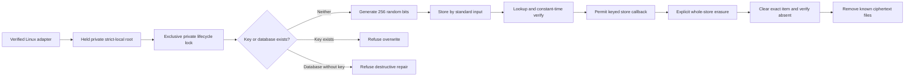

# Secret-Store Integration and Encrypted-Backup Format

**Status:** Implemented Linux and kernel boundary with explicit continuity gaps  
**Contract version:** 1  
**Canonical store schema:** 3  
**Backup format:** `agentmage-sqlcipher-backup-v1`

This record describes the current Fedora and Ubuntu Secret Service integration
and the encrypted operational-store backup accepted by the kernel. It is a
review artifact, not a key, backup manifest, configuration source, or startup
authority. The compiled implementation and its tests govern if this document
becomes stale.

## Secret-Store Item

| Field | Exact value or rule | Secret-bearing |
|---|---|---|
| Backend | Freedesktop Secret Service through verified `/usr/bin/secret-tool` | No |
| Schema attribute | `agentmage-schema=1` | No |
| Profile attribute | `agentmage-profile=<bounded-profile-id>` | No |
| Purpose attribute | `agentmage-purpose=operational-store-key-v1` | No |
| Display label | `AgentMage local credential` | No |
| Stored value | 64 hexadecimal bytes encoding one 32-byte key | Yes |
| Generation | Operating-system `getrandom`; exactly 32 bytes required | Yes |
| Lookup scope | One exact profile and the fixed operational-store purpose | No |
| Listing authority | None | Not applicable |

Profile and purpose identifiers are nonempty bounded ASCII containing only
letters, digits, `.`, `_`, or `-`. Secret values are bounded UTF-8 without NUL
or line separators and are zeroized on drop. The operational key decoder
accepts exactly 64 hexadecimal bytes and exposes the resulting 32 bytes only
inside an `OperationalStoreKeyProvider::with_key` callback.

## Process Boundary

| Channel | Current rule |
|---|---|
| Executable | Absolute, regular, root-owned `secret-tool` file with no group or other write bits; descriptor SHA-256 reverified before every execution |
| Arguments | Operation and non-secret exact attributes only; no secret value |
| Standard input | The only channel used to store secret bytes |
| Standard output | Bounded secret lookup channel; immediately wrapped in a zeroizing value |
| Standard error | Bounded to 64 KiB; only byte count and SHA-256 enter a content-free receipt |
| Environment | Cleared, then limited to current-user `XDG_RUNTIME_DIR` and the corresponding D-Bus session address |
| Runtime | Ten-second process deadline; malformed status, output, timeout, or client identity fails closed |
| Public errors | Stable content-free codes without profile, purpose, path, value, key, or client output |

The normal Linux authority-open path accepts only
`LinuxOperationalStoreKeyProvider`. The provider cannot list, select, store, or
return general credentials. A missing, malformed, or unavailable key prevents
the database callback and creates no database.

## Provisioning and Erasure

First-install provisioning requires an independently verified Linux adapter,
an owner-only strict-local state root, and a fixed mode-`0600` single-link
lifecycle lock. It refuses key overwrite and refuses an existing authority
database without its key. Successful storage is followed by exact lookup,
decode, and constant-time comparison.

Whole-store cryptographic erasure closes the database before clearing the exact
Secret Service item and verifying that lookup returns `not found`. Database,
WAL, and shared-memory ciphertext files are removed only after key absence.
This is not per-record erasure, does not erase separately keyed backups, and
makes no physical-overwrite claim. Interruption-safe key rotation is explicitly
unavailable.

## Encrypted-Backup Format

| Property | `agentmage-sqlcipher-backup-v1` rule |
|---|---|
| Container | One closed SQLCipher database file; no plaintext wrapper or outer manifest |
| File creation | New mode-`0600` regular file only; no overwrite or symlink target |
| Storage class | Strict-local eligible filesystem with no synchronization marker |
| Encryption key | Exactly 32 bytes supplied through a separate provider callback |
| Canonical schema | Exact current schema version 3 and exact migration-history hashes |
| Database policy | SQLCipher logging off, cipher memory security on, foreign keys on, trusted schema off, secure delete on, memory-only temporary storage, full synchronization, WAL autocheckpoint 1 |
| Writer policy | Exclusive locking, WAL journal, zero busy timeout |
| Copy mechanism | SQLite online backup API in bounded 64-page steps |
| Successful handoff | Closed main database file with no required WAL or shared-memory sidecar |
| Verification | SQLCipher presence, cipher/page integrity, SQLite quick check, foreign-key check, schema history, complete canonical authority, retention event chains, state digest, and source generation |
| Receipt | Schema version, canonical generation, and SHA-256 of the closed encrypted main file only |
| Startup authority | A keyed and fully verified SQLCipher backup may be opened as a source for explicit restore; it is never selected implicitly |

The outer file does not expose a plaintext SQLite header or AgentMage metadata.
Format identity is established only after a keyed open and complete internal
verification. The receipt contains no record, path, key, profile, or plaintext
digest.

The backup API requires a separately supplied key provider, and tests use a key
different from the live store key. The current type boundary does not compare
or prove that the caller supplied a different key, and the production Linux
composition does not yet provision a dedicated backup-key identity. Distinct
backup-key lifecycle is therefore a required integration invariant, not a
current end-to-end production claim.

## Restore Contract

1. The encrypted source and destination must be different strict-local paths.
2. The source must already exist as a private regular file and open under its
   supplied key at exact schema version 3.
3. The destination must not exist and is created mode `0600` under a separately
   supplied destination key.
4. The online backup API copies source state into the fresh destination.
5. Complete canonical verification and matching generation are required before
   a content-free candidate receipt is returned.
6. Wrong key, corruption, schema drift, unsafe storage, occupied destination,
   or verification failure leaves no invocation-created candidate and does not
   alter the source or live canonical store.
7. Restore produces only a verified candidate. It does not select, swap, or
   overwrite the live authority database.

## Current Evidence and Limits

Deterministic tests cover exact key decoding, callback non-invocation for an
invalid key, content-free errors and debug output, missing and wrong keys,
encrypted headers, exclusive writers, occupied backup destinations, backup
reopen, source/destination re-encryption, wrong-key and corrupt restore,
fresh-candidate cleanup, and whole-store erasure. Three live Secret Service
tests exist but remain environment-dependent and ignored by the standard gate.

The following are deliberately not claimed by this artifact:

- a production-provisioned, independently identified backup key;
- interruption-safe key rotation;
- atomic publication or crash-complete cleanup of an in-progress backup;
- an immutable outer manifest, integrity tree, retention schedule, or snapshot
  family;
- atomic live-store selection, rollback, or clean-device recovery;
- live Secret Service execution in retained evidence;
- macOS Keychain, Windows credential storage, packaging, or release support; or
- the later Sprint 11 secret-canary and crash-point campaigns.

Those continuity features remain assigned to Sprint 161 and the remaining
Sprint 11 verification tasks. This artifact must not be used to imply them.
