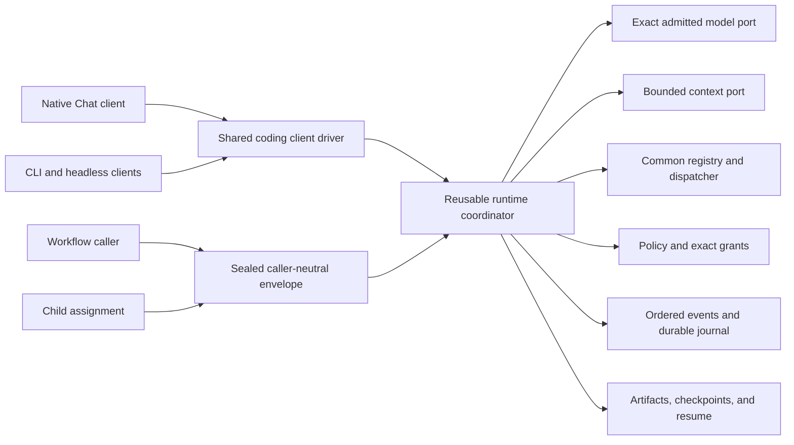
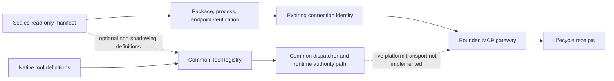

# Shared Runtime, Workflow, and MCP Boundaries

## Status

This document describes source-level pre-alpha components. It does not claim an
integrated product, enabled model, supported platform, live MCP server, workflow
engine, multi-agent director, or release gate.

## One Runtime

`WorkflowRuntimeSubmission` binds the complete existing `RuntimeRunRequest`,
its exact `WorkPacket`, caller ancestry, requested tool identities, snapshot
digests, and a sealed authority intersection. Budgets, stop conditions, model,
tools, policy, journal cursor, and output ceilings remain owned by the runtime
request rather than being copied into a competing workflow schema.

Effective workflow authority is the set intersection of exactly one `user`,
`workflow`, `node`, `parent`, `task`, `policy`, and `explicit_grant` layer.
Missing, duplicate, malformed, or noncanonical layers fail closed. No layer can
add authority absent from another, and unattended approval is always false.

The in-memory caller maps submit, acknowledge, stream, wait for user, explicit
resume, cancellation, terminal outcome, artifacts, and evidence onto existing
runtime events. It has no scheduler, lease, retry, trigger, credential,
branching UI, durable workflow definition, or separate execution loop.

## Child Assignment Boundary

`ChildRuntimeAssignment` wraps the same sealed workflow submission. It binds
parent and child identities, sorted dependencies, bounded nesting depth, and
mandatory parent review. A terminal child result becomes
`ChildRuntimeProposal` with evidence and artifact references, review state
`Pending`, and `authority_from_result: false`.

This is only the dependency-safe Sprint 95 attachment. Sprints 89-94 still own
durable workflow definitions, schedules, leases, retries, cancellation graphs,
agent definitions, child worktree ownership, isolation, and conflict handling.
Sprint 95 still owns parent review state machines, director views, sequential
and bounded parallel coordination, and complete attributable receipts.

## Optional MCP Boundary

The contracts distinguish in-process, local standard-I/O process, local socket,
loopback TCP, and remote HTTPS transports. Admission requires immutable package,
process, endpoint, capability, root, destination, schema, limit, cancellation,
and requested-operation declarations. The current registry admits only
`workspace_read`, no brokered credential identities, and no changed side effect.

MCP tools pass through the common tool-definition and argument validators.
They cannot shadow a native identity or become a prerequisite for rebuilding a
native-only registry. Responses remain untrusted, non-publicly classified at
the gateway boundary, schema-bound, digest-bound, size-bound, item-bound, and
one-use. Cancellation and disconnect are terminal only after descendant cleanup
is asserted.

## Remaining Evidence

- live MCP process and network transport confinement;
- exact runtime grant consumption before MCP exchange;
- runtime event, receipt, evidence, and artifact parity with an equivalent
  native read tool;
- malicious-server process, filesystem, network, secret, and descendant tests;
- recorded reference-hardware load and pressure campaigns;
- full workflow and child isolation supplied by Sprints 89-95;
- supported-platform package acceptance and independent review; and
- the separately deferred manual fuzz campaign.

Passing local contract tests does not close Sprint 50, Sprint 80, Sprint 81,
Sprint 95, a release gate, or current product implementation truth.
