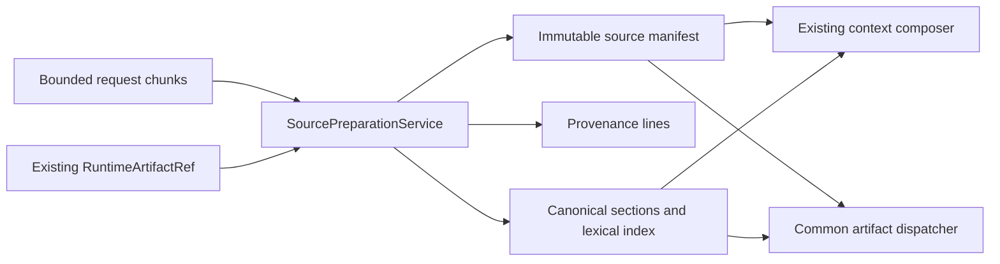

# Source-Artifact Preparation and Context Accounting

Status: Story 22.3 local production text/log implementation

## One source boundary

`SourcePreparationService` is the runtime-owned boundary for supplied plain text and logs. A caller
may submit complete captured bytes or bounded transport chunks. Publication is atomic: cancellation,
oversize input, malformed identity, invalid encoding, binary content, unsupported media, tokenizer
drift, or a mismatched persistence reference publishes no prepared source. Every admission attempt
also receives a content-free terminal observation, so a refused or unsupported supplied source can
appear in context accounting without exposing its bytes.

The service defaults to process-memory retention. Policy-persisted input must already have an exact
`RuntimeArtifactRef` from the encrypted runtime-artifact authority, including matching payload
digest, size, media type, manifest identity, and policy revision. The preparation service creates no
second database, object store, filesystem namespace, or path authority. On restart, the host reads
bytes through the existing artifact authority and `restore_persisted` republishes a projection only
when recomputation equals the complete retained prepared-source manifest.

## Text and log preparation

The admitted media families are `text/plain`, `text/x-log`, and `application/log`. Auto decoding
accepts a UTF-16 BOM or strict UTF-8; explicit UTF-8, UTF-16 little/big endian, and ISO-8859-1 are
available. No lossy decoder silently replaces bytes. Every retained line carries its original byte
range, one-based line number, stable origin-derived line identity, content digest, normalized inert
text, and repeated-line state. ANSI control sequences are removed only when syntactically complete;
malformed escape text remains visible.

The 25 MiB input ceiling, 64 MiB aggregate retained-source ceiling, 500,000 decoded-line ceiling,
16,384-section ceiling, and caller-selected smaller limits are checked before publication. Output
pressure selects a deterministic balanced head/tail subset and reports exact total, retained, and
omitted line counts. Error, warning, stack, test-result, timestamp, and ordinary text runs become
stable child sections under one content-free document root. Search is deterministic and local to a
normalized lexical index; range reads preserve exact byte, line, or section coordinates.

Append-only log refresh recomputes the successor and verifies every prior line identity before
publication. A successful append marks the predecessor stale. Shorter or prefix-changing candidates
return explicit truncation or rotation without blind reuse. Manual release, retention expiry, and
deletion clear content and indexes before retaining only content-free lineage.

## Complete context accounting

Prepared sections enter the existing `compose_context` path as `ContextItemCandidate` evidence.
There is no second prompt builder. Before composition, the service verifies the checked model-window
plan, exact tokenizer digest, counter implementation digest, and recomputed section token counts.
The source-artifact partition alone is supplied to the existing byte/token budget; workflow recovery,
output, system/tool/user, retrieval, safety, and unallocated reserves are not borrowed.

The prepared-source context manifest contains one source-level record and one record for every
canonical section. Dispositions are closed: included, summarized, truncated, duplicate, stale,
unsupported, unavailable, restricted, or omitted. Every non-included disposition has a stable reason.
The manifest binds the checked window-plan digest, tokenizer/counter identities, allocated and used
tokens, complete composition accounting, packet digest, and its own canonical digest. Duplicate
content is deterministic, restricted/private material is withheld before packet construction, stale
dependencies cannot enter, and unsupported admission observations remain visible.

## Native artifact operations

`NativeSourceArtifactBackend` projects prepared manifests, sections, line/byte fragments, and log
diagnostics into the Story 16.2 protocol. All seven identities use `dispatch_artifact`, the common
native registry, exact freshness, one-use call ledger, declared output limits, cancellation, and a
single terminal receipt. The adapter has no raw path, parser, database, model, MCP, network, or write
bypass. Restricted/private content is withheld. Page and sheet identities remain unregistered.

## Evidence boundary

Local tests cover strict encodings and binary refusal; ANSI, repetition, cluster, range, and lexical
goldens; chunk overflow and cancellation; a 25 MiB log; append, rotation, truncation, stale, restart,
corrupt reattachment, release, expiry, and deletion; duplicate/restricted/unsupported/budget context;
tokenizer and profile drift; all seven production artifact calls; schema mutations; and canary scans.
The retained campaign is source-bound local evidence for RV-08, RV-16, RV-17, and RV-18. It does not
claim installed-package, Windows, physical-fault, real admitted-model, independent-review, or release
qualification.
