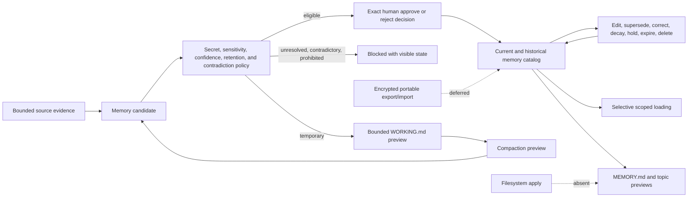

# Source-Backed Memory Boundary

## Purpose

Sprint 31 separates temporary context, source-backed durable memory, human decisions, and
human-readable files. A model may propose a candidate, but cannot remember, correct, supersede,
decay, hold, delete, or write a memory item on its own authority.

## Candidate Policy

Memory identities are stable and independent of paths. The closed type taxonomy is working,
episodic, semantic, procedural, and preference. Every candidate carries exact workspace,
project, and conversation scope; bounded content; optional normalized fact key; tags and links;
content-addressed evidence; sensitivity; confidence; creation and optional expiry; and visible
inferred-sensitive/model-requested markers.

Policy produces temporary context, durable fact, preference, procedure, episode, unresolved claim,
contradiction, or prohibited state. Secrets, restricted data, and inferred-sensitive content are
prohibited from Markdown memory. Source-free or low-confidence assertions remain unresolved.
Different current content under the same scoped fact key remains a contradiction and cannot be
silently promoted. Working context cannot be durably promoted as-is.

Eligible durable candidates still require an exact human approve/reject decision bound to the
candidate digest and decision-evidence digest. Model-requested promotion changes no policy field.
Rejected candidates retain no proposed content in the resulting tombstone.

## Working and Durable State

`WorkingMemory` enforces explicit entry and UTF-8 byte ceilings and can render its complete set as
a no-write `WORKING.md` preview. Compaction takes explicit source-entry/proposed-candidate pairs,
inherits exact scope/evidence/sensitivity, cannot raise confidence, and emits only ordinary
candidates that must pass policy and human review. It neither creates durable state nor clears the
working set.

The in-memory catalog retains current and historical items under atomic clone/validate/publish
transitions. Edit, correction, and supersession require an independently approved replacement
identity with the same scope and fact key. The original becomes `Superseded` and links to the
replacement. Confidence decay can only lower confidence. Holds resist policy expiry. Deletion
removes content, tags, and links while retaining a content-free tombstone and evidence/decision
identity. Failed transitions publish no revision.

## Human-Readable Previews and Retrieval

The catalog deterministically previews a compact linked `MEMORY.md` plus one portable
`Memory/memory-*.md` topic file per identity. Topic frontmatter exposes type, status, confidence,
dates, tags, links, and candidate/decision digests. Current and historical sections remain
separate. Preview objects have fixed false write markers and no apply method.

Selective loading requires an exact workspace and can further require project, conversation,
memory type, any-match tags, links, evidence IDs, and all-match literal relevance terms. Only
approved/held items enter by default. Stable ranking uses visible match reasons, confidence, last
verification, and identity under result and byte budgets. Every hit includes source evidence,
sensitivity, status, last verification, and supersession. The result explicitly records that no
cross-workspace content entered.

## Open Boundary

This sprint slice does not write `MEMORY.md` or `WORKING.md`; it produces source-preserving previews
for a later protected file adapter. It also does not implement encrypted versioned export/import,
atomic installed-file recovery, backup restore, simultaneous-edit conflict files, or machine
migration evidence. Those items, upstream Sprint 30 closure, and independent review remain
required before Sprint 31 can pass.
