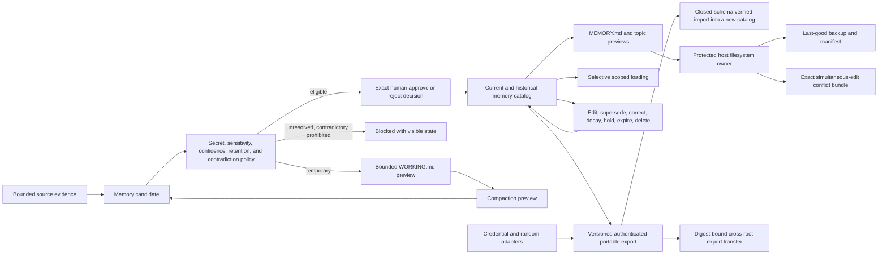

# Source-Backed Memory Boundary

## Purpose

Sprint 31 separates temporary context, source-backed durable memory, human decisions, and
human-readable files. A model may propose a candidate, but cannot remember, correct, supersede,
decay, hold, delete, or write a memory item on its own authority.

## Candidate Policy

Memory identities are stable and independent of paths. The closed type taxonomy is working,
episodic, semantic, procedural, and preference. Every candidate carries exact workspace,
project, and conversation scope; bounded content; optional normalized fact key; tags and links;
content-addressed evidence; sensitivity; confidence; creation and optional expiry; and visible
inferred-sensitive/model-requested markers.

Policy produces temporary context, durable fact, preference, procedure, episode, unresolved claim,
contradiction, or prohibited state. Secrets, restricted data, and inferred-sensitive content are
prohibited from Markdown memory. Source-free or low-confidence assertions remain unresolved.
Different current content under the same scoped fact key remains a contradiction and cannot be
silently promoted. Working context cannot be durably promoted as-is.

Eligible durable candidates still require an exact human approve/reject decision bound to the
candidate digest and decision-evidence digest. Model-requested promotion changes no policy field.
Rejected candidates retain no proposed content in the resulting tombstone.

## Working and Durable State

`WorkingMemory` enforces explicit entry and UTF-8 byte ceilings and can render its complete set as
a no-write `WORKING.md` preview. Compaction takes explicit source-entry/proposed-candidate pairs,
inherits exact scope/evidence/sensitivity, cannot raise confidence, and emits only ordinary
candidates that must pass policy and human review. It neither creates durable state nor clears the
working set.

The in-memory catalog retains current and historical items under atomic clone/validate/publish
transitions. Edit, correction, and supersession require an independently approved replacement
identity with the same scope and fact key. The original becomes `Superseded` and links to the
replacement. Confidence decay can only lower confidence. Holds resist policy expiry. Deletion
removes content, tags, and links while retaining a content-free tombstone and evidence/decision
identity. Failed transitions publish no revision.

## Human-Readable Previews and Retrieval

The catalog deterministically previews a compact linked `MEMORY.md` plus one portable
`Memory/memory-*.md` topic file per identity. Topic frontmatter exposes type, status, confidence,
dates, tags, links, and candidate/decision digests. Current and historical sections remain
separate. Preview objects have fixed false write markers and no apply method.

Selective loading requires an exact workspace and can further require project, conversation,
memory type, any-match tags, links, evidence IDs, and all-match literal relevance terms. Only
approved/held items enter by default. Stable ranking uses visible match reasons, confidence, last
verification, and identity under result and byte budgets. Every hit includes source evidence,
sensitivity, status, last verification, and supersession. The result explicitly records that no
cross-workspace content entered.

## Portable Encrypted Export

The portable boundary serializes the complete current and historical catalog into a closed
version-1 envelope and encrypts it in place with XChaCha20-Poly1305. HKDF-SHA-256 derives a
domain-separated file key from a nonzero 256-bit key supplied by a trusted credential adapter and
a fresh 256-bit public salt. The trusted caller also supplies a fresh 192-bit nonce; this pure
capability does not acquire randomness, open a credential store, or retain the key in debug output.

The authenticated header binds format version, salt, nonce, exact plaintext length, and plaintext
digest. The envelope binds catalog revision, a full catalog digest, and every item field including
scope, content, tags, links, evidence, sensitivity, lifecycle dates, decision identities, and
supersession. Import verifies length, version, AEAD, plaintext digest, closed JSON schema, portable
identities, link closure, lifecycle states, and recomputed catalog digest before constructing a new
in-memory catalog. Wrong keys, changed bytes, truncation, version drift, duplicate identities,
invalid transitions, and digest drift fail without a partial catalog.

Export refuses restricted data, credential candidates, absolute host-path evidence, nonportable
identities, and invalid evidence metadata. Ciphertext proposals and import receipts expose no
filesystem apply method and retain fixed false machine-path, credential, and file-write markers.
Fresh salt and nonce generation, key storage, and durable file application remain responsibilities
of later trusted platform adapters.

## Installed File Recovery

The host filesystem owner accepts only a complete no-write `MemoryMarkdownBundle` whose index,
ordered topic paths, content hashes, and bundle digest recompute exactly. It stages private files
under the selected local root, snapshots the verified current projection as last-good bytes, then
publishes each staged file and the closed manifest. It owns no model or network handle and records
that no automatic decision occurred.

Every update supplies the bundle identity the caller observed. A mismatch changes no governed
file and retains the complete proposed Markdown and manifest under a transaction-named conflict
directory. On restart, current files are checked against the installed manifest; corruption or an
interrupted projection restores the previously verified manifest and exact last-good bytes.
Portable encrypted export files cross machine roots only as bounded opaque bytes with the caller's
exact digest. Absolute, parent-relative, multi-component export names, symlinks, digest drift, and
oversized files fail closed.

## Open Boundary

This sprint slice now owns approved `MEMORY.md` topic-bundle publication, last-good recovery,
simultaneous-edit conflict preservation, and exact encrypted-export transfer between explicit local
roots. `WORKING.md` application, credential-store integration, and trusted entropy acquisition are
not added. Upstream Sprint 30 closure and renewal of the source-bound aggregate under the inherited
strict-local host prerequisite remain required before Sprint 31 can pass.
