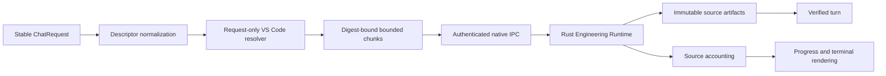

# Stable Chat Participant Reference Ingress

## Status

Story 23.5 has a stable public-API implementation for request-bound prompt and reference
collection. The `@agentmage` participant accounts for every supplied `ChatRequest.reference`,
revalidates the exact selected AgentMage profile immediately before capture, resolves only values
present on that request, and sends exact bytes to the Rust-owned Engineering Runtime over the
existing authenticated IPC channel.

This is local implementation evidence. Installed VSIX, assistive-technology, remote-placement,
supported-platform, qualified-production-model, and independent-review campaigns remain open.

## Authority Boundary

The TypeScript shell may read a `string`, `Uri`, or `Location` only because that exact value appears
in the current stable participant request. It has no ambient enumeration, path selection, parser,
context manager, model runtime, policy, grant, tool, store, or effect authority. URI text and
private paths are not placed in the source manifest or progress output.

## Complete Accounting

Each descriptor receives a stable request-local identity and a content-free descriptor digest.
The state family is closed over `queued`, `reading`, `extracting`, `partial`, `unsupported`,
`omitted`, `stale`, `cancelled`, `failed`, and `included`. Current text is captured directly. URI
and location values are read through `workspace.fs` only after a bounded stat, and their size,
type, and modification revision are rechecked after the read. Revision drift becomes `stale`; an
unknown value becomes `unsupported`; no state falls back to a workspace search.

Prompt and included-reference bytes use Verified Chat's existing `begin_artifact`, ordered
`upload_artifact_chunk`, and `commit_artifact` operations. Each 12 KiB chunk has sequence, offset,
length, finality, and SHA-256 bindings. The Rust host revalidates the declared total and digest
before immutable capture. Cancellation is checked before each chunk and before commit, and failure
requests exact upload cancellation.

The final content-free participant manifest binds request identity, command, prompt artifact,
every supplied descriptor, terminal source state, exact included artifact identity, byte count, and
digest. Because the stable API has no optional-reference marker, every supplied descriptor is
required. Any terminal state other than `included` cancels the session and stops before the model
turn; AgentMage never executes on a silently weakened subset. Only when all records are included do
their artifact identities enter the verified turn's context set.

## Provider Compatibility

The language-model provider remains a limited compatibility and picker surface. It preserves every
bounded user/assistant text message and part boundary, and visibly refuses unsupported parts,
caller tools, model options, non-default tool modes, or oversized histories before execution. It
directs those requests to Verified Chat, emits exact strict-local route and byte/part usage
disclosures for supported requests, and explicitly reports exact token usage as unavailable. A
provider label, proxy, or MCP adapter therefore cannot claim omitted bytes or a resource it did not
receive. The complete matrix is documented in
`docs/architecture/native-chat-compatibility-disclosure.md`.

## Accessibility and Presentation Contract

Participant progress uses the stable Chat progress stream, whose updates are announced politely in
source order. Every status is content-free and bounded to 256 characters. Request-local source
identities must use the closed identifier grammar, so a native path cannot become announced status
text. Terminal errors render only a closed reason code and source-record count; raw exceptions,
private paths, source content, and restricted metadata are excluded.

The participant performs no focus-changing command, editor reveal, or timed interaction, so focus
remains in the Chat input controlled by Visual Studio Code. Cancellation uses the request token and
the standard keyboard-accessible Chat cancel action; the token is checked during reference
resolution, every upload chunk, before commit, and before run submission. The exact source contract
is exported as `PARTICIPANT_ACCESSIBILITY_CONTRACT` and mutation-tested. Packaged VSIX interaction
with supported screen readers remains a verification task rather than an implementation claim.

## Local Verification and External Qualification

The deterministic extension-host suite covers 999- and 1,001-character prompts, multiple text,
file, virtual, unknown, and stale references, digest-bound chunk capture, duplicate identities,
cancellation before model work, and provider non-text accounting. Existing Engineering RPC tests
cover malformed, reordered, duplicate, oversized, interrupted, digest-mismatched, and replayed
artifact frames at the Rust boundary.

The following remain non-passes until run independently in their declared environments:

- packaged VSIX keyboard and supported-screen-reader verification of the implemented contract;
- Fedora, Ubuntu, Windows, macOS, WSL, Remote SSH, and Dev Container placement and cleanup;
- execution with an independently qualified production profile; and
- independent security, accessibility, and release review.
