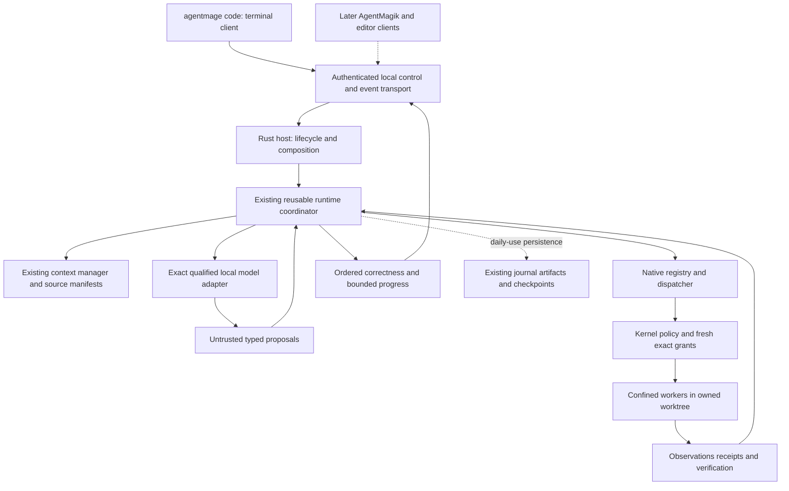

# Standalone Coding Harness

| Field | Value |
|---|---|
| Status | Accepted design under Decision 0061; installed coding workflow not implemented or qualified |
| Source baseline | AgentMage `6f90f81cbeaa930674a2f98e8ee27bfd8814a59b` |
| Reference | OpenCode `e059ac5918f3e2c798de029b9df4cede617466ed`, inspected source only |
| Product authority | PRD Section 40 |
| Execution owners | Tasks 48.2.4-48.2.6 and 50.2.4; existing host, kernel, model and platform owners |

## 1. Product Contract

AgentMage itself provides repository exploration, bounded context, coding,
testing, failure correction and verified reporting. A user launches
`agentmage code`, chooses an approved repository and model, gives an objective,
sees what is happening, controls consequential actions and receives inspectable
results. The first implementation is Linux and strict-local.

The full stack enhances this experience later. AgentMagik supplies another user
interface; CodingMage can supply separately qualified delegation and review;
USTE can supply source-backed derived retrieval. None supplies missing execution
authority, the primary coding loop, or a prerequisite database for the first
session. AgentMage is not asked to develop or modify its own running checkout.
Acceptance uses disposable synthetic repositories.

## 2. Adopt, Adapt and Exclude

The pinned OpenCode sources below demonstrate a connected user workflow. These
are design references, not copied implementation or asserted API compatibility.

| Reference pattern | AgentMage integration | Owning work |
|---|---|---|
| Session handlers call prompt, abort and permission services [O1] | One authenticated local service consumed by CLI and later UI clients | 48.2.4 |
| Prompt and processor feed observations into subsequent turns [O2] | Reuse `ReusableRuntimeCoordinator`; bounded corrections after tool/test failure; verifier owns success | 48.2.4, 48.2.6 |
| Structured event subscription [O3] | Bounded progress channel plus ordered correctness events; explicit backpressure and reconnect limits | 48.2.5 |
| Edit results and diagnostic feedback [O4] | Native exact-preimage patches, current validation and inspectable diffs; real LSP remains separately qualified | 48.2.5, 50.2.4 |
| Shell streaming and output truncation [O5] | Confined registered commands, separate stdout/stderr, bounded previews and later verified full artifacts | 48.2.5, 50.2.4 |
| Permission prompts [O6] | Exact challenge presentation; never adopt a blanket reusable effect grant | 48.2.5, 50.2.4 |
| Session compaction and revert [O7] | Source-preserving context manifests, explicit loss accounting, fresh-authority rollback and drift-aware resume | 50.2.4 |
| Recorded tool-loop and shell tests [O8] | External-process scripted fixtures plus separate qualified-model campaigns | 48.2.6 |

Do not copy unbounded event queues, permissive server exposure, ambient shell
execution, model-certified completion, or lossy summaries presented as memory.
Do not add Bun/TypeScript to the kernel, an OpenCode service, a competing store,
or another model loop. Reconsider individual upstream libraries only when an
identified component benefits and dependency/license review is complete.

## 3. One Runtime, Real Composition

These are runtime data flows, not new compile dependencies. Existing
`architecture/dependency-rules.json` and `architecture/runtime-ownership.json`
remain authoritative. The host composes; the kernel decides; the platform
enforces; the client displays and relays authenticated user decisions.

| Existing surface | Required integration delta |
|---|---|
| `shells/host/src/bin/agentmage.rs` and `bin/agent.rs` | Replace the unconditional unavailable branch only after the corresponding operational path exists; preserve typed non-success when prerequisites fail |
| `shells/host/src/main.rs` | Install actual lifecycle and factory composition; retain package/trust checks and explicit activation refusal |
| `native_chat_runtime.rs` | Supply a non-replay `NativeChatRuntimeFactory` with real model, context, tool boundary, clock and verifier dependencies |
| `coding_harness.rs`, `linux_coding_runtime.rs` | Reuse native profile and effect mediation; no second dispatcher or direct CLI filesystem/command execution |
| `runtime_transport.rs`, `cli_runtime.rs` | Evolve the synchronous step interface into a versioned live control/event contract without making clients runtime owners |
| Native model adapter and llama-server driver | Consume an exact admitted coding tuple; enforce actually served context, decoding, cancellation, resource and isolation contracts |
| Runtime journal, artifacts and operational store | Remain sole authorities when durable mode is integrated; no parallel conversation database |

The current `start/advance` driver returns event batches at runtime boundaries.
It is not proof that a user can cancel a blocking inference or command, or see
output before a step returns. The implementation must address this explicitly.

## 4. Launch and Trust

The first work item inventories build inputs, Linux confinement probes,
Secret Service/state prerequisites, executable/package identity, model files,
runtime/codec, context contract and actual resource budget. It records precise
missing dependencies and the owner/action for each, not a generic network error.

Use the existing private Unix-domain socket and peer-identity mechanisms for the
Linux coding service. Bind the session to UID, process identity, executable,
protocol version, workspace, model profile and one-use launch challenge. Retain
the applicable package/bootstrap checks. Reject foreign peers, stale sockets,
replayed challenges and wrong profiles before admitting a run. No public HTTP
listener, shared secret in model context, or loopback-equals-trust shortcut.

An internal development profile, if necessary, requires a separate accepted
trust/activation contract before live effects. It is isolated to designated
disposable roots, has explicit development labeling and cannot load production
trust state or qualify a release. Test-only factories remain test-only. This
design neither supplies missing signing authority nor removes activation gates.

Launch is bounded and single-owner. A second client cannot acquire a second
writer for the same worktree. Startup failure unwinds only resources owned by
that attempt. Diagnosis distinguishes unavailable implementation, host absence,
failed peer authentication, protocol incompatibility, missing activation,
unqualified model and unavailable confinement. Messages expose no credentials.

## 5. Session, Turn and Live Transport

Keep session identity distinct from run/turn identity and model/tool attempt
identity. Every follow-up is newly framed against the current repository state,
context budget and authority. Only one effect-bearing turn holds a worktree
lease. Duplicate submit/request identities cannot repeat an effect.

Extend existing closed contracts rather than invent unrelated message families.
The interface needs prepare/start, follow-up submission, event subscription,
approval response, cancel, status/outcome inspection and release. Version and
capability negotiation reject unavailable methods. Clients cannot submit grant
objects or choose a privileged profile by merely naming it.

Separate the host's control handling from blocking model and worker execution:

- Start acknowledges an admitted run promptly; it does not wait for inference
  to finish before servicing cancellation or status.
- Correctness events have a monotonically ordered run-bound cursor and digest;
  approvals, receipts and outcomes are never silently dropped or reordered.
- Text/progress updates are bounded and may be coalesced with explicit counts.
  They carry no completion authority and do not require a durable write per token.
- A slow client cannot cause unlimited memory growth. Define queue byte/item
  ceilings, timeout, overflow behavior and replay/retention limits in the profile.
- Control/cancellation has reserved capacity and cannot sit behind full stdout
  buffers. A blocked event consumer cannot prevent worker termination.
- A same-process reconnect can request retained events only within the declared
  retention window; an expired cursor yields explicit unavailable history.
  The ephemeral milestone promises no host-crash resume or durable replay.
- A disconnected client does not magically cancel or authorize work. The host
  remains the state owner and applies its admitted run deadline, pending-approval
  expiry and worktree/resource lease. Reconnect cannot replay a consumed grant.

## 6. Coding and Authority Loop

The runtime performs read/search -> evidence-backed plan -> exact patch proposal
-> policy/approval -> effect -> observation -> test -> bounded correction ->
verification. Native tools register directly. MCP is not needed for read, patch,
Git inspection, command or validation operations.

Approve the actual targets, arguments, preimages, effects, limits, expiry and
challenge digest. Changes invalidate approval. Denial is inert, not an invitation
to retry through another tool. A failed test is an observation available to the
next permitted attempt; it cannot be relabeled success. Invalid tool proposals,
repeated no-progress results and exhaustion terminate truthfully within budget.

The MVP uses exact operation approvals. The daily-use milestone additionally
supports direct-user-approved bounded session policy: one worktree, explicit
writable paths and command templates, no network/credentials/publication, expiry,
effect/attempt limits and immediate revocation. It is a policy ceiling, not a
reusable `CapabilityGrant`. The kernel issues and consumes a fresh exact grant
after checking each current proposal. Out-of-scope operations ask or deny; no
automatic approval responder, wildcard shell authority or Owner-mode fallback.
This is planned work, not an enabled current capability. Workflow and child-agent
authority intersections remain unchanged.

An owned worktree is not an OS sandbox. Confine reads, writes, environment,
network, processes and resource use using the existing Linux boundary. Preserve
the user's active checkout, index, refs, staged/unstaged/untracked files, hooks,
configuration and unrelated work. Cleanup must never run broad reset/clean/stash
operations or delete an unowned root.

## 7. Stop, Recovery and Output

Cancellation reaches model inference, approval waits, tools, commands, tests and
rendering. Requesting cancellation is not evidence that a process stopped.
Record cleanup acknowledgement, descendants, remaining resources and any known
effects; verify no delayed writes after acknowledgement. An effect interrupted
after dispatch is reconciled or reported uncertain, not described as no-effect.
Cancel is idempotent. A cancel/completion race yields one authoritative terminal
result, with effect truth preserved regardless of which transition wins.

Bound stdout and stderr independently while streaming. Preserve exit status,
counts, digests when available, truncation and test-parser disposition. The MVP
may explicitly truncate; it cannot assert complete retained output. Daily use
requires verified full artifact retrieval, retention/deletion, secret-safe
inspection and pressure behavior through Story 22.2's store.

The final report contains objective, repository/base/worktree identity, changed
files, current diff or explicit truncation, checks run/not run, failures,
receipts, unresolved evidence, risks, rollback options and exact terminal status.
Rollback is a new authorized change against current bytes. Later human edits
cause a conflict, not silent overwrite.

## 8. Context and Continuity

Use the actually served context limit and rendered codec token count, reserving
output and tool overhead before every model request. Keep source identity,
ranges, freshness and delivery receipts. Required-but-unseen material prevents
an unsupported completion claim. Tool output and repository instructions are
untrusted data; neither can alter policy or choose a model endpoint.

Start with bounded retrieval and visible overflow refusal. Do not enable
automatic compaction before the G1/G2 continuity gates pass. Daily-use compaction
preserves originals and makes summarized/omitted ranges and retrieval paths
visible. A summary is lossy working context, not a replacement for original
evidence or proof of complete recall.

Durable resume revalidates repository/base/worktree, source, model/runtime/codec,
policy, instructions, tool schemas and checkpoint identities. Reconcile pending
effects; never replay consumed grants. Cross-project, deleted or stale memories
are rejected. Optional future USTE retrieval can be disabled without disabling
coding; operational state remains in AgentMage's existing canonical store.

## 9. Delivery and Dependencies

| Stage | Required delivery | Does not imply |
|---|---|---|
| A: executable foundation | Launch/trust contract, real factory, authenticated transport, terminal input, exact-model admission work | Qualified real-model coding or supported packaging |
| B: interactive control | Live events, exact approvals, responsive cancel/cleanup, follow-ups, diffs and report | Durable crash resume |
| C: `M-HARNESS-MVP` | A/B plus actual binary scripted fixtures and exact-model coding acceptance; existing stale/adversarial/absence groups | Story/sprint/release closure |
| D: `M-HARNESS-DAILY` | Durable continuation, context safety, full output inspection, safe rollback, bounded preauthorization, setup/soak and independent review | All languages/providers/platforms or full GA |
| E: optional ecosystem | Separately qualified AgentMagik, CodingMage, USTE, MCP/ACP and remote adapters | Authority delegation to those clients or models |

All stage-specific prerequisites are recorded on the new sub-task rows. Contract
and scripted-provider work can continue while exact model/trust qualification is
blocked. The stage-C real-model result cannot. The exact admission bundle is
produced by the model/platform owners before stage C without requiring the whole
Sprint 49 gate, which remains downstream of Sprint 48. Complete journal/artifact
lifecycle and persistent resume enter stage D, not stage A.

Stage D consumes the completed journal/artifact/context contract tasks and
implements the remaining Linux coding integration with their owners. In
particular, the recording and reopening work in `22.1.4`/`22.1.5` supplies the
daily context acceptance, not another store or compaction system. Requiring the
whole storage/model stories first would import their broader platform/release
cycles. Exact task-level entry dependencies avoid that cycle without waiving
the Linux privacy, persistence, context or fault tests. Broader story gates
remain open until all of their own evidence exists.

## 10. Acceptance Matrix

These are case labels within existing Story 48.2/50.2 suites, not new stable
requirement IDs. Each records binary/source hashes, command, platform/profile,
inputs, stdout/stderr, timestamps, bounds, filesystem before/after, receipts,
actual result and limitations. Set thresholds before running; never lower them
to turn a recorded failure into a pass.

| Case | Required observation |
|---|---|
| `launch-real-cli` | Spawn actual CLI and host in a fresh state root; obtain a real handshake and run, not an internal helper call |
| `reject-invalid-launch` | Wrong peer, version, challenge, workspace, package or activation is refused before effects |
| `scripted-patch-test` | Scripted untrusted proposals traverse actual IPC, production tool boundaries and verifier; label model as scripted |
| `qualified-model-fix` | Exact admitted local model explores a synthetic bug, patches and runs an approved test through the same binaries |
| `failure-correction` | A genuine failed check returns to the model, a bounded revision occurs and fresh validation proves the result |
| `deny-and-stale` | Refusal, expiry, edited preimage/arguments and replayed approval produce no unauthorized effect |
| `live-control` | Observe progress before long work finishes; cancel under full output/event queues within declared limits |
| `process-stop` | Stop inference/tool/test descendants; prove no delayed writes; distinguish cleanup failure and uncertain effects |
| `preserve-human-work` | Staged, unstaged, untracked and concurrent human changes outside the owned task remain intact |
| `truthful-terminal` | Failed/skipped/zero-test/truncated/malformed results and model prose cannot establish success |
| `small-context` | Served-context preflight prevents overflow; hidden omitted evidence cannot support a completion claim |
| `stack-absent` | Coding works with no other stack service, MCP server, remote account or cloud fallback |
| `daily-recovery` | Host crash, disk pressure, model failure and reconnect preserve truth and never duplicate effects |
| `daily-inspection` | Exact full logs/diffs and conflict-aware undo remain usable after restart with retention enforced |
| `daily-policy` | Preauthorization permits only current in-scope effects; revocation/expiry/budget exhaustion stops future dispatch |
| `daily-context` | Compaction/retrieval retain originals, disclose loss and reject cross-project/stale/deleted evidence |

Keep component, external-process scripted and exact-model results separate.
Test a supported repair, new file, bounded multi-file change and verified no-op;
report repeated model failures instead of selecting only favorable runs. Measure
completion quality, invalid calls, human interventions, latency, peak memory,
queue depth and cancellation cleanup. Independent review is a distinct actor's
assessment, never the implementing agent's own approval.

## 11. Traceability and Remaining Scope

This refines existing coding/CLI requirements and `AM-ERT-001`, `AM-WKF-001`,
`AM-WKF-002`, `AM-SES-002`, `AM-TIO-001`, `AM-CTX-002`, `AM-CTX-003`,
`AM-VER-001`, `AM-OBS-002`, `AM-DEG-001`, `AM-GWY-001` and `AM-GWY-003`.
Existing `AT-ERT-001`, `AT-TIO-001`, `AT-TIO-002`, `AT-VER-001`,
`AT-RESUME-002` and coding fixture groups retain their full gates. No stable
requirement, platform gate or completed record is removed or renumbered.

General shell/PTY, installation, broad LSP, arbitrary model providers, external
network research, commits/pushes, IDE parity, accessibility matrices and teams
retain their owning gates. They are not silently promised by the first bounded
session. No first-party runtime source is changed by this architecture revision.

## Pinned Reference Sources

[O1]: https://github.com/anomalyco/opencode/blob/e059ac5918f3e2c798de029b9df4cede617466ed/packages/opencode/src/server/routes/instance/httpapi/handlers/session.ts
[O2]: https://github.com/anomalyco/opencode/blob/e059ac5918f3e2c798de029b9df4cede617466ed/packages/opencode/src/session/prompt.ts
[O3]: https://github.com/anomalyco/opencode/blob/e059ac5918f3e2c798de029b9df4cede617466ed/packages/opencode/src/server/routes/instance/httpapi/handlers/event.ts
[O4]: https://github.com/anomalyco/opencode/blob/e059ac5918f3e2c798de029b9df4cede617466ed/packages/opencode/src/tool/edit.ts
[O5]: https://github.com/anomalyco/opencode/blob/e059ac5918f3e2c798de029b9df4cede617466ed/packages/opencode/src/tool/shell.ts
[O6]: https://github.com/anomalyco/opencode/blob/e059ac5918f3e2c798de029b9df4cede617466ed/packages/opencode/src/permission/index.ts
[O7]: https://github.com/anomalyco/opencode/blob/e059ac5918f3e2c798de029b9df4cede617466ed/packages/opencode/src/session/compaction.ts
[O8]: https://github.com/anomalyco/opencode/blob/e059ac5918f3e2c798de029b9df4cede617466ed/packages/opencode/test/session/llm-native-recorded.test.ts
