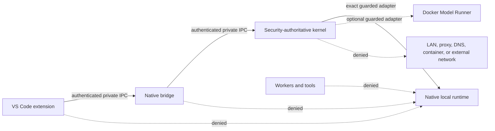
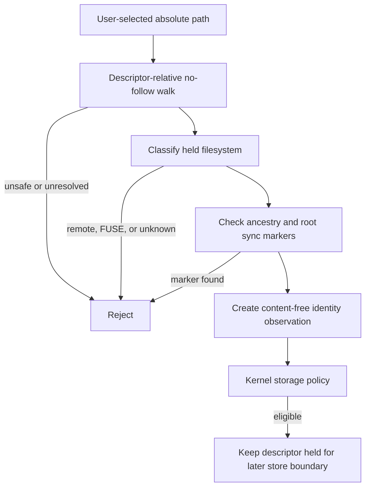

# Strict-Local Network and Data-Root Boundary

## Status

This document describes the implemented shared strict-local policy contracts and the Fedora/Ubuntu data-root inspector. It does not claim that normal-operation process confinement, runtime socket mediation, packet-capture acceptance, or macOS support is complete.

## Normal-Operation Rule

Normal operation has no general network authority. The only representable local inference paths are:

| Runtime topology | Sole client | Destination class | Transport requirement | Identity requirement |
| --- | --- | --- | --- | --- |
| Native `llama.cpp` | Kernel native inference adapter | Authenticated local socket | Mode-restricted Unix-domain socket | Authenticated peer and exact nonzero endpoint digest |
| Optional Docker Model Runner | Kernel Docker inference adapter | Loopback | Separately guarded loopback TCP | Authenticated mediation and exact nonzero endpoint digest |

The Docker topology is a compatibility path, not the Fedora/Ubuntu reference runtime. A loopback address is reachability control and is never treated as authentication by itself.

Every other component and destination class is denied, including the Visual Studio Code extension, bridge, tool workers, converters, indexers, installers during normal operation, undeclared processes, LAN addresses, container networks, proxies, DNS paths, multicast, unspecified listeners, public destinations, and unknown destinations.

The policy evaluator opens no socket. A later platform-owned collector and confinement layer must establish process identity, peer identity, destination class, transport, and attempted byte count. Those observations are untrusted until supplied by that boundary.

## Attempt Ledger

The kernel ledger is append-only and bounded to 4,096 records per in-memory instance. It stores only:

- monotonic sequence and caller-supplied monotonic time;
- attributed component and closed destination class;
- optional local transport and endpoint identity digest;
- attempted byte count; and
- the kernel-computed allow or block decision.

It stores no hostname, IP address, Unix-socket path, payload, prompt, repository content, credential, or environment value. Capacity exhaustion, sequence overflow, and backward time are explicit errors. A production enforcement boundary must treat inability to record an attempted connection as a blocking failure.

## Linux Data-Root Inspection

The Fedora/Ubuntu inspector accepts only an explicit absolute directory. It starts from a held `/` descriptor and opens each path component with `O_PATH`, `O_NOFOLLOW`, and `O_CLOEXEC`. Every component must be a directory. Symbolic links, unsafe components, non-UTF-8 names, open failures, and unavailable metadata fail closed without retaining the path in the resulting contract or error.

The inspector classifies the final descriptor using Linux filesystem magic values:

- known local filesystems are classified as local;
- NFS, CIFS/SMB, 9P, AFS, Ceph, NCP, and Coda are classified as remote;
- FUSE is conservatively classified separately and rejected; and
- every unrecognized filesystem is unknown and rejected.

Known provider-named ancestry components and root sentinels for Dropbox, OneDrive, Google Drive, Nextcloud, ownCloud, iCloud Drive, and Syncthing produce a synchronized-folder marker. Detection is intentionally conservative and is not a claim that every third-party synchronization client can be recognized by a folder name alone.

The resulting observation contains only filesystem class, synchronization-marker class, a SHA-256 digest of the held device/inode/mount/filesystem identity, and the symlink-free result. Kernel policy rejects zero identity, any symbolic link, any synchronization marker, remote storage, FUSE, and unknown filesystems.

Before later storage use, the platform adapter revalidates the held object, mount, filesystem, identity digest, and root-level synchronization sentinel state. The absolute path is presentation input only; it does not become storage authority.

## Remaining Closure Work

Sprint 10 remains open until the product has platform-owned process/socket attribution, listener and writable-path inventory, normal-process confinement, dependency/static checks for hidden network features, hostile-loopback tests, firewall and packet-capture acceptance, a complete offline workflow, and equivalent supported-platform evidence. macOS implementation and evidence are deliberately deferred and must not be inferred from the shared contracts.
