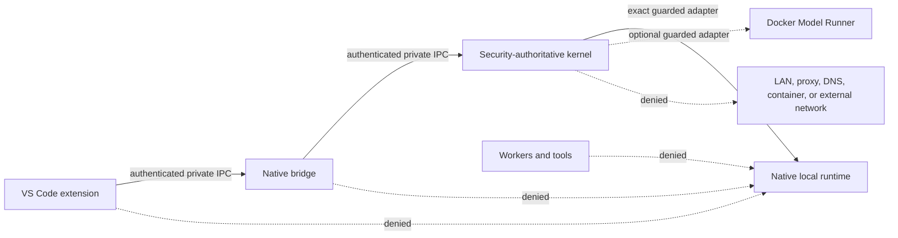
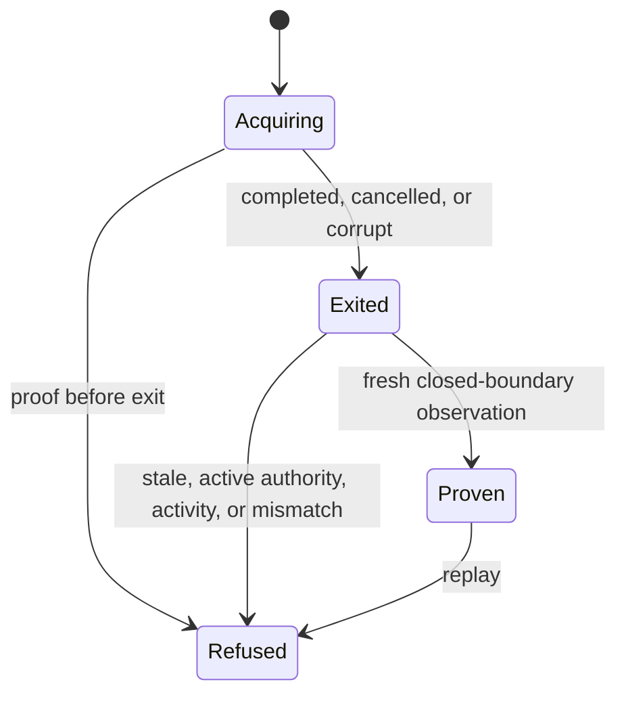
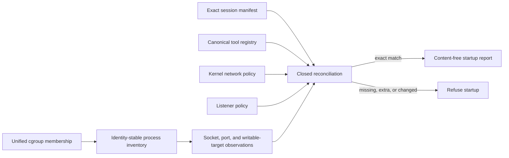
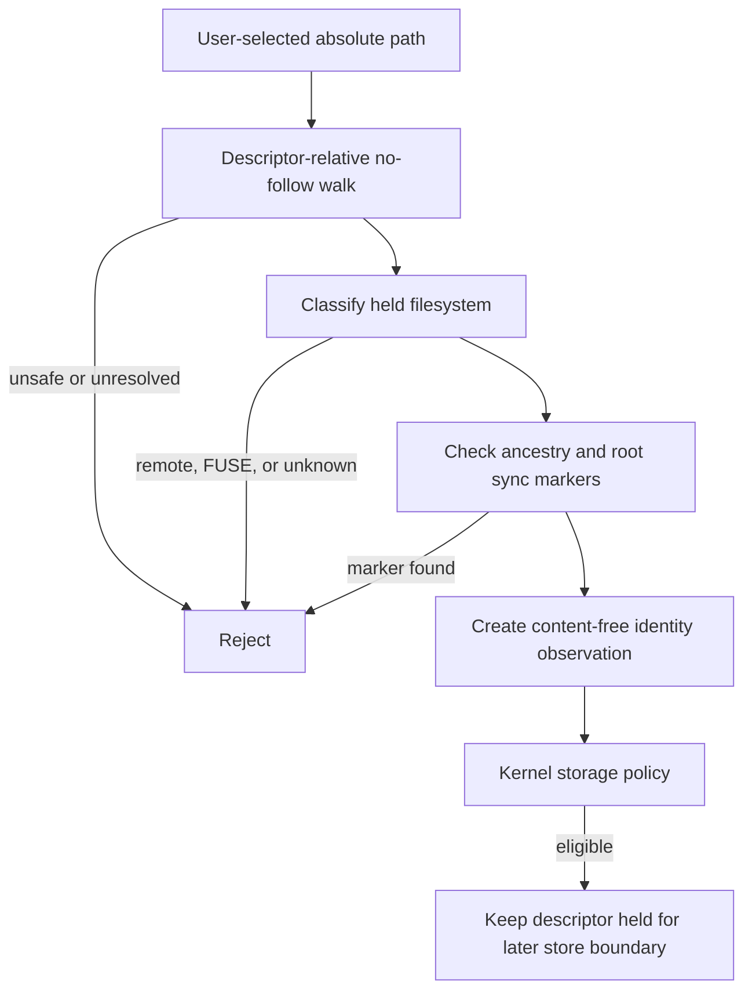

# Strict-Local Network and Data-Root Boundary

## Status

This document describes the implemented shared strict-local policy contracts,
the content-free offline-proof state machine, and the Fedora/Ubuntu data-root
inspector. It does not claim that normal-operation process confinement, runtime
socket mediation, packet-capture acceptance, or macOS support is complete.

## Normal-Operation Rule

Normal operation has no general network authority. The only representable local inference paths are:

| Runtime topology | Sole client | Destination class | Transport requirement | Identity requirement |
| --- | --- | --- | --- | --- |
| Native `llama.cpp` | Kernel native inference adapter | Authenticated local socket | Mode-restricted Unix-domain socket | Authenticated peer and exact nonzero endpoint digest |
| Optional Docker Model Runner | Kernel Docker inference adapter | Loopback | Separately guarded loopback TCP | Authenticated mediation and exact nonzero endpoint digest |

The Docker topology is a compatibility path, not the Fedora/Ubuntu reference runtime. A loopback address is reachability control and is never treated as authentication by itself.

Every other component and destination class is denied, including the Visual Studio Code extension, bridge, tool workers, converters, indexers, installers during normal operation, undeclared processes, LAN addresses, container networks, proxies, DNS paths, multicast, unspecified listeners, public destinations, and unknown destinations.

The policy evaluator opens no socket. Linux now supplies separate bounded IPC
peer-identity and session-inventory primitives; they do not grant authority or
replace normal-process network confinement. Destination class, transport, and
attempted byte count remain untrusted observations until reconciled by the
later product session boundary.

## Attempt Ledger

The kernel ledger is append-only and bounded to 4,096 records per in-memory instance. It stores only:

- monotonic sequence and caller-supplied monotonic time;
- attributed executable SHA-256 identity, component, and closed destination
  class;
- optional local transport and endpoint identity digest;
- attempted byte count; and
- the kernel-computed allow or block decision.

It stores no hostname, IP address, Unix-socket path, payload, prompt, repository content, credential, or environment value. A zero executable identity, capacity exhaustion, sequence overflow, and backward time are explicit errors. A production enforcement boundary must treat inability to record an attempted connection as a blocking failure. The ledger has a deterministic identity that binds every retained fact and the kernel-computed decision.

## Post-Acquisition Offline Proof

The kernel owns a one-way state machine for each separately authorized model
acquisition epoch: `Acquiring` becomes one exact `Exited` disposition and then
becomes `Proven`. A second exit, proof before exit, stale preflight, or replayed
proof on the same non-cloneable workflow instance is refused. The acquisition
orchestrator remains responsible for creating exactly one workflow instance per
epoch. The terminal disposition must agree with the observed staged artifact
state:

| Acquisition disposition | Required artifact state |
| --- | --- |
| Completed | Verified artifact activated atomically |
| Cancelled | Staging removed |
| Corrupt | Rejected bytes quarantined |

A proof is issued only when a newer content-free platform observation reports
zero acquisition processes, acquisition sockets, external network rules,
outbound bytes, and DNS attempts. It also requires nonzero identities for the
complete session-boundary report and active offline firewall policy. The
covered network-attempt ledger range must have exact sequence order, fall
between acquisition start and preflight, and attribute every record to a
nonzero executable digest.

The resulting receipt binds the acquisition epoch, start, exit, disposition,
preflight time, covered ledger range and identity, allowed and blocked counts,
blocked-egress count, session-boundary identity, and firewall-policy identity.
It contains no model bytes, staged path, hostname, address, payload, prompt,
credential, or repository content.

This is the deterministic kernel contract, not a claim that a production model
installer currently supplies these observations. Live acquisition lifecycle
wiring, firewall-rule inspection, syscall/DNS/socket tracing, packet capture,
and supported-platform acceptance remain separate Sprint 10 work.

## Isolated Firewall and Capture Harness

The Linux acceptance harness creates a disposable user and network namespace
from a standard-user process. Namespace-scoped capabilities bring up only
loopback and one synthetic `TEST-NET` dummy interface; no host interface is
joined and no default route exists. An exact nftables output policy defaults to
drop, admits IPv4 and IPv6 loopback, counts every final denial, and is verified
through structured nftables JSON before traffic runs.

Two in-memory `AF_PACKET` captures prove both sides of the fixture. A bounded
local TCP exchange must produce loopback frames. A synthetic DNS datagram to
the documentation-only interface must be refused, increment the firewall drop
counter, and produce zero captured egress frames and bytes. Packet bytes are
counted and immediately discarded; no packet payload or pcap is retained. The
entire firewall, interfaces, routes, sockets, and captures disappear when the
namespace process exits, without changing the host firewall.

This proves that the acceptance harness can observe permitted local traffic
and detect a blocked synthetic egress attempt. It does not exercise an
AgentMage product session, continuous confinement, a model runtime, a physical
network, every workflow, or the required 60-minute acceptance duration.

## Linux Session Inventory

The Linux adapter can snapshot an explicit, bounded PID set. It reads process
start time before collection, retains a pidfd when supported, records whether
the binding is `PidFdAndStartTime` or `StartTimeOnly`, and rechecks start time
after collection. Each accepted record includes PID, parent PID, real UID, and
executable SHA-256 identity. The collector inventories every socket descriptor
for those processes and joins socket inodes to the process network namespace's
TCP, UDP, IPv6, and Unix tables. Unsupported socket families remain visible as
`other` with an unknown destination rather than being dropped.

Internet addresses are immediately reduced to closed destination classes; only ports are retained. Unix endpoint names and writable-descriptor targets are replaced with SHA-256 digests. The collector does not read command lines, environment values, file contents, prompts, repository content, credentials, packet payloads, or socket payloads. Descriptor races, malformed kernel records, duplicate process attribution, and closed-bound overflow fail the snapshot.

Process disappearance, PID reuse, partial or malformed `/proc` state, and
unexpected pidfd failures reject the snapshot. This inventory is an observation
primitive, not an authority source or a complete confinement claim.

The Linux listener policy now reconciles the snapshot against at most 32 exact,
unique session declarations. A declaration can represent only an approved
bridge, kernel, or kernel inference-adapter component and either an exact named
Unix-stream endpoint digest or an exact loopback TCP protocol and port. Every
declared listener must appear exactly once. Unknown owners, undeclared or
missing listeners, duplicate socket objects, wildcard, LAN, link-local,
multicast, container, proxy, DNS, external, and unknown destinations, bound
sockets, and indeterminate socket states fail closed. Duplicate descriptors for
the same PID and socket inode are counted once.

The listener policy alone does not make caller-supplied process attribution
authoritative or prove the absence of short-lived connections. The complete
session report below adds cgroup membership and executable identity. Namespace
identity, continuous confinement, and the 60-minute packet/syscall acceptance
harness remain separately required.

## Linux Session Boundary Report

The Linux startup boundary captures the complete process membership of one
unified systemd cgroup. Every declared PID must report the same unified cgroup,
the declared PID set must equal the kernel-owned `cgroup.procs` membership both
before and after collection, and each process is retained with PID-reuse
protection, parent topology, user identity, component class, and executable
digest. A caller-selected PID subset is not eligible for complete session
reconciliation.

One closed session manifest then reconciles exact multisets for:

- process component, parent component, user, executable digest, and count;
- unique socket object, protocol, state, local and remote destination classes,
  local and remote ports, endpoint digest, and count;
- writable-descriptor component, target class, target digest, and count;
- canonical registered tool identity, version, definition digest, and count;
- every declared listener through the strict-local listener policy; and
- the sole guarded endpoint identity from the active kernel network policy.

Repeated descriptors for the same PID and kernel socket inode are one socket
object. Missing, extra, duplicate, unattributed, indeterminate, or substituted
entries fail closed with content-free refusal classes. The successful report
retains no command lines, environment values, raw addresses, Unix paths,
writable paths, arguments, payloads, prompts, or file contents.

This is a point-in-time startup proof. It does not establish continuous cgroup
confinement or prove the absence of short-lived processes, descriptors, or
network attempts after the snapshot. Runtime syscall tracing, packet capture,
and the long-running offline acceptance workflow remain separate Sprint 10
requirements.

## Product-Source Gate

The checked strict-local source policy closes the first-party normal-operation source roots, external-URI test allowances, network API locations, and prohibited network-client dependencies. It runs during the standard product lint gate. Mutation tests inject telemetry upload, crash upload, remote fonts/assets, marketplace sockets, update downloads, ambient proxy use, VS Code external opening, and child-process downloads; each injection must fail the gate.

The closure includes the compiled Visual Studio Code `dist/src` output that is
shipped, not only its TypeScript input. The compiled authenticated bridge must
retain the same sole Unix-socket connection, package-supplied endpoint, parsed
bootstrap frame, and bridge construction counts as the source implementation.
An injected compiled telemetry call or external URI fails independently.

The extension manifest is closed to its exact top-level keys, startup event,
UI execution location, compiled entry point, scripts, contribution family, and
single chat-provider shape. Extension dependencies, URI activation, install or
download scripts, new contribution families, runtime npm dependencies, and npm
lock disagreement fail the gate. There are no approved runtime npm packages.

The Cargo boundary admits exactly 60 reviewed package name/version identities.
All nine workspace Cargo manifests are SHA-256 bound, so changing an existing
dependency feature or source declaration requires explicit review even when
the lockfile package set remains unchanged. No first-party `build.rs` is
approved. A new package, version, manifest change, or first-party build script
fails the gate before product build acceptance.

The two network-related Rust API allowances are narrow: shared contracts and Linux inventory may classify IP addresses, while the Linux IPC module may use Unix-domain sockets and kernel peer credentials. The allowlist does not authorize a connection. Runtime namespace, seccomp, process, socket, and packet evidence remain mandatory even when the static source gate passes.

## Linux Data-Root Inspection

The Fedora/Ubuntu inspector accepts only an explicit absolute directory. It starts from a held `/` descriptor and opens each path component with `O_PATH`, `O_NOFOLLOW`, and `O_CLOEXEC`. Every component must be a directory. Symbolic links, unsafe components, non-UTF-8 names, open failures, and unavailable metadata fail closed without retaining the path in the resulting contract or error.

The inspector classifies the final descriptor using Linux filesystem magic values:

- known local filesystems are classified as local;
- NFS, CIFS/SMB, 9P, AFS, Ceph, NCP, and Coda are classified as remote;
- FUSE is conservatively classified separately and rejected; and
- every unrecognized filesystem is unknown and rejected.

Known provider-named ancestry components and root sentinels for Dropbox,
OneDrive, Google Drive, Nextcloud, ownCloud, iCloud Drive, Syncthing, Box, MEGA,
pCloud, Proton Drive, and Tresorit produce a synchronized-folder marker.
Organization-suffixed OneDrive names are included. Detection is intentionally
conservative and is not a claim that every third-party synchronization client
can be recognized by a folder name alone.

The versioned storage-detection fixture corpus records every classified Linux
filesystem magic value, including all 11 admitted local values, all seven
remote values, FUSE, and three unknown boundaries. It also records 18 provider
component cases, three root sentinels, and ordinary near-miss components. Rust
tests execute that checked corpus directly and create disposable owner-only
directories for every provider and sentinel case. These are deterministic
classification and local-directory fixtures, not live NFS, CIFS, 9P, AFS,
Ceph, NCP, Coda, or FUSE mounts; live remote-mount execution remains part of
the later classification acceptance task.

The resulting observation contains only filesystem class, synchronization-marker class, a SHA-256 digest of the held device/inode/mount/filesystem identity, and the symlink-free result. Kernel policy rejects zero identity, any symbolic link, any synchronization marker, remote storage, FUSE, and unknown filesystems.

Before any configuration, key-lifecycle, or authority-store use, the platform
adapter revalidates the held object, mount, filesystem, identity digest, and
root-level synchronization sentinel state and applies the kernel storage
decision. A known synchronization marker, remote filesystem, FUSE filesystem,
or unknown filesystem produces an exact content-free refusal before state I/O.
Adding a sentinel after inspection invalidates the held root. The absolute path
is presentation input only; it does not become storage authority.

## Remaining Closure Work

Sprint 10 remains open until the product adds normal-process continuous
confinement, platform acquisition and offline-observation wiring, firewall and
packet-capture acceptance, and equivalent supported-platform evidence. macOS
implementation and evidence are deliberately deferred and must not be inferred
from the shared contracts.
