# Structured Code Changes

## Purpose

Sprint 45 turns an approved change plan into bounded, reviewable file proposals. It
supports parser-backed edits for the pinned Rust, Python, TypeScript, TSX, JavaScript,
and Swift grammars; unique exact-text fallback for Go, shell, SQL, and explicitly
textual files; read-only language-service observations; repository-style test plans;
approved package scaffolds; and composition into the kernel's existing atomic
exact-preimage write transaction.

None of the repository-map records grant filesystem, command, network, package,
credential, Git, or model authority. A verified proposal still requires a current
held target, a complete shadow preview, explicit user approval, a single-use grant,
fresh preapply validation, and a platform transaction.

## Flow

```mermaid
flowchart LR
    I[Approved intent and change plan] --> S[Exact source preimages]
    S --> E[Structured edit planners]
    L[Confined language-service observation] -->|Untrusted evidence| E
    E --> T[Repository-style test plan]
    E --> H[Host composition]
    T --> H
    H --> P[Kernel shadow change set and complete preview]
    P --> A{Exact user approval}
    A -->|Denied or stale| X[No mutation]
    A -->|Approved| G[Single-use write grant]
    G --> R[Fresh preapply identity check]
    R -->|Changed| X
    R -->|Current| W[Atomic ordered platform transaction]
    W --> C[Postimage verification and receipts]
    W -->|Partial failure| B[Exact rollback or conflict preservation]
    C -. separate grant .-> V[Validation runner]
```

## Structured Edit Boundary

[`structured_edit.rs`](../../capabilities/repository-map/src/structured_edit.rs)
retains complete preimage and postimage bytes only in an in-memory
`StructuredFileChangePlan`. Its serializable summary contains hashes, changed ranges,
unchanged-span hashes, syntax status, classifications, and review hooks without raw
source. Every plan binds the exact change intent and implementation plan.

Parser-backed operations are:

- identifier rename over exact syntax nodes;
- replacement of one complete named syntax node;
- import insertion only at the file start or an observed import boundary; and
- terminal-LF normalization with no other byte change.

Go, shell, SQL, and explicit plain text use only a unique exact-text replacement.
Zero matches, multiple matches, stale preimages, overlapping ranges, malformed syntax,
language/path mismatch, invalid UTF-8, oversized input, or an unapproved generated file
blocks the plan. A successful parser-backed postimage must parse completely with the
same pinned grammar. Every unchanged span is hashed.

## Artifact Classes and Reviews

Both the repository-map summary and kernel shadow operation classify each file as
`code`, `configuration`, `test`, `documentation`, `migration`, or
`generated_output`. Generated status and class must agree exactly. The closed review
hooks are interface, dependency, migration, security, performance, accessibility, and
compatibility.

Rename operations select interface and compatibility review. Configuration selects
security and compatibility review. Migrations select migration and compatibility
review. Additional evidence-selected hooks remain sorted and hash-bound. Kernel scope
rules separately require:

| Scope | Separate approval | Mandatory hooks |
|---|---:|---|
| Minimal | No | Evidence-derived hooks |
| Refactor | Yes | Compatibility |
| Dependency upgrade | Yes | Dependency, security, compatibility |
| Migration | Yes | Migration, compatibility |

This prevents a narrow approved patch from silently becoming a refactor, dependency
change, or migration.

## Language Services

[`language_service.rs`](../../capabilities/repository-map/src/language_service.rs)
defines hash-bound descriptors and observations for definitions, references, rename
previews, diagnostics, and code-action edits. The descriptor pins service identity,
version, executable digest, compiled grammar digest, workspace-root identity,
capabilities, response limit, timeout, CPU, memory, and the only admitted environment
names: `LANG`, `LC_ALL`, and `NO_COLOR`.

Network, writes, command execution, package installation, plugin loading, executable
discovery, and ambient environment inheritance must all be false. Every request names
an exact separately granted path set with source digest and byte length. Every returned
range must fit one of those exact snapshots. Raw response text stays outside the
record; only its digest is retained. Result metadata and replacement text are also
represented by digests. All result items remain untrusted and carry no write
authority.

These contracts validate host observations; they do not launch or sandbox a real
language server. Native confinement evidence is therefore still required before this
surface can be enabled.

## Test Generation

[`test_generation.rs`](../../capabilities/repository-map/src/test_generation.rs)
requires exact current repository-style evidence and one admitted test framework. It
records applicability for boundary, edge, failure, permission, data-change, and
rollback concerns exactly once. Every applicable concern must have at least one case,
and every case must point to a verified structured change classified as `test`.

Case semantics remain untrusted until a later trusted runner executes the separately
approved command and produces process evidence. A generated test plan cannot report
execution success and carries neither write nor command authority.

## Package Scaffolds

[`package_scaffold.rs`](../../capabilities/repository-map/src/package_scaffold.rs)
provides closed v1 conventions for Rust, Python, TypeScript, JavaScript, and Go. A plan
requires an observed-absent package root, a current parent-entry digest, an exact
convention digest, a collision-free workspace snapshot, and the repository's exact
Apache-2.0 license artifact. It emits source, tests, configuration, documentation,
license, and four inert local command recipes for format checking, linting, tests, and
builds.

The commands prohibit network access, require separate grants, and carry no execution
authority. The plan does not create directories or files. A later controlled
filesystem workflow must resolve and revalidate every absent destination and present
the exact create operations for approval.

## Atomic Composition

[`code_change.rs`](../../shells/host/src/code_change.rs) is the only new cross-layer
composition in this sprint. It accepts path-ordered verified file plans plus exact held
targets, verifies path, object kind, preimage length and digest, intent, plan, postimage,
classification, line endings, and review hooks, then invokes the kernel's existing
`build_shadow_change_set` boundary.

The kernel and platform layers continue to own preview, approval, grant issuance,
fresh preapply checks, one-use consumption, ordered application, postimage observation,
receipt chaining, rollback, and concurrent-edit preservation. Formatting and tests do
not inherit the write grant.

## Current Limitations

- No production coordinator obtains a change intent, source snapshots, or user
  approval from native Chat.
- No production language-service launcher or operating-system sandbox is connected.
- Go, shell, and SQL have exact-text fallback rather than parser-backed edits in this
  increment.
- Package scaffolds are authority-free plans; controlled nested-directory creation is
  not composed into a production workflow.
- Native Ubuntu, Windows 11, and macOS evidence is absent. The current Linux host test
  environment also lacks the trusted installed-parent launch context required by two
  package-bootstrap tests.
- Independent boundary review and the deferred manual fuzz campaign remain absent.
