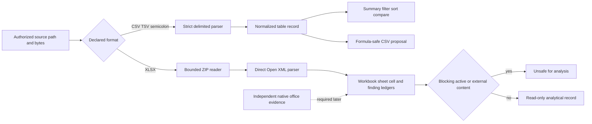

# Tabular and Spreadsheet Inspection

## Scope

Sprint 62 adds bounded, effect-free parsing and comparison for CSV, TSV, semicolon-delimited text,
and Open XML workbooks. It produces reviewable records without discovering files, writing output,
following links, recalculating formulas, decrypting content, launching an office suite, or treating
cached formula values as independently verified calculations.

## Delimited-Text Boundary

The parser accepts one explicit delimiter profile and valid UTF-8 bytes. It implements quoted
fields, doubled quotes, embedded line breaks, exact row widths, unique normalized headers, and
closed source, row, column, and field ceilings. NFKC lowercase comparison normalization is
separate from retained source values. Filename normalization cannot create a path, and URL
normalization is string-only: it performs no resolution or request.

Summaries record missing values and exact duplicate-row hashes. Filters and stable sorts return
source-row identities rather than hidden copies. Cross-table comparisons require identical
normalized headers and explicit unique key columns. Every key receives one closed reason:
`exact_row`, `differing_fields`, `missing_right`, `missing_left`, `duplicate_left`, or
`duplicate_right`.

Safe CSV output is an in-memory proposal. Formula-like cells, DDE-like values, and values beginning
with risky controls receive a leading apostrophe before RFC 4180 escaping. The exact output digest
is retained and the proposal is reparsed in tests as inert text. No spreadsheet application is
launched.

## Open XML Boundary

The XLSX inspector uses the already admitted `zip 8.6.0` and `quick-xml 0.41.0` packages directly.
It rejects unsafe or duplicate ZIP paths, encryption, unsupported compression, oversized entries,
oversized packages, missing required parts, malformed relationships, and malformed XML. Workbook
relationships may identify only package-local worksheets.

The result retains:

- workbook date system and exact source digest;
- worksheet identity, name, visibility, part identity, and part digest;
- cells with A1 address, coordinates, type, raw cached value, displayed value, inert formula,
  style, number format, and derived date where admitted;
- hidden rows and columns, merged ranges, and inert hyperlinks; and
- content-minimized findings with stable reason codes.

Formula text is never evaluated. Cached values are observations from the source package, not a
recalculation result. Hyperlinks are never followed. External workbook references, DDE-like
formulas, and macro content block analytical reuse. External hyperlinks remain visible and inert
without blocking read-only inspection.

## Format and Fidelity Limits

The direct path admits `.xlsx` Open XML packages only. Legacy binary `.xls`, password handling,
encrypted workbook decryption, embedded-object execution, formula recalculation, chart rendering,
pixel rendering, and spreadsheet accessibility evaluation are not implemented. LibreOffice,
Microsoft Excel, and Apple Numbers are not product dependencies and are not silently invoked.

Date conversion supports the 1900 and 1904 serial systems, including Excel's serial-60 leap-day
convention. It does not infer locale-specific displayed formatting beyond admitted date formats.

## Evidence Boundary

Rust tests establish deterministic parsing, matching, normalization, injection prevention,
resource limits, active-content quarantine, and absence of file, network, and execution effects.
Closed runtime schemas independently reject normalized-header, row-shape, comparison-reason,
output-hash, cell-coordinate, hyperlink-hash, aggregate-state, and authority drift.

Native office reopen, recalculation, visual fidelity, accessibility, cross-platform acceptance,
independent review, and deferred manual fuzzing remain explicit blockers. Local contract success
does not close Sprint 62 or authorize a release.
