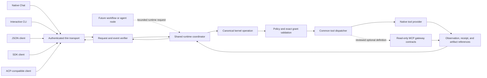
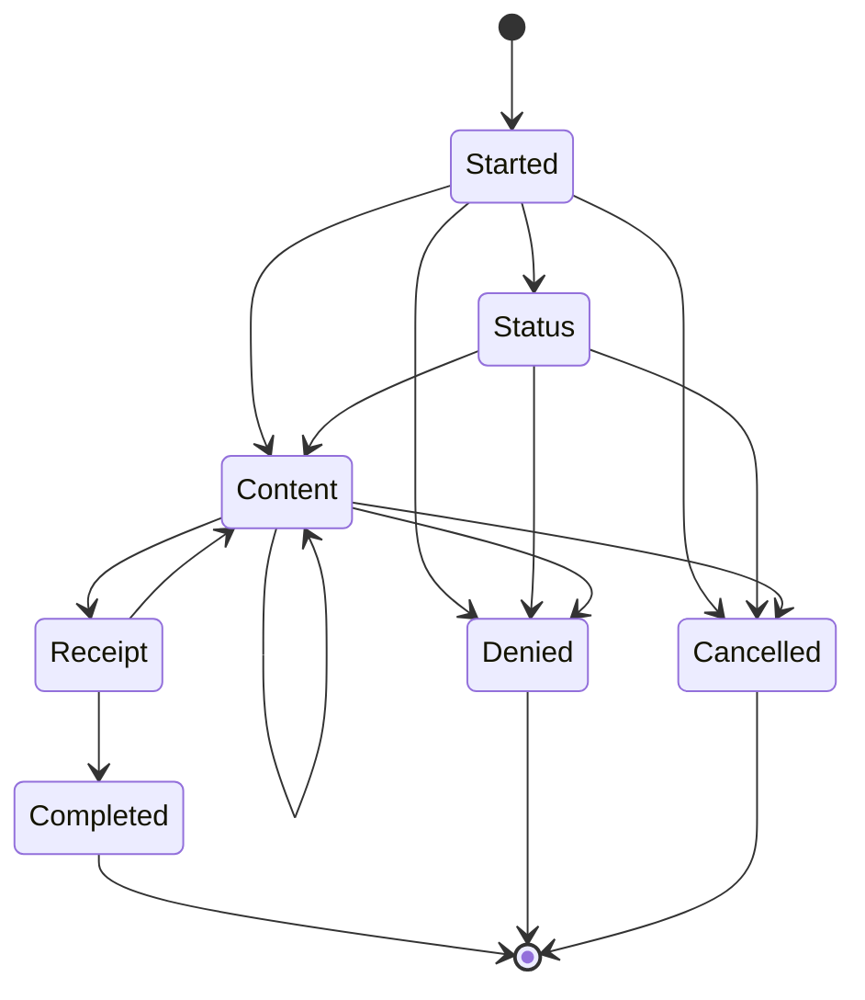

# Thin Client Boundary

## Status

The thin-client protocol and local command parser are source-level pre-alpha
contracts. They are executable and tested, but they are not an integrated
product workflow. The repository now contains the reusable runtime coordinator,
ordered event and journal components, content-addressed runtime artifact
components, a source-level native coding composition, an authenticated native
Chat runtime transport adapter, and a verified interactive CLI driver over that
same runtime port. The CLI driver independently checks request binding, ordered
events, complete artifact references, protected decisions, cancellation,
terminal outcomes, and release. These source-level clients are tested with
deterministic runtime fixtures, but they are not yet connected to a production
runtime factory, admitted-model client workflow, canonical conversation or
knowledge coordinator, CLI stdin/history transport, or installed-package
activation path.

Operational invocations therefore fail closed with exit code `5` and
`client.transport.failed`. Help, version, completion, parsing, rendering, schema
validation, and protocol tests work without a product transport.

## Trust Boundary

Native Chat, the interactive command line, JSON, SDK, and ACP-compatible clients
are alternate transport and display surfaces for one canonical kernel request.
They do not own policy, authority, storage, tools, models, connectors, secrets,
or native effects.

The `surface` field affects presentation and whether a protected live approval
channel can exist. It is never an authority source. The
`kernel_request_sha256` excludes the display surface and binds the workspace,
closed command, and exact policy identity. Equivalent requests therefore reach
the same kernel operation regardless of client.

## Shared Runtime Coordinator

The coordinator is an interface-independent composition boundary inside the
kernel. It combines the persisted agent state machine, selected exact model
profile, context manager, registered tools, policy and grant checks, canonical
store, ordered event sink, runtime artifact references, cancellation, and one
terminal outcome. It receives no new authority by being shared.

Native Chat and the interactive coding CLI submit the same versioned runtime
request and consume the same runtime event envelope. JSON, SDK, and
ACP-compatible clients use that contract without an interactive approval
channel. A later workflow or agent node can submit a bounded work packet through
the same port with an authority intersection narrower than an interactive
session. The runtime contract has no terminal, editor, or workflow-UI type.

The native Chat and interactive CLI implementations remain presentation-only.
They forward the exact host-framed request unchanged, verify
run/session/task/policy bindings, contiguous sequence, previous-event digest,
correlation, timestamps, causation, complete artifact references, protected
approval identity, cancellation identity, and terminal outcome relationships,
and render only verified event labels and digest-checked output. Neither can
select a fallback, dispatch a tool, mint a grant, alter policy, or certify
success independently.

The visible execution dispositions preserve existing grant semantics:

- `ALLOW` continues to dispatch only when current policy and an exact consumable
  grant permit the operation.
- `ASK` emits an approval request and pauses without launching a worker.
- `DENY` emits one no-effect refusal for prohibited, invalid, unsupported, or
  out-of-scope work.

## Closed Request

The normative machine-readable request shape is
[`thin-client-request.schema.json`](../../schemas/runtime/thin-client-request.schema.json).
The Rust contract is in [`headless.rs`](../../shells/host/src/headless.rs).

A request carries:

- protocol version and non-replayable request identity;
- display surface and hash-bound visible status;
- one closed command and exact cancellation identity;
- interactive or predeclared authority presentation;
- exact policy and surface-independent kernel-operation digests;
- per-event and cumulative-output ceilings; and
- an optional hash-bound resume cursor for an existing stream.

The command taxonomy is closed over chat, conversations, approved local
Markdown knowledge, checkpoint, handoff, audit, memory, transfer, and
diagnostics operations. Unknown fields and command variants are rejected.

## Authority

Native Chat and an interactive terminal may identify a protected live approval
channel. JSON, SDK, and ACP-compatible clients may not. A noninteractive client
must present one predeclared grant that is:

- bound to the one operation required by the command;
- bound to the exact current policy and kernel-request digests;
- bounded by trusted issue and exclusive-expiry times;
- nonce identified without carrying raw nonce material; and
- single use.

Missing, malformed, stale, future-issued, expired, reused, interactive-only, or
mismatched authority fails closed. The client cannot mint, refresh, broaden, or
silently request a replacement grant.

## Event Stream

The normative event shape is
[`thin-client-event.schema.json`](../../schemas/runtime/thin-client-event.schema.json).
Every event is versioned and binds the request, stream, surface-independent
kernel operation, policy, sequence, cumulative byte count, previous event, and
its own canonical digest.

A valid stream starts at sequence zero with `started`, remains contiguous and
hash chained, and ends exactly once. Success requires a verified receipt before
`completed`. Denial and cancellation are distinct terminal states. A partial,
reordered, oversized, policy-drifted, request-drifted, or post-terminal stream
cannot be reported as success.

The visible payload taxonomy is status, bounded content, approval request,
receipt, artifact reference, completion, denial, or cancellation. Content
channels distinguish ordinary content, progress, preview, diff, citation, and
error narration.

The client stream is not itself the canonical durable journal. Correctness
events for grants, effects, receipts, and checkpoints share the canonical store
transaction. Progress and content-free metrics use bounded asynchronous queues
and batches with explicit saturation behavior. Streamed model tokens are
presentation fragments rather than one synchronous database row per token. The
optional persisted transcript and optional local diagnostics or metrics remain
separate from the execution journal.

## Cancellation, Replay, And Resume

Cancellation carries no execution authority. It is an atomic signal bound to
the request's exact cancellation identity. A cancelled request cannot produce a
successful terminal claim without a separately verified canonical stream.

The replay guard consumes each request identity and each predeclared grant at
most once. Resume identifies an existing stream, the last fully verified
sequence, and that event's digest. It cannot launch a second kernel operation,
move a cursor backward, accept an unverified event, or repair a broken stream by
guessing.

## Native Effects

Thin clients contain no direct storage, filesystem, tool, model, connector,
credential, browser, application-launch, or ambient socket authority. Native
Chat uses only its authenticated package-provided IPC bridge; native effects
remain kernel mediated. The repository's effect-boundary checker treats the
shell as a presentation boundary and rejects process-launch APIs there.

Built-in filesystem, repository search, patch, controlled write, command,
validation, and Git providers register directly through the common tool
registry and dispatcher. They do not require MCP. Reviewed read-only MCP
definitions can now be adapted into a fresh common registry without shadowing
native identities. The source-level MCP gateway validates immutable manifests,
package/process/endpoint observations, request and response bounds,
classification, cancellation cleanup, disconnect, and receipts. A production
MCP process or network adapter and complete runtime grant/event/evidence parity
remain gated.

Large patches, command output, test logs, generated files, reports, and large
model output use verified content-addressed runtime artifact references. The
encrypted operational store remains authoritative for their metadata,
classification, retention, references, and checkpoint links. These private
runtime objects are distinct from checked-in sprint evidence under
`artifacts/`.

The adversarial contract corpus is
[`sprint-48-headless-corpus.json`](../verification/sprint-48-headless-corpus.json).
It records content-minimized fail-closed cases for malformed requests, authority
drift, stream corruption, transport loss, cancellation races, and prohibited
application launch.

## Remaining Product Work

This contract does not establish an integrated command-line or installed native
Chat product. Remaining work includes production runtime-factory and
admitted-model composition behind the authenticated transport, canonical
conversation and knowledge coordinators, live MCP/native disconnect and
descendant-process cleanup campaigns, supported-platform package acceptance,
independent review, and the separately deferred manual fuzz campaign. Those
absences remain blockers and must not be inferred from passing source-level
contract tests.
