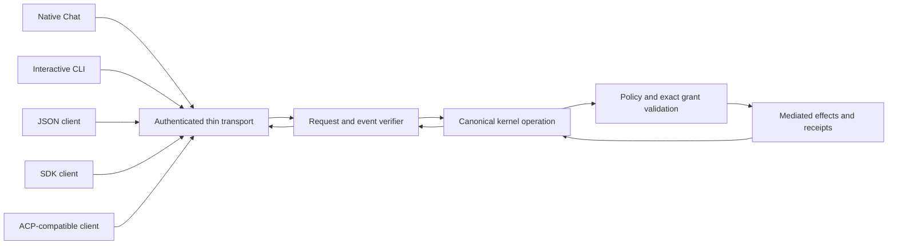
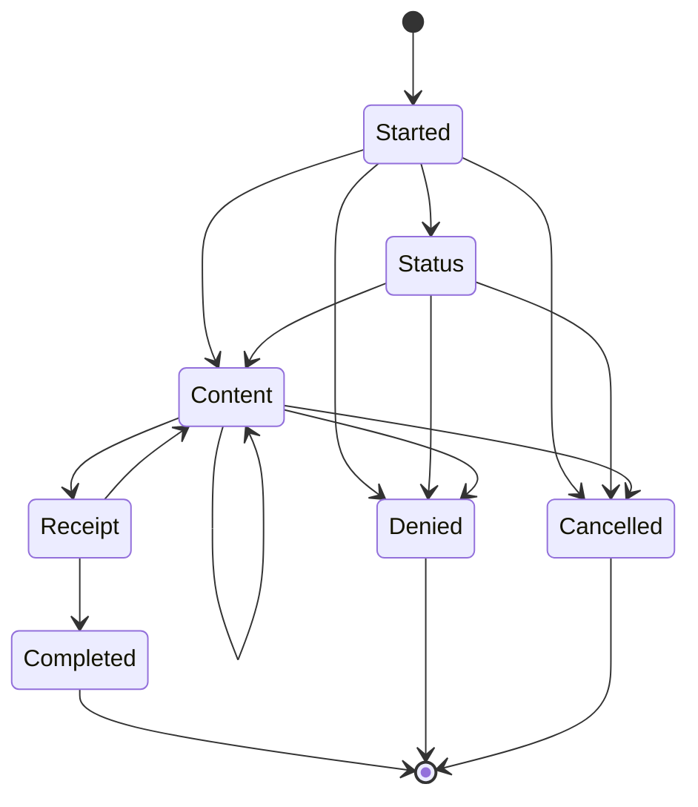

# Thin Client Boundary

## Status

The thin-client protocol and local command parser are source-level pre-alpha
contracts. They are executable and tested, but they are not an integrated
product workflow. The repository does not yet compose an authenticated product
transport, canonical conversation coordinator, canonical knowledge coordinator,
or installed-package activation path for these clients.

Operational invocations therefore fail closed with exit code `5` and
`client.transport.failed`. Help, version, completion, parsing, rendering, schema
validation, and protocol tests work without a product transport.

## Trust Boundary

Native Chat, the interactive command line, JSON, SDK, and ACP-compatible clients
are alternate transport and display surfaces for one canonical kernel request.
They do not own policy, authority, storage, tools, models, connectors, secrets,
or native effects.

The `surface` field affects presentation and whether a protected live approval
channel can exist. It is never an authority source. The
`kernel_request_sha256` excludes the display surface and binds the workspace,
closed command, and exact policy identity. Equivalent requests therefore reach
the same kernel operation regardless of client.

## Closed Request

The normative machine-readable request shape is
[`thin-client-request.schema.json`](../../schemas/runtime/thin-client-request.schema.json).
The Rust contract is in [`headless.rs`](../../shells/host/src/headless.rs).

A request carries:

- protocol version and non-replayable request identity;
- display surface and hash-bound visible status;
- one closed command and exact cancellation identity;
- interactive or predeclared authority presentation;
- exact policy and surface-independent kernel-operation digests;
- per-event and cumulative-output ceilings; and
- an optional hash-bound resume cursor for an existing stream.

The command taxonomy is closed over chat, conversations, approved local
Markdown knowledge, checkpoint, handoff, audit, memory, transfer, and
diagnostics operations. Unknown fields and command variants are rejected.

## Authority

Native Chat and an interactive terminal may identify a protected live approval
channel. JSON, SDK, and ACP-compatible clients may not. A noninteractive client
must present one predeclared grant that is:

- bound to the one operation required by the command;
- bound to the exact current policy and kernel-request digests;
- bounded by trusted issue and exclusive-expiry times;
- nonce identified without carrying raw nonce material; and
- single use.

Missing, malformed, stale, future-issued, expired, reused, interactive-only, or
mismatched authority fails closed. The client cannot mint, refresh, broaden, or
silently request a replacement grant.

## Event Stream

The normative event shape is
[`thin-client-event.schema.json`](../../schemas/runtime/thin-client-event.schema.json).
Every event is versioned and binds the request, stream, surface-independent
kernel operation, policy, sequence, cumulative byte count, previous event, and
its own canonical digest.

A valid stream starts at sequence zero with `started`, remains contiguous and
hash chained, and ends exactly once. Success requires a verified receipt before
`completed`. Denial and cancellation are distinct terminal states. A partial,
reordered, oversized, policy-drifted, request-drifted, or post-terminal stream
cannot be reported as success.

The visible payload taxonomy is status, bounded content, approval request,
receipt, completion, denial, or cancellation. Content channels distinguish
ordinary content, progress, preview, diff, citation, and error narration.

## Cancellation, Replay, And Resume

Cancellation carries no execution authority. It is an atomic signal bound to
the request's exact cancellation identity. A cancelled request cannot produce a
successful terminal claim without a separately verified canonical stream.

The replay guard consumes each request identity and each predeclared grant at
most once. Resume identifies an existing stream, the last fully verified
sequence, and that event's digest. It cannot launch a second kernel operation,
move a cursor backward, accept an unverified event, or repair a broken stream by
guessing.

## Native Effects

Thin clients contain no direct storage, filesystem, tool, model, connector,
credential, browser, application-launch, or raw-host-socket interface. Native
effects remain kernel mediated. The repository's effect-boundary checker treats
the shell as a presentation boundary and rejects process-launch APIs there.

The adversarial contract corpus is
[`sprint-48-headless-corpus.json`](../verification/sprint-48-headless-corpus.json).
It records content-minimized fail-closed cases for malformed requests, authority
drift, stream corruption, transport loss, cancellation races, and prohibited
application launch.

## Remaining Product Work

This contract does not establish an integrated command-line product. Remaining
work includes authenticated local transport composition, canonical runtime and
storage coordinators, native disconnect and descendant-process cleanup
campaigns, supported-platform package acceptance, independent review, and the
separately deferred manual fuzz campaign. Those absences remain blockers and
must not be inferred from passing source-level contract tests.
