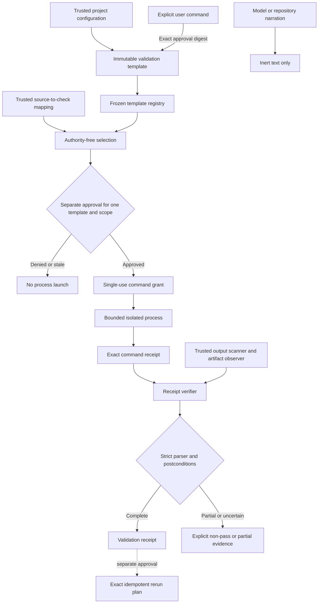

# Trusted Validation Runner

## Purpose

Sprint 46 defines how AgentMage discovers, selects, executes, and interprets repository
checks without accepting a model claim, repository instruction, hook, plugin, generated
result file, or green-looking text as proof. The current increment provides immutable
template and selection contracts, exact command-receipt verification, strict result
normalization, independent artifact observations, detailed secret-safe receipts,
failure classification, and approval-bound rerun plans.

These contracts do not enable a production validation workflow. A native platform
worker, current held execution scope, explicit approval, consumed command grant, and
independent postcondition observer are still required for an actual run.

## Authority Flow

The template, selection, rerun plan, and validation receipt all have
`execution_authority: false`. Process launch remains reachable only through the
existing kernel command grant and effect boundary.

## Trusted Template Sources

[`validation_template.rs`](../../kernel/engine/src/validation_template.rs) admits only:

1. an exact current project-configuration path and content digest observed through an
   approved read; or
2. exact user-supplied command input with a separate approval digest.

Each template pins the executable path and bytes, literal argument vector, empty
scratch working-directory class, complete replacement environment, timeout, output,
memory, task, and CPU ceilings, effective execution-scope digest, parser version and
bytes, minimum test count, rerun policy, and independent artifact expectations.

The command pack rejects shell interpreters, shell grammar, response files, dynamic
configuration, plugins, environment inheritance, network access, interactive mode,
and credential-bearing environment names. Model output and untrusted repository text
cannot register or alter a command.

## Selection and Reruns

Focused selection uses only exact pre-registered focused templates named by a trusted
source-to-check mapping. It never appends flags or rewrites an argument vector. A
requested kind with no exact mapped template remains in `unverified`; it is not
silently dropped.

A failed-test rerun is a new plan with a new attempt identity and separate approval.
It binds the prior receipt, failed-name set, unchanged template, and unchanged command
digest. Reruns are unavailable unless the template declared both rerun support and
idempotent setup before the first run. Uncertain or non-idempotent setup is never
automatically retried.

## Result Normalization

[`validation_result.rs`](../../kernel/engine/src/validation_result.rs) first verifies
the terminal [`CommandReceipt`](../../schemas/runtime/command-receipt.schema.json)
against the exact prepared command. Retained stream lengths and complete hashes must
match. Truncated output is never parsed as complete evidence.

Test templates use a closed JSON envelope with no unknown fields. The parser retains
passed, failed, skipped, failed names, parser-reported duration, artifacts, retry
count, and initial-failure identity. It rejects oversized values, invalid ordering,
control sequences, ANSI escapes, unknown fields, count/name disagreement, contradictory
status and exit code, forged green prose, and process-claimed artifacts not matched by
the trusted observer.

Non-test checks use terminal process semantics plus required independent artifacts.
Every result remains one of these non-conflated states:

| Family | States |
|---|---|
| Success | `passed` |
| Test/check failures | `assertion_failed`, `compile_failed`, `infrastructure_failed` |
| Process boundaries | `timed_out`, `cancelled`, `crashed`, `truncated` |
| Test semantics | `flaky`, `skipped_only`, `zero_tests` |
| Evidence failures | `malformed`, `unverified`, `sensitive_output` |

`is_full_pass()` is true only when the result is `passed` and coverage is `complete`.
A passing executed check with an unrun requested kind has `coverage: partial` and is
therefore not a full pass.

## Artifacts, Files, and Secrets

Expected artifacts are selected before execution. A trusted platform observer records
their exact held paths, hashes, byte lengths, and post-command observation state. The
process may name an artifact only when that name exactly matches the independently
observed set. Required missing artifacts produce `unverified`; extra or mismatched
artifacts invalidate the observation.

Affected files also come from independent preimage/postimage observations. Process
text cannot declare them. They support failure attribution but do not grant write
authority.

Raw stdout and stderr are not fields in the validation receipt. The receipt retains
complete hashes, byte counts, truncation, and trusted classification. A secret match
retains only the count and `secret_detected` classification and produces
`sensitive_output`; secret values do not enter normalized evidence. Access-controlled
raw logs, when operationally retained, remain a separate bounded artifact with their
own retention and disclosure policy.

## Failure Attribution

Attribution is deterministic and conservative. Precedence is:

1. separately approved exact rerun evidence (`flaky`);
2. trusted permission platform code;
3. trusted dependency platform code;
4. runner, sandbox, host, timeout, cancellation, crash, truncation, or sensitive-output
   evidence (`environment`);
5. exact trusted baseline failure signature;
6. independently observed affected-path intersection with the approved change;
7. known-clean baseline plus no intersection (`unrelated`); and
8. `unclassified`.

The synthetic labeled corpus is
[`sprint-46-failure-corpus.json`](../verification/sprint-46-failure-corpus.json).
Attribution never changes pass/fail truth and never authorizes a retry or mutation.

## Current Limitations

- No production coordinator currently discovers configuration, obtains approval, and
  launches these templates through native Chat.
- Native process-tree, cgroup/job-object, and independently observed artifact evidence
  remains required on each supported platform.
- Safe fixture output is covered locally; protected raw-log storage and retention need
  production integration evidence.
- Trusted installed-parent, cross-platform, independent-review, trusted-package, and
  deferred manual-fuzz evidence remain absent.
- Sprint 45 and its upstream dependencies remain blocked, so Sprint 46 cannot pass its
  dependency gate even when this local contract evidence is complete.
