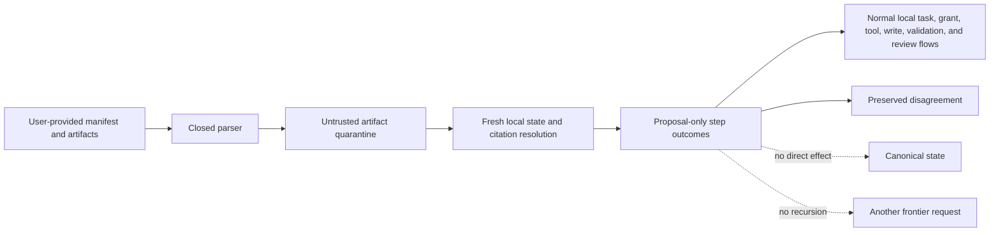

# Untrusted Frontier Result Import

## Boundary

A frontier result arrives only after the user manually moves it back to AgentMage. Import is an
offline local parse operation, not the return half of a cloud bridge. The result is external,
untrusted, non-authoritative, and incomplete even when it matches the requested schema or came from
a stronger model.

The return manifest binds the reviewed request packet; base workspace, model, and policy states;
result kind; rationale; exact inputs; separately supplied artifacts; citation claims; proposal
steps; acceptance checks; requested approvals; remaining work; and a canonical digest. Fixed fields
state that all content is untrusted, no authority is granted, no completion credit exists, and no
outbound network is required.

## Parse and Quarantine

The parser accepts at most 256 KiB of closed JSON. It rejects missing, extra, malformed, oversized,
wrong-version, wrong-request, hash-drifted, unsorted, duplicate, unsupported, authority-bearing,
completion-bearing, network-requiring, or operation-class-mismatched manifests. It does not follow
links, interpret instructions as policy, invoke tools, execute code, or run commands.

Artifacts are supplied separately and must match exact identity, media type, portable display path,
length, and SHA-256 declaration. Per-artifact and aggregate byte ceilings apply. Path escapes,
absolute or hidden paths, declaration mismatches, and secret-bearing content fail before review.
Binary content, embedded instruction attacks, dangerous command text, and external links remain
quarantined and non-executing. A safe text artifact can be proposal-eligible, but remains explicitly
untrusted and unwritten.

## Local Revalidation

The caller independently supplies fresh request, workspace, model, policy, permission, and citation
facts. Any base-state mismatch quarantines returned steps. Each citation is resolved again by exact
source, object, fragment, content hash, and local resolver receipt. Missing, stale, conflicting,
denied, unsupported, or hash-mismatched citations become visible disagreements. Imported claims can
be only `Inferred` with current local citations or `UnknownBlocked`; import cannot produce
`Observed` or `Derived` status.

Every step receives requirements for the normal local task-classification, grant, registered-tool,
exact-write-preview, trusted-validation, evidence-assignment, and user-approval flows. The importer
does not satisfy those requirements. It issues no grants, calls no tools, writes no files, changes no
canonical state, and awards no completion credit.

## Round Trip and Recursion

The content-free report binds current state, artifact outcomes, step outcomes, disagreements, and
zero-effect counters. The round-trip receipt binds the request, imported manifest, local report,
optional re-escalation reason, and capability feedback. Repeated import is deterministic and has no
duplicate effect because import has no effect to repeat.

A re-escalation reason is benchmark and capability-matrix evidence only. It cannot automatically
build, send, route, or recurse into another consultation. A new manual consultation must begin again
at Sprint 51's measured recommendation and exact disclosure boundary.

## Current Integration Limit

The manifest, quarantine, local-state, citation, step-requirement, disagreement, and receipt
contracts are source-level pre-alpha evidence. No native importer UI or product coordinator invokes
the complete flow, and proposal-eligible steps are not yet connected end to end to the normal local
task, grant, tool, write, validation, and review coordinators.
