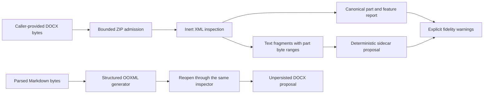

# Word OOXML Extraction and Generation

## Scope

Sprint 58 introduces bounded, in-memory WordprocessingML package inspection, deterministic text
sidecars, explicit fidelity warnings, and structured Markdown-to-Word package proposals. The
boundary accepts caller-provided bytes and validated workspace identities. It does not discover,
open, save, render, execute, or transmit a document.

The immutable source package remains authoritative. Extraction and generation return byte arrays
and closed receipts; a separate controlled writer must authorize any persistent file effect.

## Admission And Limits

The package boundary accepts only stored or deflate-compressed entries under an exact profile.
Source size, raw central-directory entry count, per-entry size, aggregate uncompressed size, and
integer expansion ratio are bounded before content is trusted. Canonical relative entry names are
required. Duplicate names are detected from raw central-directory records before the ZIP library
can collapse them.

Encrypted entries, symbolic links, unsupported compression, unsafe paths, missing required parts,
macros, ActiveX or embedded executable content, external relationships, and malformed relationship
XML quarantine extraction. No relationship target is resolved and no field, macro, script, object,
or embedded payload is executed.

## Extraction And Fidelity

Each safe package part receives an exact digest and semantic class. Text fragments carry an exact
part name, inclusive start byte, exclusive end byte, decoded text, and current, inserted, or deleted
revision state. Sidecar identity binds the source digest, converter digest, and profile. The bounded
in-memory cache admits only an exact matching key and grants no persistence authority.

Feature counts and warnings cover tables, comments, tracked insertions and deletions, headers,
footers, numbering, section layout, hyperlinks, images, fields, styles, and unsupported constructs.
Plain-text success never implies those structures were preserved in the sidecar.

## Structured Source Adapter

Story 58.2 adds the interface-neutral `StructuredSourceExtractor` contract and the authority-free
`WordStructuredSourceExtractor`. The Word adapter reuses the admitted package boundary and maps
document roots, paragraphs, headings, list items, tables, rows, cells, headers, footers, notes,
comments, tracked changes, links, images, internal relationships, and unsupported structures into a
closed canonical section vocabulary. Each section retains its exact package part and structural
path plus available XML byte, paragraph, run, table, row, cell, and relationship coordinates.
Rendered page remains explicitly absent until admitted native renderer evidence supplies it.

`WordSourceArtifactService` retains only the canonical projection and content-free manifest; the
runtime artifact store remains the owner of original DOCX bytes. Exact source/extractor cache hits,
source invalidation, cancellation, deletion, and reattachment are deterministic. Its digest-sealed
prepared manifest binds the exact source content address, extractor identity, extraction digest,
section and output metrics, ordered warnings, sensitivity, retention, and revision. Policy-persisted
restart accepts only an existing path-free `RuntimeArtifactRef`, re-extracts bytes supplied by that
artifact authority, and publishes nothing unless the complete retained manifest is reproduced.
Parser drift, corrupt payloads, mismatched references, and cancellation fail before publication;
the service never owns a second byte store or path namespace.

Prepared sections and visible warning sections flow through the existing common `artifact.list`,
`artifact.metadata`, `artifact.read`, `artifact.sections`, and `artifact.search` dispatcher with
production receipts and no parser, network, workspace-write, or client-specific bypass at
tool-dispatch time. The same minimized sections enter the existing `compose_context` path under the
checked model plan's source-artifact partition. Complete records cover source containers, canonical
sections, warnings, global duplicates, budget omissions, truncation, and sensitivity refusal;
counter/tokenizer drift fails closed. Installed-client parity and the full hostile lifecycle
campaign remain open under Story 58.2; this local adapter does not promote those requirements.

## Generation

The initial generator maps headings, paragraphs, ordered and unordered list items, task items, code
lines, and Markdown tables into a deterministic minimal DOCX package. Headings, numbering, and
tables are represented structurally. Raw HTML and links remain inert visible text; no external
relationship is created. The proposed package is reopened through the bounded inspector before it
is returned, and an output identity matching the Markdown source path is rejected.

Sprint 59 owns richer style/edit helpers, redlines, comments, rendering, image comparison, and
cross-platform visual evidence. No renderer is admitted by Sprint 58.
