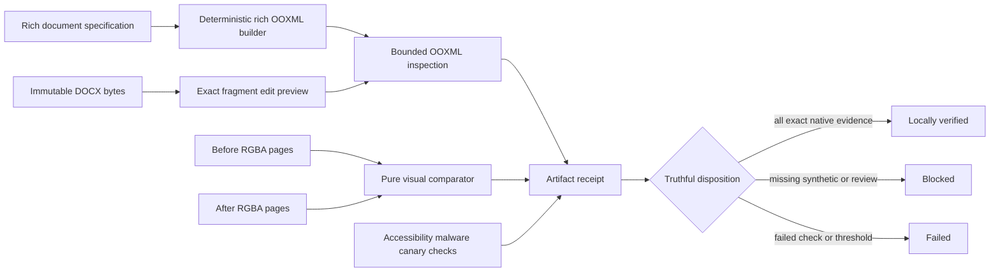

# Word Rich Generation, Editing, and Visual Evidence

## Scope

Sprint 59 extends the bounded WordprocessingML boundary with deterministic rich-document helpers,
exact proposal-only edits, pure page-image comparison, and reproducible artifact receipts. The
implementation still accepts only caller-supplied bytes and validated identities. It does not
discover files, persist packages, launch a renderer, resolve external content, or execute document
content.

The immutable source remains authoritative. Every generated or edited package is an unpersisted
proposal until a separate controlled writer authorizes a new output path.

## Rich Builder

The rich builder exposes a closed set of helpers for styles, page dimensions and margins, columns,
headers, footers, core metadata, metadata tables, warnings, Markdown tables, decision cards,
internal hyperlinks, table borders, cell shading and margins, numbering, paragraph creation,
cloning, removal, and exact section replacement. Block, style, and numbering identities are unique
and bounded. External hyperlinks reject; internal links resolve only to deterministic bookmarks in
the same package.

Package generation is deterministic for the same validated specification and output identity. The
result reopens through the Sprint 58 inspector before it is returned. No generated relationship
grants network authority.

## Exact Edit Preview

Every replacement, redline, or comment operation binds the source package digest, extraction
fragment identity, package part, exact byte range, and decoded expected text. A stale identity,
overlapping range, unsupported complex run, reused comment or revision identity, or comment
relationship collision fails before a package is returned.

Plain replacement changes only the selected XML text range. Redline replacement wraps one complete
simple run with explicit deletion and insertion elements while retaining run properties. Comments
are limited to simple main-document runs and receive explicit content-type, relationship, range,
reference, and comment-body parts. Replacement and comment text is XML escaped and remains inert.
The receipt records every changed part and the exact digest of every byte-identical preserved part.

## Visual Evidence Boundary

The visual comparator accepts already decoded, row-major RGBA8 pages. Its profile binds a renderer
identity and version, renderer artifact digest, font-manifest digest, integer dots per inch, and
integer thresholds. Page numbers, dimensions, byte counts, digests, total memory, platform,
profile, and evidence class are validated before comparison.

Changed-pixel counts, integer parts-per-million ratios, maximum channel deltas, and tight difference
rectangles are deterministic. Pagination, clipping, overlap, font fallback, table, and image
observations remain explicit. Synthetic fixtures can test the comparator but always require review
and cannot satisfy native renderer evidence.

The comparator never launches a renderer. A future platform adapter must supply native output from
an admitted, pinned renderer and retain the renderer package, license, version, digest, font set,
settings, and platform evidence.

## Artifact Receipt

The receipt binds immutable inputs, implementation identities, exact changes, structural,
semantic, visual, accessibility, malware-policy, and canary checks, required platforms, visual
report digests, and known fidelity limits. Passed and failed checks require evidence digests;
unavailable checks cannot claim evidence.

The completion state is recomputed from closed inputs:

- `failed` when a required check or native render threshold fails;
- `blocked` when evidence is absent, synthetic, awaiting review, or subject to a blocking fidelity
  limit; and
- `locally_verified` only when every required check and native platform report passes without a
  remaining disposition code.

This is a local evidence state, not release approval or platform support.

## Platform Truth

Fedora, Ubuntu, and Windows 11 x64 are first-GA targets. Apple Silicon macOS remains a retained
post-GA lane. The current local evidence runs comparator semantics on Fedora only and includes no
native renderer output on any platform. No platform is currently supported, and evidence from one
platform cannot substitute for another.
