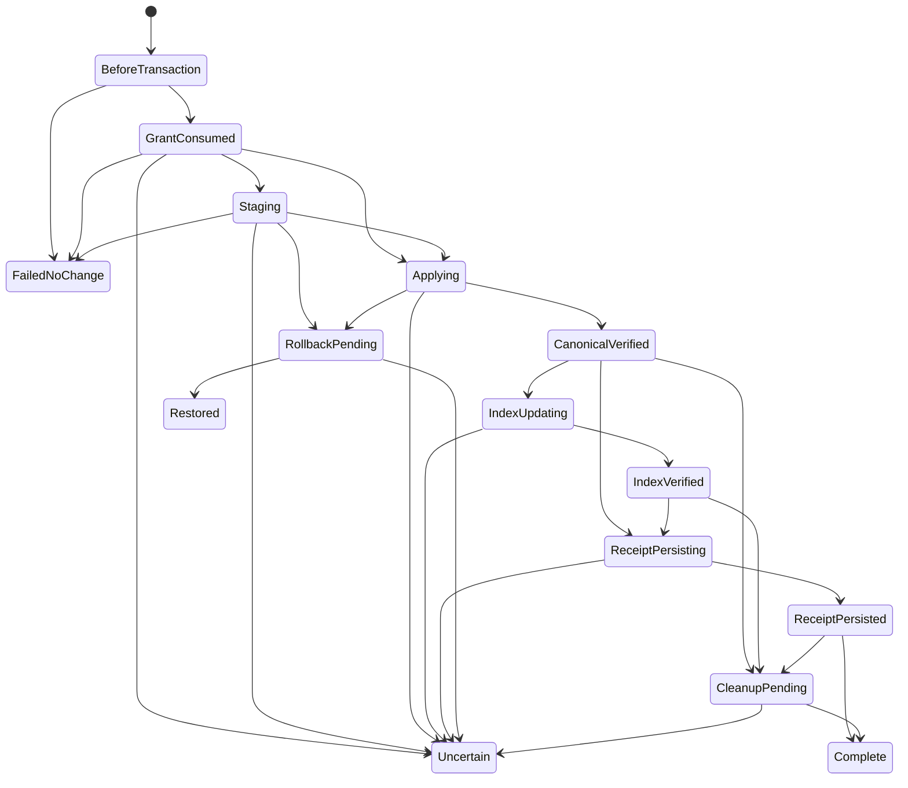

# Write Privacy, Recovery, and Audit

## Purpose

Sprint 39 composes the controlled-write foundations from Sprints 36 through 38 into a
content-free recovery and audit layer. The layer classifies data before every write-adjacent trust
boundary, records hash-chained metadata checkpoints, chooses a deterministic restart instruction,
diagnoses temporary staging objects, and produces a sanitized human-readable audit summary.

It is not a write engine. It exposes no path opener, file driver, index driver, grant issuer, grant
consumer, shell, network client, or cleanup effect. File and index changes still require the exact
preimage, preview, approval, revalidation, and single-use authority paths owned by the earlier
controlled-write stories.

## Boundary Composition

```mermaid
flowchart LR
    P[Exact approved preview] --> S[Privacy scan]
    S --> C0[Before-transaction checkpoint]
    C0 --> G[Existing single-use grant consumption]
    G --> W[Existing isolated write transaction]
    W --> V[Fresh canonical postimage verification]
    V --> I[Separate derived-index publication]
    I --> R[Receipt and next-session publication]
    R --> C1[Terminal write-aware checkpoint]
    C1 --> A[Redacted audit summary]
    C1 --> D[Staging diagnostics]

    M[Model output] -. descriptive only .-> P
    C0 -. no effect authority .-> C1
    A -. no effect authority .-> C1
    D -. cleanup requires a fresh grant .-> C1
```

The privacy gate has one closed boundary enumeration: preview, staging, receipt, model context,
persistence, backup, diagnostic, export, log, checkpoint, and error. Each field must carry a trusted
sensitivity. Declared private excerpts, declared credentials, non-UTF-8 values, and values matching
the deterministic persistence secret detector are replaced with the fixed `[REDACTED]` marker.
The receipt retains only counts, stable finding classes, and a digest of sanitized output. It never
retains removed bytes or their digests.

## Checkpoint Contract

The formal wire contract is
[`write-aware-checkpoint.schema.json`](../../schemas/runtime/write-aware-checkpoint.schema.json).
The Rust contract is `write_recovery::WriteAwareCheckpoint`.

Every checkpoint binds:

- checkpoint, transaction, and canonical action identities;
- a monotonic sequence and previous-checkpoint digest;
- the consumed single-use grant identity after consumption;
- the file-receipt count and exact receipt-chain head;
- evidence-set, index-update, next-session-checkpoint, privacy-scan, and staging-inventory digests;
- staging count, retention deadline, and cleanup state;
- canonical-postimage, receipt-chain, index, and rollback verification states;
- a stable failure code and kernel-clock observation time.

No checkpoint contains a file preimage, postimage, prompt, model response, private excerpt,
credential, absolute staging path, environment value, or rollback bytes. The closed state machine
refuses terminal extension, sequence drift, duplicate identities, missing consumed authority,
receipt-count/head disagreement, unsupported transitions, and completion without required
postimage, receipt, index, and cleanup proof.

## Atomicity And Recovery

The operational store already publishes authority state, grant consumption, the terminal authority
receipt, and the next metadata-only `SessionCheckpoint` in one immediate SQLCipher transaction.
That is the strongest atomic unit available inside one store. A canonical user file, an external
derived index, and the SQLCipher store cannot honestly be described as one atomic transaction.

The cross-store protocol instead binds exact digests and uses ordered recovery:

| Boundary | Durable proof | Restart behavior |
|---|---|---|
| Before grant consumption | Genesis checkpoint | A new proposal may be built; the old preview grants no authority |
| After grant consumption | Grant identity and phase | Never replay the write from checkpoint metadata |
| Staging/application | Inventory digest and file receipt head | Freshly observe canonical state; uncertainty blocks |
| Canonical verification | Exact postimage and receipt proof | Publish only a declared index or terminal receipt through separate authority |
| Index publication | Index-update digest and verification state | Rebuild from current canonical bytes; do not rewrite the source |
| Receipt publication | Verified receipt-chain head | Continue only cleanup or report complete |
| Rollback | Exact restoration receipt and fresh preimage proof | Preserve later user changes; failed reconciliation becomes uncertain |
| Cleanup | Separate cleanup receipt | Remove only attributable staging after a fresh proposal and grant |

Recovery precedence is deterministic: unavailable secret store, changed workspace identity,
concurrent edit, no consumed grant, uncertain state, canonical verification, index publication,
receipt persistence, staging cleanup, then verified no-action completion. Every decision sets
`repeat_completed_write` to false. A recovery instruction is descriptive and cannot perform its
named effect.

## Concurrency And Failure

Concurrent user or session changes always select conflict preservation. Changed permissions and a
moved root share the fail-closed workspace-identity result. A missing secret store stops protected
recovery before persistence. Cancellation before grant consumption allows only a fresh proposal.
Timeout, crash ambiguity, stale consumed authority, and rollback failure become uncertain and are
not replayable. Disk-full after a verified canonical postimage selects separate terminal-receipt
persistence rather than file application.

The public-synthetic scenario inventory is
[`sprint-39-recovery-corpus.json`](../verification/sprint-39-recovery-corpus.json). The Rust
integration suite executes those condition families through the public recovery API.

## Staging And Audit

Staging diagnostics use stable staging, transaction, and action identities plus content and
inventory digests. They retain no raw path or staged bytes. Unknown owners are not cleanup eligible;
live owners remain active; terminal known owners are attributable orphans; quarantined objects stop
for review. Cleanup has its own hash-chained receipt, and a memory-only ledger rejects a second
terminal cleanup result for the same staging identity.

The audit builder lists each safe canonical relative file path, operation kind, preimage and
postimage digest, validation result, failure code, and rollback status. Secret-like paths and
failure fields pass through the same privacy gate and are replaced before serialization. The
retained public-synthetic example is
[`sprint-39-redacted-audit-fixture.json`](../verification/sprint-39-redacted-audit-fixture.json).

## Evidence Boundary

Current local evidence exercises platform-neutral contracts and existing Linux write/store tests.
It does not claim power-loss durability, torn-sector behavior, exhaustive native fault injection at
every staging and index boundary, a trusted packaged-launcher run, non-Fedora native execution,
independent review, release approval, or deferred manual fuzzing. Those remain explicit gate
dependencies rather than being inferred from unit or synthetic integration coverage.
