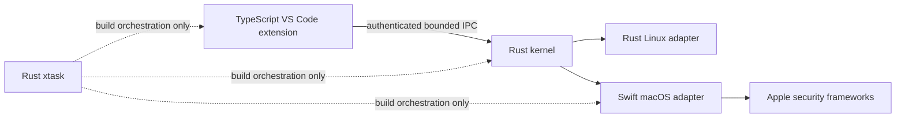

# Decision 0004: Language and Build-System Architecture

| Field | Value |
|---|---|
| Status | Accepted |
| Date | 2026-08-10 |
| Scope | Product implementation languages, build systems, and platform targets |
| Supersedes | No prior decision |

## Context

AgentMage needs one security-authoritative kernel across Apple Silicon macOS,
Fedora, and Ubuntu, a native Visual Studio Code Chat integration, and narrow
platform adapters for operating-system security primitives. End users must not
need ambient compilers, interpreters, package managers, or developer tools.

The language choice must preserve the existing rule that the Visual Studio Code
extension has display and interaction authority only. It must also support the
macOS App Sandbox, XPC, Keychain, security-scoped bookmarks, signing, and native
IPC requirements without moving those responsibilities into shared product
logic. Decision 0003 allows this design to be recorded while actual macOS
implementation and verification remain `BLOCKED-MACOS`.

## Decision

1. **Rust owns the interface-independent product kernel.** Policy, grants,
   deterministic tools, model mediation, canonical state, receipts, shared
   contracts, and the Linux platform adapter use Rust. Cargo is the Rust build
   system, with a virtual workspace, Rust edition 2024, resolver 3, a pinned
   toolchain, and a committed `Cargo.lock`.
2. **TypeScript owns only the Visual Studio Code extension shell.** The extension
   uses npm with a committed `package-lock.json`, strict TypeScript, and the
   published stable `vscode.lm.registerLanguageModelChatProvider` API plus the
   `contributes.languageModelChatProviders` contribution point. It performs
   display, interaction, provider registration, and authenticated IPC client
   duties. It receives no workspace, Git, model-runtime, tool, grant-minting, or
   secret-store authority.
3. **Swift owns the macOS platform boundary.** Swift and Apple frameworks provide
   App Sandbox, XPC, Keychain, security-scoped bookmark, code-identity, signing,
   and native IPC integration around the shared Rust kernel. Swift Package
   Manager manages Swift dependencies, `Package.resolved` is committed, and
   Xcode owns app, helper, entitlement, signing, notarization, and package builds.
4. **A Rust `xtask` owns cross-package developer and release orchestration.** It
   invokes component-native build systems without becoming a shipped runtime
   dependency or replacing their lock files.
5. **Python and JavaScript remain repository tooling.** Existing planning,
   evidence, fixture, documentation, and schema tools may use them. They are not
   product runtime languages and are never ambient end-user dependencies.
6. The initial Rust release targets are `aarch64-apple-darwin` for Apple Silicon
   macOS and `x86_64-unknown-linux-gnu` for the Fedora and Ubuntu references.
   Additional architectures require a recorded scope decision and their own
   evidence.
7. Exact toolchain and minimum platform versions are pinned by Sub-task
   1.1.1.4. Distributed packages contain required runtimes and native binaries;
   users do not install Cargo, Node.js, npm, Python, Swift, Xcode, or `xtask`.
8. The machine-readable contract is
   [`architecture/language-build-matrix.json`](../../architecture/language-build-matrix.json).
   Its validator fails when a component changes languages, Python becomes an
   end-user dependency, the extension gains authority, a proposed Visual Studio
   Code API is enabled, required lock files disappear, or blocked Mac status is
   represented as passing.

## Dependency Boundary

The arrows are calls toward authority or build orchestration. The kernel never
imports a shell or capability pack. The TypeScript extension never bypasses the
kernel to reach files, Git, tools, secrets, or a model runtime. Platform adapters
implement shared contracts and do not redefine product policy.

## Alternatives Considered

- **All Rust:** rejected because Visual Studio Code extensions use its
  TypeScript/JavaScript extension-host API, while native Apple security and
  packaging integration is clearest through supported Apple frameworks.
- **All TypeScript or Electron:** rejected because the extension host is not the
  product security boundary and must not receive workspace or execution
  authority.
- **Python product runtime:** rejected because it adds an interpreter and package
  environment to the deployed trust boundary and conflicts with the clean-install
  contract. Python remains useful for non-product development tooling.
- **C or C++ shared kernel:** rejected for new authority-bearing code because Rust
  provides a smaller memory-safety review surface while still supporting the
  declared native targets and controlled foreign-function boundaries.

## Consequences

- Shared policy and deterministic behavior have one implementation across all
  declared platforms.
- Platform security remains explicit instead of spreading operating-system
  conditionals through kernel logic.
- The repository has three component-native build systems, but `xtask`, pinned
  manifests, and committed lock files provide one reproducible maintainer entry
  point.
- Foreign-function and IPC boundaries require schema, identity, fuzzing, and
  lifecycle tests. No boundary transfers ambient authority.
- Architecture support for `aarch64-apple-darwin` is not Mac execution evidence.
  The macOS component and every affected gate remain `BLOCKED-MACOS` under
  Decision 0003.

## Primary References

- [Rust platform support](https://doc.rust-lang.org/rustc/platform-support.html)
- [Cargo workspaces](https://doc.rust-lang.org/cargo/reference/workspaces.html)
- [Rust 2024 Cargo resolver](https://doc.rust-lang.org/edition-guide/rust-2024/cargo-resolver.html)
- [Visual Studio Code Language Model Chat Provider API](https://code.visualstudio.com/api/extension-guides/ai/language-model-chat-provider)
- [Visual Studio Code API reference](https://code.visualstudio.com/api/references/vscode-api)
- [Swift platform support](https://www.swift.org/platform-support/)
- [Apple XPC documentation](https://developer.apple.com/documentation/xpc)
- [Configuring the macOS App Sandbox](https://developer.apple.com/documentation/xcode/configuring-the-macos-app-sandbox)

## Verification

- `python3 scripts/architecture_decision.py` validates the exact component,
  language, build-system, target, lock-file, API-channel, and authority matrix.
- Mutation tests independently remove or weaken each key decision and require a
  validation failure.
- Documentation validation requires this decision and its machine-readable
  matrix.
- Actual clean builds, dependency direction, reproducibility, packaging, and
  platform execution are later Sprint 1 tasks; this decision does not mark them
  complete.
