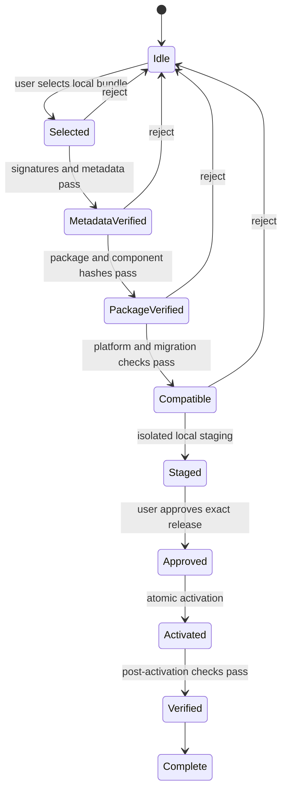

# Decision 0005: Signed Manual Update Design

| Field | Value |
|---|---|
| Status | Accepted design, not implemented |
| Date | 2026-08-10 |
| Scope | Update discovery boundary, trusted metadata, verification, and activation |
| Supersedes | No prior decision |

## Context

AgentMage must be maintainable without giving the running product network,
background-download, remote-control, or silent-update authority. The public
security policy already requires fixes to arrive as new signed releases and
states that normal operation performs no automatic update check. A concrete
design is needed before later work defines patch metadata or writes an installer.

## Decision

1. AgentMage v0.1 has no update-discovery client, scheduler, background
   downloader, remote trigger, remote feature flag, or update-check endpoint.
2. A user obtains a release bundle and advisory outside the AgentMage runtime,
   then explicitly selects the local bundle for verification. Acquisition does
   not grant the product runtime network authority.
3. Versioned trusted metadata binds the immutable release, monotonically
   increasing release sequence, source commit, package, configuration,
   component inventory, software/cryptographic/model bills of materials,
   platform, architecture, signer key identifiers, threshold, expiration,
   support state, and revocations.
4. Detached signatures and package hashes are verified against a local trust
   root before extraction. Unknown signers, unmet thresholds, stale or revoked
   metadata, non-increasing release sequences, platform mismatches, undeclared
   components, and malformed records fail closed.
5. Compatibility, prerequisites, capability and authority deltas, data/schema
   impact, migration identity, rollback identity, support state, revocations,
   and release notes are reviewable before local user approval.
6. Verification, staging, approval, activation, post-activation checks, and
   completion are explicit durable states. Activation is atomic and preserves
   the prior release until the new release passes its post-activation checks.
7. The signature algorithm suite and key ceremony are versioned metadata-policy
   decisions owned by the later signed-patch implementation. This design does
   not treat the existing test-signature mechanism as a production signer.

## State Machine

No transition performs network discovery or acquisition. An interrupted
transaction selects either the complete prior release or the complete new
release; it never treats a partial stage as active.

## Consequences

- Users must learn about and acquire releases through an external channel.
- Manual delivery does not weaken signature, freshness, anti-downgrade,
  compatibility, component, or rollback verification.
- Later implementation must provide deterministic fixtures for valid, wrong
  signer, threshold, expiration, downgrade, corruption, mismatch, interruption,
  migration, revocation, and unsupported-platform cases.
- This decision approves a design only. It does not approve a signer, update
  package, product runtime, release, or supported platform.

## Verification

- [`signed-update-design.json`](../../architecture/signed-update-design.json)
  is the machine-readable design authority.
- `python3 scripts/update_design.py` rejects hidden update authority, weakened
  signature/identity requirements, unsafe version policy, implementation
  overclaims, and macOS evidence substitution.
- Package-level implementation and `RV-22` remain owned by later stories.
