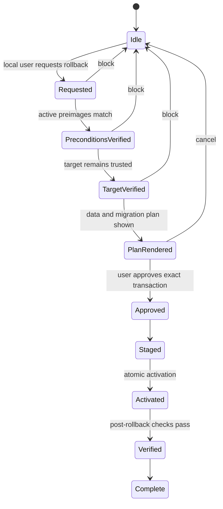

# Decision 0006: Update Rollback Design

| Field | Value |
|---|---|
| Status | Accepted design, not implemented |
| Date | 2026-08-10 |
| Scope | Eligibility, data safety, state transitions, and failure recovery |
| Supersedes | No prior decision |

## Context

Keeping a prior binary is not by itself a safe rollback. The active release or
configuration may have changed, the prior release may have been revoked, a
migration may not be reversible, and later user data must not be overwritten.
Rollback therefore needs its own authorization and exact-precondition design.

## Decision

1. Rollback is a new local user-approved transaction. It is never remotely
   triggered, silently initiated, or authorized by an automatic remote policy.
2. The transaction binds the exact active release and configuration preimages.
   Stale state blocks before any write.
3. The target must have been previously verified and must pass signature, hash,
   support, revocation, platform, configuration, backup, and schema-compatibility
   checks again. There is no exception that permits rollback to revoked or
   unsupported code.
4. Binary/configuration rollback and user-data recovery are separate. AgentMage
   never blindly restores a database or overwrites later user work. Every data
   migration needs a reviewed reverse plan; an irreversible schema change blocks
   rollback and requires a separate recovery path.
5. Request, precondition verification, target verification, rendered recovery
   plan, user approval, staging, activation, post-check, and completion are
   durable states with receipts. Activation is atomic.
6. An interruption leaves either the exact current release or the complete
   verified prior release active. An uncertain result requires reconciliation
   before retry. A failed post-check enters local safe mode and cannot create a
   remote kill switch.

## State Machine

## Consequences

- A security rollback is not a general downgrade mechanism.
- Some releases may be non-rollbackable when safe data/schema reversal cannot
  be proven; that limitation must be visible before update approval.
- Recovery material remains integrity-bound, minimized, retained for a declared
  period, and separate from later user data.
- This decision does not implement rollback or claim execution on Fedora,
  Ubuntu, or macOS.

## Verification

- [`rollback-design.json`](../../architecture/rollback-design.json) is the
  machine-readable design authority.
- `python3 scripts/update_design.py` rejects stale-precondition bypass,
  revoked-target rollback, silent initiation, later-data overwrite, blind
  restore, network authority, implementation overclaims, and macOS substitution.
- Crash injection, migration reversal, package activation, and `RV-22` remain
  later implementation and release-gate work.
