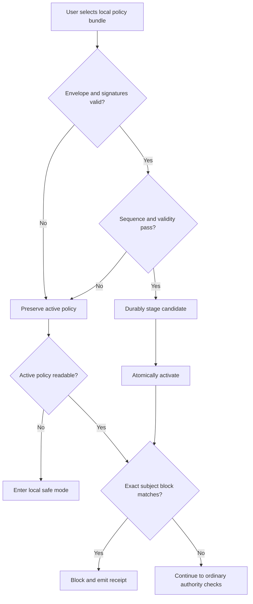

# Decision 0007: Local Emergency Disablement

| Field | Value |
|---|---|
| Status | Accepted contract, product integration pending |
| Date | 2026-08-10 |
| Scope | Local emergency policy installation, evaluation, receipts, and recovery |
| Supersedes | No prior decision |

## Context

AgentMage needs a way to stop use of a compromised model artifact, runtime,
component, capability, or release version without granting the product an
update-discovery client, remote-control channel, or kill switch. The device
owner must remain the actor who obtains and installs policy material.

## Decision

1. An emergency policy arrives only as a user-selected local bundle acquired
   outside the AgentMage runtime. Policy installation performs no network
   request and transmits no workstation data.
2. The policy is a versioned canonical payload with a strictly increasing
   sequence, bounded validity period, exact subject identities, local trust-root
   identity, signer threshold, detached signatures, and payload hash.
3. Signatures and metadata are verified before activation. An unknown signer,
   unmet threshold, hash mismatch, stale sequence, malformed entry, or invalid
   time window rejects the candidate and preserves the last valid active policy.
4. Installation uses durable staging and atomic activation. The prior valid
   policy remains available until post-activation verification succeeds.
5. Evaluation occurs before product startup admission, model/runtime/component
   load, capability registration, and work acceptance. Exact matching block
   entries take precedence over configuration or model output. A policy can
   remove authority but cannot create it.
6. The closed v1 subject set is model artifact, runtime, component, capability,
   and release version. Optional artifact hashes make a block more specific;
   absence of a hash never permits an identifier mismatch.
7. An unreadable or unverifiable active policy enters local safe mode and blocks
   model loading and capability registration. A rejected candidate does not
   corrupt or replace the active policy.
8. Every decision produces a local minimized receipt containing policy and
   subject identities, matched entry, outcome, reason, advisory identity, and
   hashes. Prompts, user files, credentials, keys, and unrelated paths are never
   policy inputs or receipt fields.
9. Recovery requires a newer locally installed signed policy that explicitly
   removes or supersedes a block. Expiration, deletion, downgrade, or a remote
   message cannot silently re-enable a subject.

## Evaluation Order

## Consequences

- There is no instant remote revocation. Users must obtain and install a newer
  policy through an external trusted channel.
- Emergency policy evaluation is subtractive only and cannot authorize a tool,
  network request, workspace root, model, runtime, component, or release.
- The contract does not yet implement the production signature verifier,
  installer, startup hook, trust root, or Mac execution path. Those claims
  require later implementation and evidence.

## Verification

- [`emergency-disable-policy.schema.json`](../../schemas/support/emergency-disable-policy.schema.json)
  closes the policy and receipt-relevant input fields.
- The synthetic fixture exercises all five subject classes without containing
  private workstation data or a production key.
- Sub-task 3.2.2.1 owns cryptographic, stale, revoked, interrupted, and rollback
  execution fixtures. Story criterion 3.2.AC3 owns product-startup integration.
