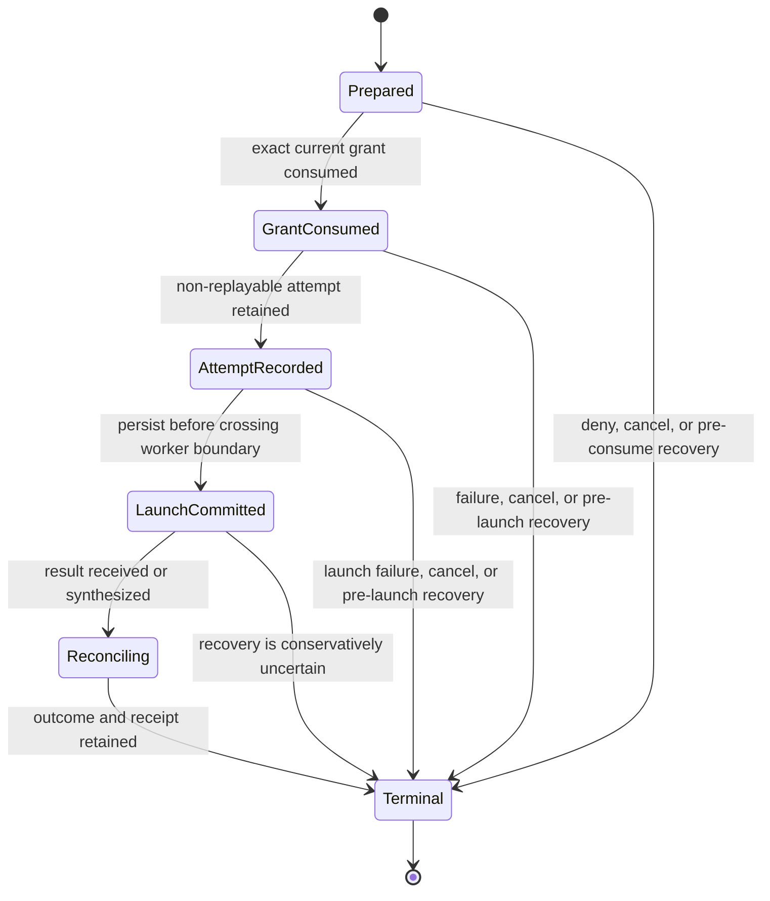

# Decision 0013: Kernel Authority Transaction and Operation Taxonomy

| Field | Value |
|---|---|
| Status | Accepted |
| Date | 2026-08-11 |
| Scope | Canonical operation identity, authority classification, and kernel-owned transaction ordering |
| Resolves | `RM-006`, `RM-007` |
| Preserves | Decisions 0001 through 0012, all accepted product scope, and immutable historical evidence |

## Context

AgentMage previously represented related authority concepts in several forms:
closed grant operations, free-form configuration and tool-effect strings, broad
product authority classes, and descriptive capability names. The grant issuer,
policy evaluator, tool registry, approvals, result reconciliation, and receipts
also lacked one owner with a specified operation-attempt order.

Those gaps permit ambiguity even when each component is locally deny-first. A
tool, policy rule, approval, grant, and receipt must identify the same operation
without string inference. An effect attempt must consume one exact grant before
launch and must not become replayable after cancellation, failure, or recovery.

## Decision

### Canonical Taxonomy

1. `OperationBinding` is the canonical authority identity. It contains an exact
   taxonomy version, one closed `GrantOperation`, and the operation's one fixed
   `AuthorityClass`.
2. Authority classes are orthogonal labels, not an inheritance hierarchy.
   Authority in one class never implies authority in another class.
3. Callers cannot select or override an operation's class. Construction and
   deserialization reject a mismatched class or unsupported taxonomy version.
4. There is no wildcard, custom operation, unknown fallback, or many-to-one
   escalation fallback.
5. Tools declare exactly one operation binding, and their required-grant
   template must contain the same binding. Approval requests, grants, expected
   effects, policy rules, transaction records, and receipts use the same exact
   binding. Work packets use the same closed `AuthorityClass` vocabulary while
   remaining non-authoritative descriptions.
6. Version-zero bare operation records may migrate only through the explicit
   exact operation mapping. Legacy configuration migrates only the unambiguous
   `read` plus `workspace.read` combination to `workspace_read`; ambiguous or
   authority-broadening input fails closed.
7. The live kernel contract family and live agent-configuration bundle are
   schema version 2 because Phase 4 adds required authority fields and changes
   operation wire shapes. Version 1 kernel contracts and historical
   configuration-migration fixtures stay frozen in their revision-bound
   packages; current parsing does not silently reinterpret a version-1 record
   as version 2.
8. Configuration evidence, result, diff, rollback, catalog, and other record
   families keep their independently versioned version-1 schemas. Their version
   numbers do not imply that they contain a live agent-configuration bundle.

| Canonical operation | Authority class |
|---|---|
| `workspace_read` | `observe` |
| `database_read` | `observe` |
| `draft_create` | `draft` |
| `workspace_write` | `local-write` |
| `workspace_delete` | `local-write` |
| `git_clone` | `local-write` |
| `git_fetch` | `local-write` |
| `git_worktree_create` | `local-write` |
| `git_worktree_remove` | `local-write` |
| `git_branch_fast_forward` | `local-write` |
| `git_commit` | `local-write` |
| `git_push` | `remote-write` |
| `publish` | `remote-write` |
| `send` | `remote-write` |
| `upload` | `remote-write` |
| `database_write` | `remote-write` |
| `command_execute` | `execute` |
| `network_access` | `execute` |
| `model_inference` | `execute` |
| `deploy` | `deploy` |
| `credential_access` | `secrets` |
| `administration` | `admin` |

The strict-local read-only policy allows only exact `workspace_read` bindings.
Every other current operation is explicitly denied. Absence from an allow set
also remains a denial.

### Repository Safety Boundary

1. The Git operations above are the complete representable source-control
   mutation set. Generic pull, merge, rebase, reset, clean, checkout-discard,
   stash mutation, tag mutation, note mutation, branch deletion, remote
   configuration, hook execution, forced update, mirror, and arbitrary ref
   update have no operation variant and cannot receive a grant.
2. `git_fetch` is a local write because it downloads objects and updates one
   exact AgentMage-owned ref. It must not update configured remote-tracking
   branches, tags, `FETCH_HEAD`, submodules, user refs, or maintenance state.
3. Generic pull is decomposed into an exact namespaced fetch followed by a
   separately previewed `git_branch_fast_forward` compare-and-swap operation.
4. Clone, fetch, worktree lifecycle, branch advancement, commit, and push each
   consume a distinct grant. Commit approval never authorizes push, and local or
   remote observation never authorizes mutation.
5. Models and repository content cannot invoke Git directly. The future Git
   adapter must enforce the normative
   [repository-safety contract](../security/repository-safety.md) through a
   pinned process boundary, exact repository preservation manifests, isolated
   worktrees, authenticated credential brokering, current preconditions, and
   terminal receipts.
6. Repository state such as the active checkout, user index, untracked files,
   user notes, `refs/notes/*`, stashes, reflogs, tags, unrelated refs,
   configuration, hooks, filters, submodules, and Large File Storage state is
   preserved unless a separately representable exact operation owns it.

### Transaction Owner and Order

1. `AuthorityTransactionCoordinator` is the sole kernel owner of authority
   transaction histories and their terminal receipts.
2. One transaction binds an `AuthorityTransactionId`, `OperationAttemptId`,
   `ApprovalId`, `GrantId`, canonical operation, correlation, session, task,
   action, tool call, and immutable registered tool version.
3. The only normal forward order is prepared, consumed, attempt recorded,
   launch committed, reconciliation, and terminal. Defined pre-launch failures
   may move directly from the current nonterminal state to terminal.
4. The coordinator validates the registered tool and exact authority bindings,
   performs current policy evaluation and atomic grant consumption, and only
   then records the non-replayable attempt and launch commitment before crossing
   the worker boundary.
5. A terminal transaction and its receipt are appended as one coordinator
    operation. The receipt binds every authority identity and participates in
    the receipt hash chain.
6. A terminal transaction cannot reopen. Recovery of a terminal record is
    idempotent and returns only the already-bound retained receipt.

### Failure, Cancellation, and Recovery

1. Failure or cancellation before consumption leaves the grant issued and
   launches no worker.
2. Failure, cancellation, or recovery after consumption but before confirmed
   launch leaves the grant consumed and non-replayable.
3. Cancellation, timeout, missing result, conflicting duplicate result, or
   recovery after the persisted launch commitment produces an uncertain effect
   whenever the effect cannot be proven. The grant then becomes `uncertain` and
   cannot be reused.
4. Identical duplicate worker results reconcile idempotently. Conflicting
    duplicates never select a winner and instead produce an uncertain outcome.
5. Changed policy, stale preimage, mismatched approval, grant, action, tool,
    version, or operation fails before launch.
6. Diagnostics and errors remain bounded and content-free. They do not echo
    arguments, paths, credentials, workspace content, or model output.

### Phase Boundary

1. Phase 4 specifies and tests ordering with a private in-module worker driver.
    It deliberately exposes no public product launch method and makes no claim
    of a working effect path.
2. Phase 5 owns structural effect mediation and the sealed cross-boundary
    launch capability. Phase 6 owns canonical held-target parity and isolation.
    Phase 7 owns encrypted durable storage, atomic persistence, restart
    recovery, and production receipt publication.
3. Shells, models, capability packs, and adapters must not construct authority
    transactions, consume grants, or launch effect workers directly.

## Consequences

- Operation meaning can be compared structurally across configuration, tool
  registration, approval, policy, grants, transactions, and receipts.
- Adding or reclassifying an operation requires a taxonomy-version decision,
  migration analysis, schema changes, exhaustive tests, and explicit review.
- A consumed operation cannot silently return to an issued state.
- An observed launch without a trustworthy terminal result is visible as
  uncertain rather than guessed successful or failed.
- Historical Story 4.1 and Story 5.1 packages, references, fixtures, and reports
  remain unchanged and describe their recorded source revisions. This decision
  describes the current Phase 4 candidate.
- Current kernel contracts and live agent-configuration bundles use schema
  version 2. Their version-1 historical packages remain authoritative for
  retained version-1 evidence; explicit migration must construct validated
  version-2 bindings without broadening authority. Separately versioned
  configuration evidence and report records remain at version 1.
- No runtime, sandbox, durable-store, packaging, platform-support, or integrated
  product claim follows from this decision.

## Verification

- Exhaustive operation-to-class coverage and mapping round trips.
- Unknown operation, authority mismatch, unsupported version, wildcard, and
  ambiguous legacy-migration rejection.
- Exact tool-definition, configuration, approval, grant, policy, work-packet,
  transaction, and receipt binding tests.
- Exhaustive state-transition matrix and no-public-launch compile-fail test.
- Missing grant, changed policy, stale preimage, launch failure, replay,
  timeout, cancellation at each boundary, identical and conflicting duplicate
  result, crash-boundary recovery, receipt-chain, and terminal-idempotence tests.
- Workspace product format, lint, build, and test gates.

## Approval Gate

This decision remains proposed until the user explicitly approves the Phase 4
candidate. No Phase 4 commit, push, or transition to Phase 5 is authorized by
the existence of this document.
