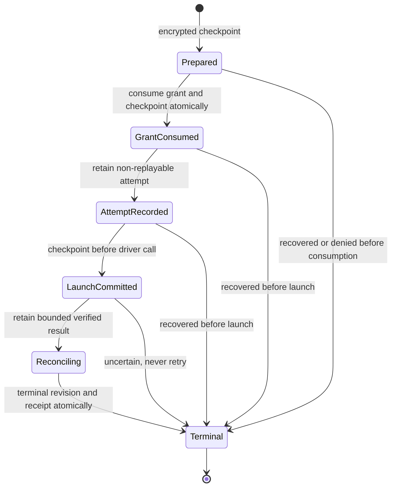

# Decision 0016: Encrypted Canonical Authority and Recovery

| Field | Value |
|---|---|
| Status | Accepted |
| Date | 2026-08-11 |
| Scope | Canonical authority persistence, key brokering, atomic checkpoints, and restart recovery |
| Resolves | `RM-011`, `RM-012` |
| Preserves | Decisions 0001 through 0015, exact-object isolation, and immutable historical evidence |

## Context

Decision 0013 fixed the authority transaction order and conservative recovery
rules. Decisions 0014 and 0015 made the effect permit opaque and bound it to
exact held objects. The Phase 6 implementation still retained grants,
anti-replay nonces, transaction revisions, and receipts only in process memory.
A restart could therefore forget consumption or lose the distinction between a
launch that never happened and one whose outcome was unknown.

Phase 7 needs one encrypted crash-durable authority without creating a second
JSON, log, or export authority. It must also fail closed when a key, an eligible
local root, an exclusive writer, a supported migration, or record integrity
cannot be established.

## Decision

### Canonical Store

1. One SQLCipher database is the sole durable authority for the currently
   implemented grant and authority-transaction state.
2. The kernel uses pinned `rusqlite` 0.40.2 with bundled SQLCipher and the
   platform cryptographic provider. Linux currently links the distribution's
   OpenSSL 3 `libcrypto`; the support matrix and package manifests must declare
   that runtime dependency. The kernel verifies `cipher_version`, encrypted
   page integrity, SQLite integrity, and foreign keys before admitting state.
3. The database uses a 256-bit random key. The kernel receives the key only
   inside a bounded `OperationalStoreKeyProvider` callback. Keys are not read
   from command arguments, environment variables, configuration, repository
   files, or plaintext fallback storage.
4. The Linux key provider can look up only the fixed
   `operational-store-key-v1` identity for one bounded profile through Secret
   Service. It cannot list or return general credentials. Initial key
   provisioning and full lifecycle composition remain Phase 8 work.
5. A missing, malformed, or wrong key prevents state from opening. SQLCipher
   diagnostic logging is disabled before key validation so page failures do not
   become an uncontrolled diagnostic surface.
6. The selected root must pass strict-local storage policy. Symlinked files,
   permissive database modes, remote filesystems, FUSE, unknown filesystems,
   and known synchronized roots are denied. Linux descriptor-bound state-root
   composition remains owned by the Phase 8 aggregate adapter.
7. Exactly one process owns the writer connection. Exclusive locking, WAL,
   full synchronization, secure deletion, memory-only temporary storage, zero
   busy timeout, and foreign keys are mandatory; no write waits behind an
   unknown owner.

### Schema and Publication

1. Version 1 stores schema history, metadata, grant identities and nonces,
   immutable grant revisions, grant heads, transaction identities and attempts,
   immutable transaction revisions, transaction heads, receipts, and
   checkpoints.
2. Every immutable row is inserted once and compared byte-for-byte on a
   duplicate. Conflicting history is an integrity failure rather than an
   update.
3. Grant consumption and the matching `grant_consumed` transaction revision are
   published in one SQLite transaction. Grant uncertainty, terminal state, and
   the canonical receipt are likewise one publication.
4. Each publication uses a compare-and-swap generation, a deterministic digest
   of all authority state, and one checkpoint row. A failed or ambiguous commit
   poisons the runtime; no further effect is admitted until reopen and recovery.
5. Grant and transaction state machines remain deterministic in-memory caches.
   On startup they are reconstructed only from validated canonical rows and
   checked against revision order, immutable identity, nonce uniqueness,
   receipt sequence, receipt hash chain, heads, and the state digest.
6. JSON Lines, logs, diagnostics, and backups never become startup authority.
   A backup is a separately keyed SQLCipher database created through the online
   backup API and verified before success is reported.

### Effect Ordering and Recovery

The public effect entry point moves from the in-memory coordinator to
`DurableAuthorityRuntime`. The machine boundary guard rejects a public raw
coordinator launch method.

1. Recovery from `prepared` closes as failed without consuming the grant.
2. Recovery from `grant_consumed` or `attempt_recorded` closes as failed while
   preserving consumed, non-replayable authority.
3. Recovery from `launch_committed` closes as uncertain, marks the grant
   uncertain, and never calls the driver.
4. `reconciling` contains a bounded result digest and outcome. A complete,
   non-uncertain result publishes its one canonical terminal receipt after
   restart. An uncertain result remains uncertain. No effect is retried.
5. Recovery of terminal state is idempotent and returns the one retained
   receipt. Reusing the transaction identity or consumed grant is denied.

### Failure Surface

Store, migration, key, writer, integrity, and persistence failures have closed,
content-free codes. Paths, SQL text, keys, record content, workspace content,
tool arguments, and model output are not included in public errors or `Debug`
representations.

## Verification

Phase 7 verification must include:

- missing and wrong keys with no plaintext fallback;
- encrypted database and backup header inspection;
- local, remote, synchronized, and symlink storage decisions;
- schema version, future migration, foreign-key, and immutable-row checks;
- concurrent writer denial;
- induced transaction rollback with no partial generation or checkpoint;
- encrypted backup reopen with its distinct key;
- encrypted restart recovery at every transition boundary;
- verified-result receipt publication exactly once;
- launch-boundary uncertainty with no automatic replay;
- database, WAL, and shared-memory canary inspection; and
- page corruption refusal.

## Deliberate Limits

- This decision makes grants, nonces, attempts, transaction revisions,
  receipts, and checkpoints durable. It does not claim the complete Sprint 11
  retention, legal-hold, export, erasure, or future domain-table scope.
- Full Linux state-root ownership, first-install key provisioning, key rotation,
  uninstall orchestration, and production process lifecycle belong to Phase 8.
- Clean Fedora and Ubuntu packaging must prove the selected OpenSSL 3 runtime
  package and must include the bundled SQLCipher BSD notice.
- macOS remains blocked and unimplemented. Windows is not claimed.
- The application host and VS Code surface do not yet compose this runtime.

## Approval Gate

The user approved this decision, the Phase 7 local commit, and entry into Phase
8 on 2026-08-11. That approval did not authorize a push or a Phase 8 commit.
